# 26.05.15 CNN_VLM 개선 (CNN 라벨 제거, 썸네일 고정)

# 기존 VLM, CNN_VLM, CNN_MERGE_VLM에 대한 MMBench 벤치마킹

```bash
"VLM.py", "CNN_VLM.py", "CNN_MERGE_VLM.py"를 각각 MMBench_DEV_EN 으로 벤치마킹 하기 위한 스크립트를 작성하고자 한다.
즉 새로 작성하는 스크립트는 3개이다. 스크립트 이름은 "VLM_Benchmark_MMBench_DEV_EN.py", "CNN_VLM_Benchmark_MMBench_DEV_EN.py", "CNN_MERGE_VLM_Benchmark_MMBench_DEV_EN.py" 와 같이 한다.
벤치마킹은 https://github.com/open-compass/MMBench 페이지를 참고해서 해당 데이터셋을 사용하는 방법에 대해 조사한 뒤 올바르게 구현하라.
LMUData 경로 내에 존재하는 MMBench_DEV_EN_V11.tsv를 사용하고, 각 컬럼에 대응되는 이미지는 동일 경로 내 images/MMBench_V11 폴더 내에 존재한다.
TSV 파일을 확인하여, 이미지 경로가 경로/ID/Base64 각 경우에 대해 모두 처리할 수 있도록 스크립트를 작성하라.
스크립트 작성 시 "VLM.py", "CNN_VLM.py", "CNN_MERGE_VLM.py" 의 각 동작을 정확히 유지해야하며, 각 코드는 다음 "prompt_for_VLM.py", "prompt_for_CNN_VLM.py", "prompt_for_CNN_MERGE_VLM.py" 설명을 정확히 구현한 것이다.
각 스크립트는 벤치마크 결과를 csv와 md 파일로 생성하며, 벤치마크 결과 표는 다음 열 정보들을 포함한다.
rows, correct, accuracy, avg_preprocess_time_sec, min_preprocess_time_sec, max_preprocess_time_sec, avg_processor_time_sec, min_processor_time_sec, max_processor_time_sec, avg_prefill_time_sec, min_prefill_time_sec, max_prefill_time_sec, avg_decode_time_sec, min_decode_time_sec, max_decode_time_sec, avg_input_time_with_preprocess_sec, min_input_time_with_preprocess_sec, max_input_time_with_preprocess_sec, avg_total_time_sec, min_total_time_sec, max_total_time_sec, avg_text_tokens, min_text_tokens, max_text_tokens, avg_image_tokens, min_image_tokens, max_image_tokens, avg_total_tokens, min_total_tokens, max_total_tokens, avg_prefill_tokens_per_sec, min_prefill_tokens_per_sec, max_prefill_tokens_per_sec, avg_decode_tokens_per_sec, min_decode_tokens_per_sec, max_decode_tokens_per_sec, avg_prefill_mem_peak_allocated_mb, min_prefill_mem_peak_allocated_mb, max_prefill_mem_peak_allocated_mb, avg_decode_mem_peak_allocated_mb, min_decode_mem_peak_allocated_mb, max_decode_mem_peak_allocated_mb, avg_overall_peak_allocated_mb, min_overall_peak_allocated_mb, max_overall_peak_allocated_mb, avg_prefill_mem_peak_reserved_mb, min_prefill_mem_peak_reserved_mb, max_prefill_mem_peak_reserved_mb, avg_decode_mem_peak_reserved_mb, min_decode_mem_peak_reserved_mb, max_decode_mem_peak_reserved_mb, avg_num_objects, min_num_objects, max_num_objects, accuracy_percent
이를 정확히 설명하자면, 
벤치마크 문제 수를 기입하고, 맞춘 문제수를 측정하여 벤치마크 최종 정확도를 측정한다. 그리고 벤치마크 각 문제마다 
전처리(추가된동작, yolo 및 merge 등)에 걸린 시간, 전처리기(processor) 동작 시간, prefill 시간, decode(출력) 시간, 전처리를 포함한 입력 시간, 전체 걸린 시간, 텍스트 토큰 수, 이미지 토큰 수, 전체 토큰 수, prefill 단계에서 tokens/sec, decode 단계에서 tokens/sec, prefill 단계에서 메모리 피크, decode 단계에서 메모리 피크, 전체 메모리 피크, 객체 탐지 수
에 대해 측정한 뒤, 각 항목에 대해 평균값, 최대값, 최소값을 구한 후 기입한다.
측정 항목은 원본 "CNN_VLM.py" 의 출력 포맷과 미리 생성해둔 "test1" 폴더 내의 "test1_CNN_VLM.out" 파일를 참고하라.
정확한 결과 포맷은 all_benchmarks_summary.csv 과 동일하도록 한다.
벤치마킹 진행 로그는 print(..., flush=True)로 stdout에 바로 찍히도록 한다.
스크립트는 추가로 두 인자를 받아, 벤치마킹 시작 인덱스와 벤치마킹 종료 인덱스를 지정할 수 있게 하여 소규모 샘플 벤치마킹이 가능하도록 작성한다.
```

- 공통 벤치마킹 코드 (같은 경로에 위치시켜야함)
    
    ```python
    from __future__ import annotations
    
    import argparse
    import base64
    import json
    import math
    import re
    import time
    from dataclasses import dataclass
    from io import BytesIO
    from pathlib import Path
    from typing import Any
    
    import pandas as pd
    from PIL import Image
    
    SUMMARY_COLUMNS = [
        "benchmark",
        "method",
        "rows",
        "correct",
        "accuracy",
        "avg_preprocess_time_sec",
        "min_preprocess_time_sec",
        "max_preprocess_time_sec",
        "avg_processor_time_sec",
        "min_processor_time_sec",
        "max_processor_time_sec",
        "avg_prefill_time_sec",
        "min_prefill_time_sec",
        "max_prefill_time_sec",
        "avg_decode_time_sec",
        "min_decode_time_sec",
        "max_decode_time_sec",
        "avg_output_time_sec",
        "min_output_time_sec",
        "max_output_time_sec",
        "avg_input_time_with_preprocess_sec",
        "min_input_time_with_preprocess_sec",
        "max_input_time_with_preprocess_sec",
        "avg_total_time_sec",
        "min_total_time_sec",
        "max_total_time_sec",
        "avg_text_tokens",
        "min_text_tokens",
        "max_text_tokens",
        "avg_image_tokens",
        "min_image_tokens",
        "max_image_tokens",
        "avg_total_tokens",
        "min_total_tokens",
        "max_total_tokens",
        "avg_prefill_tokens_per_sec",
        "min_prefill_tokens_per_sec",
        "max_prefill_tokens_per_sec",
        "avg_decode_tokens_per_sec",
        "min_decode_tokens_per_sec",
        "max_decode_tokens_per_sec",
        "avg_prefill_mem_peak_allocated_mb",
        "min_prefill_mem_peak_allocated_mb",
        "max_prefill_mem_peak_allocated_mb",
        "avg_decode_mem_peak_allocated_mb",
        "min_decode_mem_peak_allocated_mb",
        "max_decode_mem_peak_allocated_mb",
        "avg_overall_peak_allocated_mb",
        "min_overall_peak_allocated_mb",
        "max_overall_peak_allocated_mb",
        "avg_prefill_mem_peak_reserved_mb",
        "min_prefill_mem_peak_reserved_mb",
        "max_prefill_mem_peak_reserved_mb",
        "avg_decode_mem_peak_reserved_mb",
        "min_decode_mem_peak_reserved_mb",
        "max_decode_mem_peak_reserved_mb",
        "avg_num_objects",
        "min_num_objects",
        "max_num_objects",
        "accuracy_percent",
    ]
    
    @dataclass
    class MetricRow:
        correct: float
        preprocess_time_sec: float
        processor_time_sec: float
        prefill_time_sec: float
        decode_time_sec: float
        output_time_sec: float
        input_time_with_preprocess_sec: float
        total_time_sec: float
        text_tokens: float
        image_tokens: float
        total_tokens: float
        prefill_tokens_per_sec: float
        decode_tokens_per_sec: float
        prefill_mem_peak_allocated_mb: float
        decode_mem_peak_allocated_mb: float
        overall_peak_allocated_mb: float
        prefill_mem_peak_reserved_mb: float
        decode_mem_peak_reserved_mb: float
        num_objects: float
    
    def parse_args(default_method: str) -> argparse.Namespace:
        parser = argparse.ArgumentParser(description=f"Benchmark MMBench_DEV_EN ({default_method})")
        parser.add_argument("--benchmark", default="mmbench_dev_en", help="벤치마크 이름")
        parser.add_argument(
            "--mmbench_tsv",
            type=Path,
            default=Path("MMBench_DEV_EN.tsv"),
            help="MMBench DEV EN TSV 파일 경로 (open-compass/MMBench 포맷)",
        )
        parser.add_argument(
            "--image_root",
            type=Path,
            default=Path("."),
            help="TSV의 image 값이 파일명/ID일 때 사용할 이미지 루트 경로",
        )
        parser.add_argument("--dataset", default="MMBench_DEV_EN", help="메타 정보용 데이터셋 이름")
        parser.add_argument("--split", default="dev", help="메타 정보용 split")
        parser.add_argument("--method", default=default_method, help="method 이름")
        parser.add_argument("--max_rows", type=int, default=0, help="0이면 전체")
        parser.add_argument("--output_csv", type=Path, default=Path("all_benchmarks_summary.csv"))
        parser.add_argument("--output_md", type=Path, default=Path(f"{default_method}_Benchmark_MMBench_DEV_EN.md"))
        parser.add_argument(
            "--work_dir",
            type=Path,
            default=None,
            help="중간 산출물 루트. 미지정 시 benchmark_runs/<benchmark> 사용",
        )
        args = parser.parse_args()
        if args.work_dir is None:
            args.work_dir = Path("benchmark_runs") / str(args.benchmark)
        return args
    
    def load_mmbench_samples(tsv_path: Path) -> list[dict[str, Any]]:
        if not tsv_path.is_file():
            raise FileNotFoundError(f"MMBench TSV 파일을 찾을 수 없습니다: {tsv_path.resolve()}")
        df = pd.read_csv(tsv_path, sep="\t")
        return df.to_dict(orient="records")
    
    def _try_open_image_from_path(text: str, image_root: Path) -> Image.Image | None:
        p = Path(text)
        candidates = [p]
        if not p.is_absolute():
            candidates.append(image_root / p)
    
        for c in candidates:
            try:
                if c.is_file():
                    with Image.open(c) as im:
                        return im.convert("RGB")
            except OSError:
                # base64 문자열처럼 경로로 해석 불가능한 경우 포함
                continue
        return None
    
    def _open_image_file(path: Path) -> Image.Image | None:
        try:
            if path.is_file():
                with Image.open(path) as im:
                    return im.convert("RGB")
        except Exception:
            return None
        return None
    
    def _try_open_image_from_id(text: str, image_root: Path) -> Image.Image | None:
        if not re.fullmatch(r"\d+", text.strip()):
            return None
        stem = text.strip()
    
        # 1) image_root 바로 아래에서 빠른 탐색 (확장자/무확장자)
        no_ext = _open_image_file(image_root / stem)
        if no_ext is not None:
            return no_ext
        for ext in (".jpg", ".jpeg", ".png", ".webp", ".bmp"):
            found = _open_image_file(image_root / f"{stem}{ext}")
            if found is not None:
                return found
    
        # 2) zero-padding 변형도 시도 (예: 250 -> 000250)
        for pad in range(3, 13):
            padded = stem.zfill(pad)
            found = _open_image_file(image_root / padded)
            if found is not None:
                return found
            for ext in (".jpg", ".jpeg", ".png", ".webp", ".bmp"):
                found = _open_image_file(image_root / f"{padded}{ext}")
                if found is not None:
                    return found
    
        # 3) 하위 폴더 포함 stem 인덱스 탐색 (lazy cache)
        root_key = str(image_root.resolve())
        if root_key not in _IMAGE_ID_INDEX_CACHE:
            stem_map: dict[str, Path] = {}
            for p in image_root.rglob("*"):
                if not p.is_file():
                    continue
                # 확장자 없는 파일도 허용
                if p.suffix and p.suffix.lower() not in {".jpg", ".jpeg", ".png", ".webp", ".bmp"}:
                    continue
                s = p.stem
                if s not in stem_map:
                    stem_map[s] = p
                # 숫자 stem의 선행 0 제거 버전도 같이 매핑
                if re.fullmatch(r"\d+", s):
                    stripped = str(int(s))
                    if stripped not in stem_map:
                        stem_map[stripped] = p
            _IMAGE_ID_INDEX_CACHE[root_key] = stem_map
    
        stem_map = _IMAGE_ID_INDEX_CACHE[root_key]
        candidate = stem_map.get(stem)
        if candidate:
            found = _open_image_file(candidate)
            if found is not None:
                return found
    
        # 4) 디렉터리 구조가 특이한 경우를 위해 파일명 부분 일치로 최종 탐색
        # 예: img_000250_v1.jpg, folder/250/image.png
        for p in image_root.rglob(f"*{stem}*"):
            if not p.is_file():
                continue
            if p.suffix and p.suffix.lower() not in {".jpg", ".jpeg", ".png", ".webp", ".bmp"}:
                continue
            found = _open_image_file(p)
            if found is not None:
                return found
        return None
    
    def _decode_base64_image(text: str) -> Image.Image | None:
        raw = text.strip()
        if raw.startswith("data:image") and "," in raw:
            raw = raw.split(",", 1)[1]
    
        try:
            decoded = base64.b64decode(raw, validate=False)
        except Exception:
            return None
    
        if not decoded:
            return None
    
        try:
            with Image.open(BytesIO(decoded)) as im:
                return im.convert("RGB")
        except Exception:
            return None
    
    def _looks_like_base64_image(text: str) -> bool:
        s = text.strip()
        if not s:
            return False
        if s.startswith("data:image"):
            return True
        # JPEG(/9j), PNG(iVBOR), WEBP(UklGR), GIF(R0lGOD) 등 시그니처 + 충분한 길이
        if len(s) > 256 and re.match(r"^(/9j|iVBOR|UklGR|R0lGOD)", s):
            return True
        return False
    
    def _safe_num(value: Any) -> float:
        if value is None:
            return 0.0
        try:
            f = float(value)
        except Exception:
            return 0.0
        if math.isnan(f) or math.isinf(f):
            return 0.0
        return f
    
    def _agg(values: list[float], mode: str) -> float:
        if not values:
            return 0.0
        if mode == "avg":
            return sum(values) / len(values)
        if mode == "min":
            return min(values)
        if mode == "max":
            return max(values)
        raise ValueError(mode)
    
    def _norm_text(s: Any) -> str:
        text = str(s or "").strip().lower()
        text = re.sub(r"\s+", " ", text)
        text = text.replace(".", "").replace(",", "")
        return text
    
    def extract_question_and_gt(sample: dict[str, Any]) -> tuple[str, str, list[str]]:
        q = sample.get("question") or sample.get("query") or sample.get("prompt") or ""
        hint = sample.get("hint") or sample.get("context") or ""
        if hint:
            q = f"{hint}\n{q}"
    
        ans = sample.get("answer") or sample.get("label") or sample.get("gt") or ""
    
        # MMBench는 A/B/C/D(or E) 컬럼을 직접 제공하는 케이스가 많다.
        letter_options = []
        for key in ("A", "B", "C", "D", "E"):
            value = sample.get(key)
            if value is not None and str(value).strip():
                letter_options.append(f"{key}. {value}")
    
        options = letter_options or sample.get("choices") or sample.get("options") or []
        if isinstance(options, dict):
            options = [f"{k}. {v}" for k, v in options.items()]
        if not isinstance(options, list):
            options = []
    
        return str(q), str(ans), [str(x) for x in options]
    
    def image_from_sample(sample: dict[str, Any], image_root: Path = Path(".")):
        image = sample.get("image")
        if image is None:
            # 일부 포맷은 image_path / img 키를 사용
            image = sample.get("image_path") or sample.get("img")
        if image is None:
            raise ValueError("sample 에 image/image_path/img 필드가 없습니다.")
    
        if hasattr(image, "convert"):
            return image.convert("RGB")
    
        if isinstance(image, bytes):
            with Image.open(BytesIO(image)) as im:
                return im.convert("RGB")
    
        # pandas TSV 로딩 시 image 컬럼이 int/float로 들어올 수 있다.
        if isinstance(image, (int, float)) and not isinstance(image, bool):
            if isinstance(image, float):
                if not float(image).is_integer():
                    raise ValueError(f"이미지 ID가 정수가 아닙니다: {image}")
                image = str(int(image))
            else:
                image = str(image)
    
        if isinstance(image, str):
            # 서버에서 image가 base64 문자열일 수 있으므로 경로 판단보다 먼저 처리
            if _looks_like_base64_image(image):
                by_b64 = _decode_base64_image(image)
                if by_b64 is not None:
                    return by_b64
    
            by_path = _try_open_image_from_path(image, image_root)
            if by_path is not None:
                return by_path
    
            by_id = _try_open_image_from_id(image, image_root)
            if by_id is not None:
                return by_id
    
            # 시그니처가 없어도 마지막으로 base64 디코딩 재시도
            by_b64 = _decode_base64_image(image)
            if by_b64 is not None:
                return by_b64
    
        raise ValueError(
            f"이미지 로드 실패: image={repr(image)} (type={type(image).__name__}), "
            f"image_root={image_root.resolve()} 에서 경로/ID/base64 매칭 실패"
        )
    
    def build_user_prompt(question: str, options: list[str]) -> str:
        if options:
            opts = "\n".join(options)
            return (
                "다음 객관식 문제를 풀어라. 반드시 최종 답은 선택지 문자(A/B/C/D/E)만 출력하라.\n"
                f"질문: {question}\n"
                f"선택지:\n{opts}"
            )
        return f"다음 질문에 답하라. 최종 답만 간단히 출력: {question}"
    
    def is_correct(pred: str, gt: str, options: list[str]) -> bool:
        p = _norm_text(pred)
        g = _norm_text(gt)
        if not g:
            return False
        if p == g or g in p:
            return True
        # allow matching option index/letter
        letter_map = {"1": "a", "2": "b", "3": "c", "4": "d", "5": "e"}
        if g in letter_map and (p == letter_map[g] or p.startswith(letter_map[g])):
            return True
        if re.fullmatch(r"[a-e]", g) and (p == g or p.startswith(g)):
            return True
        for idx, opt in enumerate(options):
            key = chr(ord("a") + idx)
            norm_opt = _norm_text(opt)
            if g == key and (p == key or norm_opt in p):
                return True
            if g in norm_opt and (p == key or norm_opt in p):
                return True
        return False
    
    def summarize(
        benchmark: str,
        method: str,
        rows: int,
        metrics: list[MetricRow],
    ) -> dict[str, Any]:
        d: dict[str, Any] = {"benchmark": benchmark, "method": method, "rows": rows}
    
        d["correct"] = sum(m.correct for m in metrics)
        d["accuracy"] = (d["correct"] / rows) if rows else 0.0
    
        fields = [
            "preprocess_time_sec",
            "processor_time_sec",
            "prefill_time_sec",
            "decode_time_sec",
            "output_time_sec",
            "input_time_with_preprocess_sec",
            "total_time_sec",
            "text_tokens",
            "image_tokens",
            "total_tokens",
            "prefill_tokens_per_sec",
            "decode_tokens_per_sec",
            "prefill_mem_peak_allocated_mb",
            "decode_mem_peak_allocated_mb",
            "overall_peak_allocated_mb",
            "prefill_mem_peak_reserved_mb",
            "decode_mem_peak_reserved_mb",
            "num_objects",
        ]
    
        for field in fields:
            vals = [_safe_num(getattr(m, field)) for m in metrics]
            d[f"avg_{field}"] = _agg(vals, "avg")
            d[f"min_{field}"] = _agg(vals, "min")
            d[f"max_{field}"] = _agg(vals, "max")
    
        d["accuracy_percent"] = d["accuracy"] * 100.0
        return {c: d.get(c, 0.0) for c in SUMMARY_COLUMNS}
    
    def save_outputs(summary_row: dict[str, Any], output_csv: Path, output_md: Path) -> None:
        new_df = pd.DataFrame([summary_row], columns=SUMMARY_COLUMNS)
    
        if output_csv.exists():
            old_df = pd.read_csv(output_csv)
            old_df = old_df[[c for c in old_df.columns if c in SUMMARY_COLUMNS]]
            merged = pd.concat([old_df, new_df], ignore_index=True)
        else:
            merged = new_df
    
        merged.to_csv(output_csv, index=False, encoding="utf-8")
        output_md.write_text(new_df.to_markdown(index=False), encoding="utf-8")
    
    def print_progress(i: int, total: int, correct: int) -> None:
        print(f"[{i}/{total}] correct={correct} acc={((correct / i) * 100.0):.2f}%", flush=True)
    _IMAGE_ID_INDEX_CACHE: dict[str, dict[str, Path]] = {}
    
    ```
    
- 코드 원본 (VLM.py 벤치마킹)
    
    ```python
    from __future__ import annotations
    
    import time
    
    import VLM as base
    import benchmark_mmbench_dev_en_common as common
    
    def main() -> None:
        args = common.parse_args("VLM_single")
    
        import torch
        from transformers import AutoProcessor, Qwen3VLForConditionalGeneration
    
        base.torch = torch
        base.init_nvml_optional()
    
        ds = common.load_mmbench_samples(args.mmbench_tsv)
        if args.max_rows and args.max_rows > 0:
            ds = ds[: min(args.max_rows, len(ds))]
    
        processor = AutoProcessor.from_pretrained(base.MODEL_ID, trust_remote_code=True)
        processor.image_processor.size = {"longest_edge": 16384 * 32**2, "shortest_edge": 4 * 32**2}
    
        model_kwargs = {"torch_dtype": base.choose_dtype(), "trust_remote_code": True}
        if torch.cuda.is_available():
            model_kwargs["device_map"] = "auto"
    
        model = Qwen3VLForConditionalGeneration.from_pretrained(base.MODEL_ID, **model_kwargs).eval()
        try:
            model_device = model.device
        except Exception:
            model_device = torch.device("cuda:0" if torch.cuda.is_available() else "cpu")
    
        metrics = []
        correct = 0
        total = len(ds)
    
        for i, sample in enumerate(ds, start=1):
            total_start = time.perf_counter()
    
            image = common.image_from_sample(sample, args.image_root)
            question, gt, options = common.extract_question_and_gt(sample)
            user_prompt = common.build_user_prompt(question, options)
    
            content = [{"type": "image", "image": image}, {"type": "text", "text": user_prompt}]
            messages = [{"role": "user", "content": content}]
            messages_text_only = [{"role": "user", "content": [{"type": "text", "text": user_prompt}]}]
    
            full_text = processor.apply_chat_template(messages, tokenize=False, add_generation_prompt=True)
            text_only = processor.apply_chat_template(messages_text_only, tokenize=False, add_generation_prompt=True)
    
            full_token_ids = processor.tokenizer(full_text, add_special_tokens=False, return_attention_mask=False)["input_ids"]
            text_only_token_ids = processor.tokenizer(text_only, add_special_tokens=False, return_attention_mask=False)["input_ids"]
    
            image_pad_token_id = base.get_image_pad_token_id(processor)
            image_pad_token_count = base.count_image_pad_tokens(full_token_ids, image_pad_token_id)
    
            proc_start = time.perf_counter()
            inputs = processor(text=[full_text], images=[[image]], padding=True, return_tensors="pt")
            proc_end = time.perf_counter()
            inputs = base.move_inputs_to_device(inputs, model_device)
    
            image_tokens, _ = base.count_image_tokens_from_grid(inputs)
            text_tokens = len(text_only_token_ids)
            total_input_tokens = len(full_token_ids)
            if image_pad_token_count is not None and image_tokens is not None:
                total_input_tokens = len(full_token_ids) - image_pad_token_count + image_tokens
    
            if model_device.type == "cuda":
                didx = base.cuda_device_index(model_device)
                torch.cuda.set_device(didx)
                torch.cuda.empty_cache()
                torch.cuda.reset_peak_memory_stats(didx)
                base.sync_cuda(model_device)
    
            prefill_start = time.perf_counter()
            with torch.inference_mode():
                outputs = model(**inputs, use_cache=True, return_dict=True)
            base.sync_cuda(model_device)
            prefill_end = time.perf_counter()
            del outputs
    
            mem_after_prefill = base.get_pytorch_gpu_mem(model_device) or {}
    
            if model_device.type == "cuda":
                didx = base.cuda_device_index(model_device)
                torch.cuda.reset_peak_memory_stats(didx)
                base.sync_cuda(model_device)
    
            decode_start = time.perf_counter()
            with torch.inference_mode():
                generated_ids = model.generate(**inputs, max_new_tokens=base.MAX_NEW_TOKENS, do_sample=True, temperature=0.7)
            base.sync_cuda(model_device)
            decode_end = time.perf_counter()
    
            trimmed = [out_ids[len(in_ids) :] for in_ids, out_ids in zip(inputs["input_ids"], generated_ids)]
            response = processor.batch_decode(trimmed, skip_special_tokens=True, clean_up_tokenization_spaces=False)[0].strip()
            decode_tokens = int(trimmed[0].shape[-1]) if trimmed else 0
    
            mem_after_decode = base.get_pytorch_gpu_mem(model_device) or {}
    
            ok = common.is_correct(response, gt, options)
            if ok:
                correct += 1
    
            preprocess_t = 0.0
            processor_t = proc_end - proc_start
            prefill_t = prefill_end - prefill_start
            decode_t = decode_end - decode_start
            total_t = time.perf_counter() - total_start
    
            metrics.append(
                common.MetricRow(
                    correct=1.0 if ok else 0.0,
                    preprocess_time_sec=preprocess_t,
                    processor_time_sec=processor_t,
                    prefill_time_sec=prefill_t,
                    decode_time_sec=decode_t,
                    output_time_sec=decode_t,
                    input_time_with_preprocess_sec=preprocess_t + processor_t + prefill_t,
                    total_time_sec=total_t,
                    text_tokens=float(text_tokens),
                    image_tokens=float(image_tokens or 0),
                    total_tokens=float(total_input_tokens or 0),
                    prefill_tokens_per_sec=float((total_input_tokens / prefill_t) if prefill_t > 0 else 0.0),
                    decode_tokens_per_sec=float((decode_tokens / decode_t) if decode_t > 0 else 0.0),
                    prefill_mem_peak_allocated_mb=float(mem_after_prefill.get("max_allocated_mb", 0.0)),
                    decode_mem_peak_allocated_mb=float(mem_after_decode.get("max_allocated_mb", 0.0)),
                    overall_peak_allocated_mb=float(
                        max(mem_after_prefill.get("max_allocated_mb", 0.0), mem_after_decode.get("max_allocated_mb", 0.0))
                    ),
                    prefill_mem_peak_reserved_mb=float(mem_after_prefill.get("max_reserved_mb", 0.0)),
                    decode_mem_peak_reserved_mb=float(mem_after_decode.get("max_reserved_mb", 0.0)),
                    num_objects=0.0,
                )
            )
            common.print_progress(i, total, correct)
    
        summary = common.summarize(args.benchmark, args.method, total, metrics)
        common.save_outputs(summary, args.output_csv, args.output_md)
        print(f"Saved: {args.output_csv} / {args.output_md}")
    
    if __name__ == "__main__":
        main()
    
    ```
    
- 코드 원본 (CNN_VLM.py 벤치마킹)
    
    ```python
    from __future__ import annotations
    
    import json
    import time
    
    import CNN_VLM as base
    import benchmark_mmbench_dev_en_common as common
    
    def main() -> None:
        args = common.parse_args("CNN_VLM")
    
        import torch
        from transformers import AutoProcessor, Qwen3VLForConditionalGeneration
    
        base.torch = torch
        from PIL import Image
    
        base.Image = Image
        base.init_nvml_optional()
    
        ds = common.load_mmbench_samples(args.mmbench_tsv)
        if args.max_rows and args.max_rows > 0:
            ds = ds[: min(args.max_rows, len(ds))]
    
        yolo_model = base.load_yolo_model()
        processor = AutoProcessor.from_pretrained(base.QWEN_MODEL_ID, trust_remote_code=True)
        processor.image_processor.size = {"longest_edge": 16384 * 32**2, "shortest_edge": 4 * 32**2}
    
        model_kwargs = {"torch_dtype": base.choose_dtype(), "trust_remote_code": True}
        if torch.cuda.is_available():
            model_kwargs["device_map"] = "auto"
        qwen_model = Qwen3VLForConditionalGeneration.from_pretrained(base.QWEN_MODEL_ID, **model_kwargs).eval()
    
        yolo_device = torch.device("cuda:0" if torch.cuda.is_available() else "cpu")
        try:
            model_device = qwen_model.device
        except Exception:
            model_device = yolo_device
    
        metrics = []
        correct = 0
        total = len(ds)
    
        for i, sample in enumerate(ds, start=1):
            run_dir = args.work_dir / args.method / f"row_{i:05d}"
            run_dir.mkdir(parents=True, exist_ok=True)
            img_path = run_dir / "image.jpg"
    
            total_start = time.perf_counter()
            image = common.image_from_sample(sample, args.image_root)
            image.save(img_path, quality=95)
            question, gt, options = common.extract_question_and_gt(sample)
            user_prompt_from_sample = common.build_user_prompt(question, options)
    
            preprocess_start = time.perf_counter()
            output_results = base.run_yolo_once(
                yolo_model,
                img_path,
                "cuda:0" if yolo_device.type == "cuda" else "cpu",
                image.size,
            )
            original_objects = base.parse_yolo_results(output_results, image.size, yolo_model.names, img_path.stem)
            filtered_objects = base.rename_objects_for_output(base.filter_objects_for_vlm(original_objects, image.size), img_path.stem)
            vlm_image_paths, resized_objects = base.create_crops_resize_and_json(image, filtered_objects, run_dir, img_path.stem)
            user_prompt = base.build_vlm_prompt(resized_objects, user_prompt_from_sample)
            preprocess_end = time.perf_counter()
    
            images = base.load_images(vlm_image_paths)
            content = [{"type": "image", "image": im} for im in images]
            content.append({"type": "text", "text": user_prompt})
            messages = [{"role": "user", "content": content}]
            messages_text_only = [{"role": "user", "content": [{"type": "text", "text": user_prompt}]}]
    
            full_text = processor.apply_chat_template(messages, tokenize=False, add_generation_prompt=True)
            text_only = processor.apply_chat_template(messages_text_only, tokenize=False, add_generation_prompt=True)
            full_token_ids = processor.tokenizer(full_text, add_special_tokens=False, return_attention_mask=False)["input_ids"]
            text_only_token_ids = processor.tokenizer(text_only, add_special_tokens=False, return_attention_mask=False)["input_ids"]
    
            image_pad_token_id = base.get_image_pad_token_id(processor)
            image_pad_token_count = base.count_image_pad_tokens(full_token_ids, image_pad_token_id)
    
            proc_start = time.perf_counter()
            inputs = processor(text=[full_text], images=[images], padding=True, return_tensors="pt")
            proc_end = time.perf_counter()
            inputs = base.move_inputs_to_device(inputs, model_device)
    
            image_tokens, _ = base.count_image_tokens_from_grid(inputs)
            text_tokens = len(text_only_token_ids)
            total_input_tokens = len(full_token_ids)
            if image_pad_token_count is not None and image_tokens is not None:
                total_input_tokens = len(full_token_ids) - image_pad_token_count + image_tokens
    
            if model_device.type == "cuda":
                didx = base.cuda_device_index(model_device)
                torch.cuda.set_device(didx)
                torch.cuda.empty_cache()
                torch.cuda.reset_peak_memory_stats(didx)
                base.sync_cuda(model_device)
    
            prefill_start = time.perf_counter()
            with torch.inference_mode():
                outputs = qwen_model(**inputs, use_cache=True, return_dict=True)
            base.sync_cuda(model_device)
            prefill_end = time.perf_counter()
            del outputs
    
            mem_after_prefill = base.get_pytorch_gpu_mem(model_device) or {}
    
            if model_device.type == "cuda":
                didx = base.cuda_device_index(model_device)
                torch.cuda.reset_peak_memory_stats(didx)
                base.sync_cuda(model_device)
    
            decode_start = time.perf_counter()
            with torch.inference_mode():
                generated_ids = qwen_model.generate(**inputs, max_new_tokens=base.MAX_NEW_TOKENS, do_sample=True, temperature=0.7)
            base.sync_cuda(model_device)
            decode_end = time.perf_counter()
    
            trimmed = [out_ids[len(in_ids) :] for in_ids, out_ids in zip(inputs["input_ids"], generated_ids)]
            response = processor.batch_decode(trimmed, skip_special_tokens=True, clean_up_tokenization_spaces=False)[0].strip()
            decode_tokens = int(trimmed[0].shape[-1]) if trimmed else 0
    
            mem_after_decode = base.get_pytorch_gpu_mem(model_device) or {}
    
            (run_dir / "prediction.txt").write_text(response, encoding="utf-8")
            (run_dir / "detected_objects.json").write_text(json.dumps(resized_objects, ensure_ascii=False, indent=2), encoding="utf-8")
    
            ok = common.is_correct(response, gt, options)
            if ok:
                correct += 1
    
            preprocess_t = preprocess_end - preprocess_start
            processor_t = proc_end - proc_start
            prefill_t = prefill_end - prefill_start
            decode_t = decode_end - decode_start
            total_t = time.perf_counter() - total_start
    
            metrics.append(
                common.MetricRow(
                    correct=1.0 if ok else 0.0,
                    preprocess_time_sec=preprocess_t,
                    processor_time_sec=processor_t,
                    prefill_time_sec=prefill_t,
                    decode_time_sec=decode_t,
                    output_time_sec=decode_t,
                    input_time_with_preprocess_sec=preprocess_t + processor_t + prefill_t,
                    total_time_sec=total_t,
                    text_tokens=float(text_tokens),
                    image_tokens=float(image_tokens or 0),
                    total_tokens=float(total_input_tokens or 0),
                    prefill_tokens_per_sec=float((total_input_tokens / prefill_t) if prefill_t > 0 else 0.0),
                    decode_tokens_per_sec=float((decode_tokens / decode_t) if decode_t > 0 else 0.0),
                    prefill_mem_peak_allocated_mb=float(mem_after_prefill.get("max_allocated_mb", 0.0)),
                    decode_mem_peak_allocated_mb=float(mem_after_decode.get("max_allocated_mb", 0.0)),
                    overall_peak_allocated_mb=float(
                        max(mem_after_prefill.get("max_allocated_mb", 0.0), mem_after_decode.get("max_allocated_mb", 0.0))
                    ),
                    prefill_mem_peak_reserved_mb=float(mem_after_prefill.get("max_reserved_mb", 0.0)),
                    decode_mem_peak_reserved_mb=float(mem_after_decode.get("max_reserved_mb", 0.0)),
                    num_objects=float(len(resized_objects)),
                )
            )
            common.print_progress(i, total, correct)
    
        summary = common.summarize(args.benchmark, args.method, total, metrics)
        common.save_outputs(summary, args.output_csv, args.output_md)
        print(f"Saved: {args.output_csv} / {args.output_md}")
    
    if __name__ == "__main__":
        main()
    
    ```
    
- 코드 원본 (CNN_MERGE_VLM.py 벤치마킹)
    
    ```python
    from __future__ import annotations
    
    import json
    import time
    
    import CNN_MERGE_VLM as merge
    import CNN_VLM as base
    import benchmark_mmbench_dev_en_common as common
    
    def main() -> None:
        args = common.parse_args("CNN_MERGE_VLM")
    
        import torch
        from transformers import AutoProcessor, Qwen3VLForConditionalGeneration
    
        base.torch = torch
        merge.torch = torch
        from PIL import Image
    
        base.Image = Image
        merge.Image = Image
    
        base.init_nvml_optional()
        merge.ensure_rectpack_available()
    
        ds = common.load_mmbench_samples(args.mmbench_tsv)
        if args.max_rows and args.max_rows > 0:
            ds = ds[: min(args.max_rows, len(ds))]
    
        yolo_model = base.load_yolo_model()
        processor = AutoProcessor.from_pretrained(base.QWEN_MODEL_ID, trust_remote_code=True)
        processor.image_processor.size = {"longest_edge": 16384 * 32**2, "shortest_edge": 4 * 32**2}
    
        model_kwargs = {"torch_dtype": base.choose_dtype(), "trust_remote_code": True}
        if torch.cuda.is_available():
            model_kwargs["device_map"] = "auto"
        qwen_model = Qwen3VLForConditionalGeneration.from_pretrained(base.QWEN_MODEL_ID, **model_kwargs).eval()
    
        yolo_device = torch.device("cuda:0" if torch.cuda.is_available() else "cpu")
        try:
            model_device = qwen_model.device
        except Exception:
            model_device = yolo_device
    
        metrics = []
        correct = 0
        total = len(ds)
    
        for i, sample in enumerate(ds, start=1):
            run_dir = args.work_dir / args.method / f"row_{i:05d}"
            run_dir.mkdir(parents=True, exist_ok=True)
            img_path = run_dir / "image.jpg"
    
            total_start = time.perf_counter()
            image = common.image_from_sample(sample, args.image_root)
            image.save(img_path, quality=95)
            question, gt, options = common.extract_question_and_gt(sample)
            user_prompt_from_sample = common.build_user_prompt(question, options)
    
            preprocess_start = time.perf_counter()
            output_results = base.run_yolo_once(
                yolo_model,
                img_path,
                "cuda:0" if yolo_device.type == "cuda" else "cpu",
                image.size,
            )
            original_objects = base.parse_yolo_results(output_results, image.size, yolo_model.names, img_path.stem)
            filtered_objects = base.rename_objects_for_output(merge.filter_objects_for_merged_vlm(original_objects, image.size), img_path.stem)
            all_image_paths, resized_objects = base.create_crops_resize_and_json(image, filtered_objects, run_dir, img_path.stem)
            resized_image_path = all_image_paths[0]
            crop_paths = all_image_paths[1:]
            merged_image_path, merged_map = merge.create_merged_image_and_json(crop_paths, resized_objects, run_dir, img_path.stem)
            vlm_image_paths = [resized_image_path, merged_image_path]
            user_prompt = merge.build_vlm_prompt(merged_map, user_prompt_from_sample)
            preprocess_end = time.perf_counter()
    
            images = base.load_images(vlm_image_paths)
            content = [{"type": "image", "image": im} for im in images]
            content.append({"type": "text", "text": user_prompt})
            messages = [{"role": "user", "content": content}]
            messages_text_only = [{"role": "user", "content": [{"type": "text", "text": user_prompt}]}]
    
            full_text = processor.apply_chat_template(messages, tokenize=False, add_generation_prompt=True)
            text_only = processor.apply_chat_template(messages_text_only, tokenize=False, add_generation_prompt=True)
            full_token_ids = processor.tokenizer(full_text, add_special_tokens=False, return_attention_mask=False)["input_ids"]
            text_only_token_ids = processor.tokenizer(text_only, add_special_tokens=False, return_attention_mask=False)["input_ids"]
    
            image_pad_token_id = base.get_image_pad_token_id(processor)
            image_pad_token_count = base.count_image_pad_tokens(full_token_ids, image_pad_token_id)
    
            proc_start = time.perf_counter()
            inputs = processor(text=[full_text], images=[images], padding=True, return_tensors="pt")
            proc_end = time.perf_counter()
            inputs = base.move_inputs_to_device(inputs, model_device)
    
            image_tokens, _ = base.count_image_tokens_from_grid(inputs)
            text_tokens = len(text_only_token_ids)
            total_input_tokens = len(full_token_ids)
            if image_pad_token_count is not None and image_tokens is not None:
                total_input_tokens = len(full_token_ids) - image_pad_token_count + image_tokens
    
            if model_device.type == "cuda":
                didx = base.cuda_device_index(model_device)
                torch.cuda.set_device(didx)
                torch.cuda.empty_cache()
                torch.cuda.reset_peak_memory_stats(didx)
                base.sync_cuda(model_device)
    
            prefill_start = time.perf_counter()
            with torch.inference_mode():
                outputs = qwen_model(**inputs, use_cache=True, return_dict=True)
            base.sync_cuda(model_device)
            prefill_end = time.perf_counter()
            del outputs
    
            mem_after_prefill = base.get_pytorch_gpu_mem(model_device) or {}
    
            if model_device.type == "cuda":
                didx = base.cuda_device_index(model_device)
                torch.cuda.reset_peak_memory_stats(didx)
                base.sync_cuda(model_device)
    
            decode_start = time.perf_counter()
            with torch.inference_mode():
                generated_ids = qwen_model.generate(**inputs, max_new_tokens=base.MAX_NEW_TOKENS, do_sample=True, temperature=0.7)
            base.sync_cuda(model_device)
            decode_end = time.perf_counter()
    
            trimmed = [out_ids[len(in_ids) :] for in_ids, out_ids in zip(inputs["input_ids"], generated_ids)]
            response = processor.batch_decode(trimmed, skip_special_tokens=True, clean_up_tokenization_spaces=False)[0].strip()
            decode_tokens = int(trimmed[0].shape[-1]) if trimmed else 0
    
            mem_after_decode = base.get_pytorch_gpu_mem(model_device) or {}
    
            (run_dir / "prediction.txt").write_text(response, encoding="utf-8")
            (run_dir / "merged2resized_detected_objects.json").write_text(json.dumps(merged_map, ensure_ascii=False, indent=2), encoding="utf-8")
    
            ok = common.is_correct(response, gt, options)
            if ok:
                correct += 1
    
            preprocess_t = preprocess_end - preprocess_start
            processor_t = proc_end - proc_start
            prefill_t = prefill_end - prefill_start
            decode_t = decode_end - decode_start
            total_t = time.perf_counter() - total_start
    
            metrics.append(
                common.MetricRow(
                    correct=1.0 if ok else 0.0,
                    preprocess_time_sec=preprocess_t,
                    processor_time_sec=processor_t,
                    prefill_time_sec=prefill_t,
                    decode_time_sec=decode_t,
                    output_time_sec=decode_t,
                    input_time_with_preprocess_sec=preprocess_t + processor_t + prefill_t,
                    total_time_sec=total_t,
                    text_tokens=float(text_tokens),
                    image_tokens=float(image_tokens or 0),
                    total_tokens=float(total_input_tokens or 0),
                    prefill_tokens_per_sec=float((total_input_tokens / prefill_t) if prefill_t > 0 else 0.0),
                    decode_tokens_per_sec=float((decode_tokens / decode_t) if decode_t > 0 else 0.0),
                    prefill_mem_peak_allocated_mb=float(mem_after_prefill.get("max_allocated_mb", 0.0)),
                    decode_mem_peak_allocated_mb=float(mem_after_decode.get("max_allocated_mb", 0.0)),
                    overall_peak_allocated_mb=float(
                        max(mem_after_prefill.get("max_allocated_mb", 0.0), mem_after_decode.get("max_allocated_mb", 0.0))
                    ),
                    prefill_mem_peak_reserved_mb=float(mem_after_prefill.get("max_reserved_mb", 0.0)),
                    decode_mem_peak_reserved_mb=float(mem_after_decode.get("max_reserved_mb", 0.0)),
                    num_objects=float(len(resized_objects)),
                )
            )
            common.print_progress(i, total, correct)
    
        summary = common.summarize(args.benchmark, args.method, total, metrics)
        common.save_outputs(summary, args.output_csv, args.output_md)
        print(f"Saved: {args.output_csv} / {args.output_md}")
    
    if __name__ == "__main__":
        main()
    
    ```
    

MMBench_DEV_EN_V11.tsv 와 대응되는 이미지 파일은, [https://github.com/open-compass/MMBench](https://github.com/open-compass/MMBench) 를 확인하여 직접 구해야함.

## MMBench 테스트 결과

평균 해상도 :  464.94 x 353.20 (Min 106 x 56, Max 2880 x 1008)

### 핵심 지표

| model | rows | correct | accuracy | accuracy_percent | avg_total_time_sec | avg_prefill_time_sec | avg_decode_time_sec | avg_total_tokens | avg_prefill_tokens_per_sec | avg_decode_tokens_per_sec | avg_overall_peak_allocated_mb |
| --- | --- | --- | --- | --- | --- | --- | --- | --- | --- | --- | --- |
| VLM_single | 4876 | 4425 | 0.907506 | 90.750615 | 12.262472 | 6.098421 | 6.146537 | 825.168991 | 149.907339 | 0.581116 | 8601.483689 |
| CNN_VLM | 4876 | 4295 | 0.880845 | 88.084495 | 5.369481 | 2.634909 | 2.693292 | 551.991181 | 283.24695 | 1.470957 | 8659.902308 |
| CNN_MERGE_VLM | 4876 | 4287 | 0.879204 | 87.920427 | 4.985655 | 2.438885 | 2.4847 | 587.907096 | 297.02188 | 1.393832 | 8673.829451 |

### 전체 지표

| model | rows | correct | accuracy | avg_preprocess_time_sec | min_preprocess_time_sec | max_preprocess_time_sec | avg_processor_time_sec | min_processor_time_sec | max_processor_time_sec | avg_prefill_time_sec | min_prefill_time_sec | max_prefill_time_sec | avg_decode_time_sec | min_decode_time_sec | max_decode_time_sec | avg_output_time_sec | min_output_time_sec | max_output_time_sec | avg_input_time_with_preprocess_sec | min_input_time_with_preprocess_sec | max_input_time_with_preprocess_sec | avg_total_time_sec | min_total_time_sec | max_total_time_sec | avg_text_tokens | min_text_tokens | max_text_tokens | avg_image_tokens | min_image_tokens | max_image_tokens | avg_total_tokens | min_total_tokens | max_total_tokens | avg_prefill_tokens_per_sec | min_prefill_tokens_per_sec | max_prefill_tokens_per_sec | avg_decode_tokens_per_sec | min_decode_tokens_per_sec | max_decode_tokens_per_sec | avg_prefill_mem_peak_allocated_mb | min_prefill_mem_peak_allocated_mb | max_prefill_mem_peak_allocated_mb | avg_decode_mem_peak_allocated_mb | min_decode_mem_peak_allocated_mb | max_decode_mem_peak_allocated_mb | avg_overall_peak_allocated_mb | min_overall_peak_allocated_mb | max_overall_peak_allocated_mb | avg_prefill_mem_peak_reserved_mb | min_prefill_mem_peak_reserved_mb | max_prefill_mem_peak_reserved_mb | avg_decode_mem_peak_reserved_mb | min_decode_mem_peak_reserved_mb | max_decode_mem_peak_reserved_mb | avg_num_objects | min_num_objects | max_num_objects | accuracy_percent |
| --- | --- | --- | --- | --- | --- | --- | --- | --- | --- | --- | --- | --- | --- | --- | --- | --- | --- | --- | --- | --- | --- | --- | --- | --- | --- | --- | --- | --- | --- | --- | --- | --- | --- | --- | --- | --- | --- | --- | --- | --- | --- | --- | --- | --- | --- | --- | --- | --- | --- | --- | --- | --- | --- | --- | --- | --- | --- | --- |
| VLM_single | 4876 | 4425 | 0.907506 | 0 | 0 | 0 | 0.003652 | 0.001104 | 0.065093 | 6.098421 | 0.258616 | 97.319287 | 6.146537 | 0.296595 | 98.037263 | 6.146537 | 0.296595 | 98.037263 | 6.102074 | 0.259894 | 97.380279 | 12.262472 | 0.562177 | 194.833379 | 97.020509 | 70 | 514 | 726.148482 | 24 | 11520 | 825.168991 | 107 | 11646 | 149.907339 | 119.261479 | 868.976869 | 0.581116 | 0.0204 | 6.743198 | 8601.483689 | 8513.325195 | 9851.196777 | 8544.039526 | 8494.958984 | 9248.396973 | 8601.483689 | 8513.325195 | 9851.196777 | 8655.728466 | 8534 | 10332 | 8658.223134 | 8534 | 10334 | 0 | 0 | 0 | 90.750615 |
| CNN_VLM | 4876 | 4295 | 0.880845 | 0.020423 | 0.010238 | 0.858108 | 0.003145 | 0.001213 | 0.173537 | 2.634909 | 0.215834 | 67.091411 | 2.693292 | 0.267537 | 67.266856 | 2.693292 | 0.267537 | 67.266856 | 2.658477 | 0.227872 | 67.210637 | 5.369481 | 0.503793 | 134.583003 | 266.305783 | 154 | 3246 | 280.662018 | 16 | 5268 | 551.991181 | 174 | 5639 | 283.24695 | 82.827293 | 1672.020516 | 1.470957 | 0.029732 | 7.475592 | 8659.902308 | 8577.946777 | 10227.623535 | 8586.464992 | 8542.558105 | 9381.893555 | 8659.902308 | 8577.946777 | 10227.623535 | 8713.097621 | 8608 | 10794 | 8716.296965 | 8612 | 10796 | 1.51169 | 0 | 54 | 88.084495 |
| CNN_MERGE_VLM | 4876 | 4287 | 0.879204 | 0.040522 | 0.010404 | 3.969102 | 0.00371 | 0.001588 | 0.174964 | 2.438885 | 0.345774 | 43.552204 | 2.4847 | 0.396285 | 43.50593 | 2.4847 | 0.396285 | 43.50593 | 2.483117 | 0.35931 | 43.780735 | 4.985655 | 0.764573 | 87.344205 | 296.314807 | 162 | 4162 | 287.592289 | 32 | 5328 | 587.907096 | 200 | 6326 | 297.02188 | 129.298191 | 1129.690848 | 1.393832 | 0.045971 | 5.046872 | 8673.829451 | 8585.130859 | 10483.813477 | 8593.72041 | 8545.758789 | 9502.459961 | 8673.829451 | 8585.130859 | 10483.813477 | 8730.828548 | 8614 | 11132 | 8733.550861 | 8618 | 11134 | 1.489541 | 0 | 54 | 87.920427 |

### 결과 정리

.png)

.png)

.png)

.png)

.png)

.png)

.png)

.png)

Prefill 시간이 소폭 감소하는 것 외에는, 큰 이득이 없었고 정확도가 하락했다. Preprocess 과정(Merge 동작)이 가지는 오버헤드가 여기서는 0.02초 정도로 매우 작게 나타났지만, 고해상도 이미지에서는 해당 비율 그대로 시간이 늘어나기 때문에 오버헤드가 커진다.

즉 중간 해상도 및 저해상도 벤치마킹에서도 큰 이득이 없었으므로, **CNN_MERGE_VLM은 우선 다루지 않는다.**

# 모델 개선

## 개선 방안

- **CNN의 Label 제거**
    - CNN 분류 결과가 모델 정확도에 크게 기여하지 않거나, 저해할 수도 있다.
- **Thumbnail 크기 축소**
    - 성태가 진행한 실험결과로부터, 우선 1280x1280 크기의 썸네일을 선택한다.

## CNN_VLM_V2

**생성용 프롬프트**

- `prompt_for_CNN_VLM.txt`
    
    ```bash
    "CNN_VLM.py" 의 동작
    (1) --img : 이미지를 입력받는다, --prompt : 텍스트를 입력받는다.
    (2) 출력 결과를 저장하기 위해 입력 이미지 파일의 이름으로 "test1" 폴더를 만든다. 폴더가 이미 있다면, 만들지 않는다.
    (3) 인자 --img 로 입력 이미지("test1.jpg")가 들어오면, CNN(yolo26n.pt)이 제일 먼저 동작한다.
    (4) CNN 모델이 입력 이미지에서 객체를 탐지하고, 각 객체에 대해 Bounding Box를 그리고 Classification을 수행한다. 이때, 탐지 결과는 코드 내부적으로 딕셔너리 형태로 보관한다.
    (5) 입력 이미지("test1.jpg")에서 CNN이 탐지한 각 객체를 Bounding Box를 따라 오려내고, "test1" 폴더 내에 "test1_crop_01.jpg", "test1_crop_02.jpg", ... 와 같이 오려낸 객체 이미지들을 생성한다.
    (6) 입력 이미지("test1.jpg")를 1/4 크기로 리사이징하고, 리사이징한 이미지를 "test1" 폴더 내에 "test1_resized.jpg" 라는 이름으로 저장한다.
    (7) (4)에서 저장한 탐지 결과로부터, 딕셔너리 내 각 객체의 Bounding Box 좌표를 "test1_resized.jpg" 이미지로 Projection한 뒤, "test1" 폴더 내에 그 결과를 "test1_detected_objects.json" 파일 내에 [{"name": "test1_crop_01.jpg","bbox_2d": [72,32,152,155],"label": "사람"}, ... ] 과 같은 형태로 저장한다.
    (8) 오려진 객체 이미지들에 대해, 다음의 제외 규칙을 적용한 뒤, 파일 목록과 "test1_detected_objects.json"을 업데이트 및 재정렬한다.
    	(a) 픽셀 수 기준, 원본 전체 이미지의 25% 이상 크기로 오려진 객체는 모두 제외한다.
    	(b) CNN(yolo26n.pt)이 bbox 좌표가 완전히 동일한 두 물체를 두 번 이상 탐지 및 분류한 경우, 첫번째로 탐지 및 분류된 항목만 남기고 모두 제외한다. (이는 원본 bbox 좌표기준으로 동작 후, "test1_resized.jpg" 이미지로 Projection 된 뒤의 bbox 좌표 기준으로도 동작한다.)
    	(c) 특정 객체의 bbox가 다른 객체의 bbox 내부에 완전히 포함 될 경우, 포함되는 객체는 모두 제외한다.
    	(d) (a), (b), (c)를 수행한 후에도 여전히 VLM에 입력되는 이미지들(저해상도로 리사이징된 전체 이미지와 오려진 모든 객체 이미지들)의 픽셀 수 합이 원본 전체 이미지 픽셀 수를 초과한다면, 제일 작은 객체들부터 제외하여 그 이하가 되도록 한다.
    (9) VLM(Qwen/Qwen3-VL-4B-Instruct)에 다음과 같이 입력한다.
    - 이미지 입력 : "test1_resized.jpg", "test1_crop_01.jpg", "test1_crop_02.jpg", ...
    - 텍스트 입력 : "첫번째 이미지는 원본 이미지를 저해상도로 리사이징한 이미지다. 
    그 다음 이미지들은 모두 원본 이미지에서 객체를 잘라낸 이미지이며, 첫번째 이미지 내에 대응되는 위치 정보는 다음과 같다
    ("test1_detected_objects.json" 내용)
    객체 이미지들과 그 위치 정보를 모두 활용하여, 첫번째 이미지에 대해 다음 작업을 수행한다.
    (--prompt 인자로 받은 "test1.txt" 파일의 내용)"
    (10) VLM 전체 출력 결과(stdout, stderr)를 "test1" 폴더 내의 "test1_CNN_VLM.out" 파일에 저장한다. 출력은 성능 Profile을 위해 1번, 출력 결과(모델 정확도) 확인을 위해 1번 총 2번 생성한다. 출력 포맷은 "CNN_VLM.py"와 미리 생성해둔 "test1" 폴더 내의 "test1_CNN_VLM.out" 파일를 참고하라.
    ```
    

```bash
"prompt_for_CNN_VLM.txt"의 내용을 참고하여, "CNN_VLM.py"의 다음 동작을 수정한 "CNN_VLM_V2.py" 스크립트를 새로 작성하라. 

(1) --img : 이미지를 입력받는다, --prompt : 텍스트를 입력받는다, --thumbsz : 원본 이미지를 리사이징할 타겟 해상도를 입력받는다. (예시 : 1280x720)

(6) 입력 이미지("test1.jpg")를 인자로 받은 thumbsz 크기 근처의 픽셀 수(예시 : 1280x720의 경우 921600 픽셀)를 가지도록 비율을 유지하면서 리사이징하고, 리사이징한 이미지를 "test1" 폴더 내에 "test1_resized_1000x922.jpg" 과 같은 결과 해상도를 뒤에 표기한 이름으로 저장한다.

(7) (4)에서 저장한 탐지 결과로부터, 딕셔너리 내 각 객체의 Bounding Box 좌표를 "test1_resized.jpg" 이미지로 Projection한 뒤, "test1" 폴더 내에 그 결과를 "test1_detected_objects.json" 파일 내에 [{"name": "test1_crop_01.jpg","bbox_2d": [72,32,152,155]}, ... ] 과 같은 형태로 저장한다. 즉, 핵심 변경 사항은 라벨 (분류결과)을 저장하지 않는다.

다른 동작 설명에서도, "test1_resized.jpg"는 "test1_resized_1000x922.jpg"와 같이 결과 해상도가 표기된 이름으로 수정한다.
```

**생성된 스크립트**

- `CNN_VLM_V2.py`
    
    ```bash
    from __future__ import annotations
    
    import argparse
    import contextlib
    import json
    import os
    import sys
    import time
    from pathlib import Path
    from typing import Any
    
    YOLO_MODEL_ID = "yolo26n.pt"
    QWEN_MODEL_ID = "Qwen/Qwen3-VL-4B-Instruct"
    DEFAULT_IMAGE_PATH = Path("test.jpg")
    DEFAULT_PROMPT_PATH = Path("test.txt")
    MAX_NEW_TOKENS = 256
    MAX_CROP_AREA_NUMERATOR = 1
    MAX_CROP_AREA_DENOMINATOR = 4
    
    COCO_KO_LABELS = {
        "person": "사람",
        "bicycle": "자전거",
        "car": "자동차",
        "motorcycle": "오토바이",
        "airplane": "비행기",
        "bus": "버스",
        "train": "기차",
        "truck": "트럭",
        "boat": "보트",
        "traffic light": "신호등",
        "fire hydrant": "소화전",
        "stop sign": "정지 표지판",
        "parking meter": "주차 미터기",
        "bench": "벤치",
        "bird": "새",
        "cat": "고양이",
        "dog": "개",
        "horse": "말",
        "sheep": "양",
        "cow": "소",
        "elephant": "코끼리",
        "bear": "곰",
        "zebra": "얼룩말",
        "giraffe": "기린",
        "backpack": "배낭",
        "umbrella": "우산",
        "handbag": "핸드백",
        "tie": "넥타이",
        "suitcase": "여행가방",
        "frisbee": "프리스비",
        "skis": "스키",
        "snowboard": "스노보드",
        "sports ball": "공",
        "kite": "연",
        "baseball bat": "야구 방망이",
        "baseball glove": "야구 글러브",
        "skateboard": "스케이트보드",
        "surfboard": "서프보드",
        "tennis racket": "테니스 라켓",
        "bottle": "병",
        "wine glass": "와인잔",
        "cup": "컵",
        "fork": "포크",
        "knife": "나이프",
        "spoon": "숟가락",
        "bowl": "그릇",
        "banana": "바나나",
        "apple": "사과",
        "sandwich": "샌드위치",
        "orange": "오렌지",
        "broccoli": "브로콜리",
        "carrot": "당근",
        "hot dog": "핫도그",
        "pizza": "피자",
        "donut": "도넛",
        "cake": "케이크",
        "chair": "의자",
        "couch": "소파",
        "potted plant": "화분",
        "bed": "침대",
        "dining table": "식탁",
        "toilet": "변기",
        "tv": "TV",
        "laptop": "노트북",
        "mouse": "마우스",
        "remote": "리모컨",
        "keyboard": "키보드",
        "cell phone": "휴대전화",
        "microwave": "전자레인지",
        "oven": "오븐",
        "toaster": "토스터",
        "sink": "싱크대",
        "refrigerator": "냉장고",
        "book": "책",
        "clock": "시계",
        "vase": "꽃병",
        "scissors": "가위",
        "teddy bear": "곰인형",
        "hair drier": "헤어드라이어",
        "toothbrush": "칫솔",
    }
    
    NVML_AVAILABLE = False
    pynvml = None
    
    def fail(message: str) -> None:
        print(f"[ERROR] {message}", file=sys.stderr)
        raise SystemExit(1)
    
    class Tee:
        def __init__(self, *streams: Any):
            self.streams = streams
    
        def write(self, data: str) -> int:
            for stream in self.streams:
                stream.write(data)
                stream.flush()
            return len(data)
    
        def flush(self) -> None:
            for stream in self.streams:
                stream.flush()
    
    def parse_thumb_size(value: str) -> tuple[int, int]:
        normalized = value.lower().replace("*", "x")
        parts = normalized.split("x")
        if len(parts) != 2:
            raise argparse.ArgumentTypeError("--thumbsz 형식은 WIDTHxHEIGHT 이어야 합니다. 예: 1280x720")
    
        try:
            width = int(parts[0])
            height = int(parts[1])
        except ValueError as exc:
            raise argparse.ArgumentTypeError("--thumbsz에는 양의 정수 해상도를 입력해야 합니다.") from exc
    
        if width <= 0 or height <= 0:
            raise argparse.ArgumentTypeError("--thumbsz에는 양의 정수 해상도를 입력해야 합니다.")
    
        return width, height
    
    def parse_args() -> argparse.Namespace:
        parser = argparse.ArgumentParser(description="YOLO26n + Qwen3-VL multi-image profiling runner V2")
        parser.add_argument("--img", type=Path, default=DEFAULT_IMAGE_PATH, help="입력 이미지 파일 경로")
        parser.add_argument("--prompt", type=Path, default=DEFAULT_PROMPT_PATH, help="텍스트 프롬프트 파일 경로")
        parser.add_argument(
            "--thumbsz",
            type=parse_thumb_size,
            required=True,
            metavar="WIDTHxHEIGHT",
            help="리사이징 목표 픽셀 수를 정하는 해상도. 예: 1280x720",
        )
        return parser.parse_args()
    
    def make_output_dir(image_path: Path) -> Path:
        output_dir = image_path.with_suffix("")
        output_dir.mkdir(parents=True, exist_ok=True)
        return output_dir
    
    def read_prompt_file(prompt_path: Path) -> str:
        if not prompt_path.is_file():
            fail(f"프롬프트 파일을 찾을 수 없습니다: {prompt_path.resolve()}")
        return prompt_path.read_text(encoding="utf-8").strip()
    
    def init_nvml_optional() -> None:
        global NVML_AVAILABLE, pynvml
    
        try:
            import pynvml as imported_pynvml
    
            pynvml = imported_pynvml
            NVML_AVAILABLE = True
        except Exception:
            pynvml = None
            NVML_AVAILABLE = False
    
    def bytes_to_mb(value: int) -> float:
        return value / (1024**2)
    
    def cuda_device_index(device: torch.device) -> int:
        if device.type != "cuda":
            raise ValueError(f"CUDA device가 아닙니다: {device}")
        return device.index if device.index is not None else torch.cuda.current_device()
    
    def sync_cuda(device: torch.device) -> None:
        if device.type == "cuda":
            torch.cuda.synchronize(cuda_device_index(device))
    
    def get_pytorch_gpu_mem(device: torch.device) -> dict[str, float] | None:
        if device.type != "cuda":
            return None
        device_index = cuda_device_index(device)
        return {
            "allocated_mb": bytes_to_mb(torch.cuda.memory_allocated(device_index)),
            "reserved_mb": bytes_to_mb(torch.cuda.memory_reserved(device_index)),
            "max_allocated_mb": bytes_to_mb(torch.cuda.max_memory_allocated(device_index)),
            "max_reserved_mb": bytes_to_mb(torch.cuda.max_memory_reserved(device_index)),
        }
    
    def get_nvml_process_gpu_mem(device: torch.device) -> float | None:
        if not NVML_AVAILABLE or pynvml is None or device.type != "cuda":
            return None
    
        try:
            pynvml.nvmlInit()
            device_index = cuda_device_index(device)
            handle = pynvml.nvmlDeviceGetHandleByIndex(device_index)
            my_pid = os.getpid()
            if hasattr(pynvml, "nvmlDeviceGetComputeRunningProcesses_v3"):
                processes = pynvml.nvmlDeviceGetComputeRunningProcesses_v3(handle)
            else:
                processes = pynvml.nvmlDeviceGetComputeRunningProcesses(handle)
            for process in processes:
                if process.pid == my_pid:
                    return bytes_to_mb(process.usedGpuMemory)
        except Exception:
            return None
    
        return None
    
    def choose_dtype() -> torch.dtype:
        if torch.cuda.is_available():
            if torch.cuda.is_bf16_supported():
                return torch.bfloat16
            return torch.float16
        return torch.float32
    
    def clamp_bbox(bbox: list[float], width: int, height: int) -> list[int]:
        x1, y1, x2, y2 = bbox
        left = max(0, min(width - 1, int(round(x1))))
        top = max(0, min(height - 1, int(round(y1))))
        right = max(left + 1, min(width, int(round(x2))))
        bottom = max(top + 1, min(height, int(round(y2))))
        return [left, top, right, bottom]
    
    def translate_label(label: str) -> str:
        return COCO_KO_LABELS.get(label, label)
    
    def resized_dimensions(image_size: tuple[int, int], target_size: tuple[int, int]) -> tuple[int, int]:
        original_width, original_height = image_size
        target_width, target_height = target_size
        original_pixel_count = original_width * original_height
        target_pixel_count = target_width * target_height
        scale = (target_pixel_count / original_pixel_count) ** 0.5
        return (
            max(1, int(round(original_width * scale))),
            max(1, int(round(original_height * scale))),
        )
    
    def yolo_imgsz_from_image_size(image_size: tuple[int, int]) -> tuple[int, int]:
        width, height = image_size
        return height, width
    
    def bbox_pixel_area(bbox: list[int]) -> int:
        x1, y1, x2, y2 = bbox
        return max(0, x2 - x1) * max(0, y2 - y1)
    
    def bbox_contains(outer: list[int], inner: list[int]) -> bool:
        return outer[0] <= inner[0] and outer[1] <= inner[1] and outer[2] >= inner[2] and outer[3] >= inner[3]
    
    def filter_large_objects(objects: list[dict[str, Any]], original_pixel_count: int) -> list[dict[str, Any]]:
        return [
            obj
            for obj in objects
            if bbox_pixel_area(obj["bbox_2d"]) * MAX_CROP_AREA_DENOMINATOR
            < original_pixel_count * MAX_CROP_AREA_NUMERATOR
        ]
    
    def filter_duplicate_bboxes(objects: list[dict[str, Any]]) -> list[dict[str, Any]]:
        seen_bboxes: set[tuple[int, int, int, int]] = set()
        filtered = []
    
        for obj in objects:
            bbox_key = tuple(obj["bbox_2d"])
            if bbox_key in seen_bboxes:
                continue
            seen_bboxes.add(bbox_key)
            filtered.append(obj)
    
        return filtered
    
    def filter_duplicate_projected_bboxes(
        objects: list[dict[str, Any]],
        image_size: tuple[int, int],
        target_size: tuple[int, int],
    ) -> list[dict[str, Any]]:
        original_width, original_height = image_size
        resized_width, resized_height = resized_dimensions(image_size, target_size)
        x_scale = resized_width / original_width
        y_scale = resized_height / original_height
        seen_bboxes: set[tuple[int, int, int, int]] = set()
        filtered = []
    
        for obj in objects:
            x1, y1, x2, y2 = obj["bbox_2d"]
            projected_bbox = tuple(
                clamp_bbox(
                    [x1 * x_scale, y1 * y_scale, x2 * x_scale, y2 * y_scale],
                    resized_width,
                    resized_height,
                )
            )
            if projected_bbox in seen_bboxes:
                continue
            seen_bboxes.add(projected_bbox)
            filtered.append(obj)
    
        return filtered
    
    def filter_contained_objects(objects: list[dict[str, Any]]) -> list[dict[str, Any]]:
        contained_indexes: set[int] = set()
    
        for inner_index, inner_obj in enumerate(objects):
            inner_bbox = inner_obj["bbox_2d"]
            for outer_index, outer_obj in enumerate(objects):
                if inner_index == outer_index:
                    continue
                if bbox_contains(outer_obj["bbox_2d"], inner_bbox):
                    contained_indexes.add(inner_index)
                    break
    
        return [obj for index, obj in enumerate(objects) if index not in contained_indexes]
    
    def enforce_vlm_pixel_budget(
        objects: list[dict[str, Any]],
        image_size: tuple[int, int],
        target_size: tuple[int, int],
    ) -> list[dict[str, Any]]:
        original_width, original_height = image_size
        original_pixel_count = original_width * original_height
        resized_width, resized_height = resized_dimensions(image_size, target_size)
        total_input_pixels = resized_width * resized_height + sum(bbox_pixel_area(obj["bbox_2d"]) for obj in objects)
    
        if total_input_pixels <= original_pixel_count:
            return objects
    
        remove_indexes: set[int] = set()
        smallest_first = sorted(
            range(len(objects)),
            key=lambda index: (bbox_pixel_area(objects[index]["bbox_2d"]), index),
        )
    
        for index in smallest_first:
            if total_input_pixels <= original_pixel_count:
                break
            remove_indexes.add(index)
            total_input_pixels -= bbox_pixel_area(objects[index]["bbox_2d"])
    
        return [obj for index, obj in enumerate(objects) if index not in remove_indexes]
    
    def filter_objects_for_vlm(
        objects: list[dict[str, Any]],
        image_size: tuple[int, int],
        target_size: tuple[int, int],
    ) -> list[dict[str, Any]]:
        original_width, original_height = image_size
        original_pixel_count = original_width * original_height
    
        filtered = filter_large_objects(objects, original_pixel_count)
        filtered = filter_duplicate_bboxes(filtered)
        filtered = filter_contained_objects(filtered)
        filtered = filter_duplicate_projected_bboxes(filtered, image_size, target_size)
        filtered = enforce_vlm_pixel_budget(filtered, image_size, target_size)
        return filtered
    
    def rename_objects_for_output(objects: list[dict[str, Any]], image_stem: str) -> list[dict[str, Any]]:
        renamed = []
        for index, obj in enumerate(objects, start=1):
            renamed_obj = dict(obj)
            renamed_obj["name"] = f"{image_stem}_crop_{index:02d}.jpg"
            renamed.append(renamed_obj)
        return renamed
    
    def load_yolo_model():
        try:
            from ultralytics import YOLO
        except ImportError:
            fail("ultralytics 패키지가 없습니다. `pip install ultralytics` 후 다시 실행하세요.")
    
        try:
            return YOLO(YOLO_MODEL_ID)
        except Exception as exc:
            fail(f"YOLO 모델을 로드할 수 없습니다: {YOLO_MODEL_ID}\n{exc}")
    
    def run_yolo_once(
        yolo_model: Any,
        image_path: Path,
        device_name: str | None,
        image_size: tuple[int, int],
    ):
        kwargs: dict[str, Any] = {
            "verbose": False,
            "imgsz": yolo_imgsz_from_image_size(image_size),
        }
        if device_name is not None:
            kwargs["device"] = device_name
        return yolo_model.predict(str(image_path), **kwargs)
    
    def parse_yolo_results(
        results: Any,
        image_size: tuple[int, int],
        yolo_names: dict[int, str],
        image_stem: str,
    ) -> list[dict[str, Any]]:
        width, height = image_size
        parsed: list[dict[str, Any]] = []
    
        if not results:
            return parsed
    
        boxes = getattr(results[0], "boxes", None)
        if boxes is None:
            return parsed
    
        for index, box in enumerate(boxes, start=1):
            xyxy = box.xyxy[0].detach().cpu().tolist()
            cls_id = int(box.cls[0].detach().cpu().item())
            label = translate_label(yolo_names.get(cls_id, str(cls_id)))
            parsed.append(
                {
                    "name": f"{image_stem}_crop_{index:02d}.jpg",
                    "bbox_2d": clamp_bbox(xyxy, width, height),
                    "label": label,
                }
            )
    
        return parsed
    
    def resize_bbox(bbox: list[int], x_scale: float, y_scale: float, width: int, height: int) -> list[int]:
        x1, y1, x2, y2 = bbox
        return clamp_bbox([x1 * x_scale, y1 * y_scale, x2 * x_scale, y2 * y_scale], width, height)
    
    def create_crops_resize_and_json(
        original_image: Image.Image,
        original_objects: list[dict[str, Any]],
        output_dir: Path,
        image_stem: str,
        target_size: tuple[int, int],
    ) -> tuple[list[Path], list[dict[str, Any]]]:
        original_width, original_height = original_image.size
        resized_width, resized_height = resized_dimensions(original_image.size, target_size)
    
        resized_image_path = output_dir / f"{image_stem}_resized_{resized_width}x{resized_height}.jpg"
        detected_json_path = output_dir / f"{image_stem}_detected_objects.json"
    
        resized_image = original_image.resize((resized_width, resized_height), Image.Resampling.LANCZOS)
        resized_image.save(resized_image_path, quality=95)
    
        image_paths = [resized_image_path]
        resized_objects: list[dict[str, Any]] = []
        x_scale = resized_width / original_width
        y_scale = resized_height / original_height
    
        for obj in original_objects:
            crop_path = output_dir / obj["name"]
            crop = original_image.crop(tuple(obj["bbox_2d"]))
            crop.save(crop_path, quality=95)
            image_paths.append(crop_path)
    
            resized_objects.append(
                {
                    "name": obj["name"],
                    "bbox_2d": resize_bbox(obj["bbox_2d"], x_scale, y_scale, resized_width, resized_height),
                }
            )
    
        detected_json_path.write_text(
            json.dumps(resized_objects, ensure_ascii=False, indent=4),
            encoding="utf-8",
        )
    
        return image_paths, resized_objects
    
    def measure_yolo(
        yolo_model: Any,
        image_path: Path,
        device: torch.device,
        image_size: tuple[int, int],
    ) -> tuple[float, float | None]:
        if device.type == "cuda":
            device_index = cuda_device_index(device)
            torch.cuda.set_device(device_index)
            torch.cuda.empty_cache()
            torch.cuda.reset_peak_memory_stats(device_index)
            sync_cuda(device)
        mem_before = get_pytorch_gpu_mem(device)
    
        start = time.perf_counter()
        _ = run_yolo_once(yolo_model, image_path, "cuda:0" if device.type == "cuda" else "cpu", image_size)
        sync_cuda(device)
        elapsed = time.perf_counter() - start
    
        mem_after = get_pytorch_gpu_mem(device)
        if mem_before is not None and mem_after is not None:
            peak = mem_after["max_allocated_mb"]
            memory_used = max(0.0, peak - mem_before["allocated_mb"])
        else:
            memory_used = None
    
        return elapsed, memory_used
    
    def load_images(paths: list[Path]) -> list[Image.Image]:
        images = []
        for path in paths:
            if not path.is_file():
                fail(f"이미지 파일을 찾을 수 없습니다: {path.resolve()}")
            images.append(Image.open(path).convert("RGB"))
        return images
    
    def move_inputs_to_device(inputs: Any, device: torch.device) -> dict[str, Any]:
        moved = {}
        for key, value in inputs.items():
            moved[key] = value.to(device) if hasattr(value, "to") else value
        return moved
    
    def count_image_tokens_from_grid(inputs: dict[str, Any]) -> tuple[int | None, list[int] | None]:
        if "image_grid_thw" not in inputs:
            return None, None
    
        grid = inputs["image_grid_thw"].detach().cpu()
        per_image = []
        for row in grid:
            t, h, w = [int(x) for x in row.tolist()]
            per_image.append(t * h * w)
    
        return sum(per_image), per_image
    
    def get_image_pad_token_id(processor: Any) -> int | None:
        image_token_str = getattr(processor, "image_token", None)
        if image_token_str is None:
            return None
    
        token_ids = processor.tokenizer(
            image_token_str,
            add_special_tokens=False,
            return_attention_mask=False,
        )["input_ids"]
    
        if len(token_ids) != 1:
            return None
    
        return token_ids[0]
    
    def count_image_pad_tokens(token_ids: list[int], image_pad_token_id: int | None) -> int | None:
        if image_pad_token_id is None:
            return None
        return sum(1 for token_id in token_ids if token_id == image_pad_token_id)
    
    class ForwardTimer:
        def __init__(self, module: Any, device: torch.device):
            self.module = module
            self.device = device
            self.total_time = 0.0
            self.call_count = 0
            self.original_forward = module.forward
    
        def install(self) -> None:
            def wrapped_forward(*args, **kwargs):
                sync_cuda(self.device)
                start = time.perf_counter()
                output = self.original_forward(*args, **kwargs)
                sync_cuda(self.device)
                self.total_time += time.perf_counter() - start
                self.call_count += 1
                return output
    
            self.module.forward = wrapped_forward
    
        def remove(self) -> None:
            self.module.forward = self.original_forward
    
    def build_vlm_prompt(detected_objects: list[dict[str, Any]], user_prompt: str, resized_image_name: str) -> str:
        objects_json = json.dumps(detected_objects, ensure_ascii=False, indent=4)
        return (
            f"첫번째 이미지는 원본 이미지를 저해상도로 리사이징한 이미지({resized_image_name})다\n"
            "그 다음 이미지들은 모두 원본 이미지에서 객체를 잘라낸 이미지이며, 첫번째 이미지 내에 대응되는 위치 정보는 다음과 같다.\n"
            f"{objects_json}\n"
            "객체 이미지들과 그 위치 정보를 모두 활용하여, 첫번째 이미지에 대해 다음 작업을 수행한다.\n"
            f"{user_prompt}"
        )
    
    def print_json_block(objects: list[dict[str, Any]]) -> None:
        print(json.dumps(objects, ensure_ascii=False, indent=4))
    
    def run(args: argparse.Namespace) -> None:
        global Image, torch
    
        import torch
        from PIL import Image
        init_nvml_optional()
    
        image_path = args.img
        prompt_path = args.prompt
        target_size = args.thumbsz
        output_dir = make_output_dir(image_path)
        image_stem = image_path.stem
        user_prompt_from_file = read_prompt_file(prompt_path)
    
        if not image_path.is_file():
            fail(f"원본 이미지 파일을 찾을 수 없습니다: {image_path.resolve()}")
    
        try:
            from transformers import AutoProcessor, Qwen3VLForConditionalGeneration
        except ImportError:
            fail("transformers 패키지 또는 Qwen3-VL 클래스가 없습니다. transformers 최신 버전을 확인하세요.")
    
        yolo_device = torch.device("cuda:0" if torch.cuda.is_available() else "cpu")
    
        print(f"🚀 모델 로딩 시작: YOLO26n, {QWEN_MODEL_ID}")
        print(f"🖼️ 입력 이미지: {image_path.resolve()}")
        print(f"📝 입력 프롬프트: {prompt_path.resolve()}")
        print(f"📐 리사이즈 타겟: {target_size[0]}x{target_size[1]} ({target_size[0] * target_size[1]} pixels)")
        print(f"📁 출력 폴더: {output_dir.resolve()}")
    
        yolo_model = load_yolo_model()
        print(f"📌 대표 디바이스: {yolo_device}")
    
        original_image = Image.open(image_path).convert("RGB")
        yolo_elapsed, yolo_mem_used = measure_yolo(yolo_model, image_path, yolo_device, original_image.size)
    
        output_results = run_yolo_once(
            yolo_model,
            image_path,
            "cuda:0" if yolo_device.type == "cuda" else "cpu",
            original_image.size,
        )
        original_objects = parse_yolo_results(output_results, original_image.size, yolo_model.names, image_stem)
        filtered_objects = rename_objects_for_output(
            filter_objects_for_vlm(original_objects, original_image.size, target_size),
            image_stem,
        )
        vlm_image_paths, resized_objects = create_crops_resize_and_json(
            original_image,
            filtered_objects,
            output_dir,
            image_stem,
            target_size,
        )
    
        print("\n" + "=" * 60)
        print("📊 YOLO26n 측정 결과")
        print("=" * 60)
        print(f"(1) 총 동작 시간 : {yolo_elapsed:.4f} 초")
        if yolo_mem_used is None:
            print("(2) 메모리 사용량 : CUDA 환경이 아니므로 생략")
        else:
            print(f"(2) 메모리 사용량 : {yolo_mem_used:.2f} MB")
    
        print("\n" + "=" * 60)
        print("📊 YOLO26n 출력 결과")
        print("=" * 60)
        print_json_block(resized_objects)
    
        del yolo_model
        if yolo_device.type == "cuda":
            torch.cuda.empty_cache()
            sync_cuda(yolo_device)
    
        processor = AutoProcessor.from_pretrained(QWEN_MODEL_ID, trust_remote_code=True)
    
        processor.image_processor.size = {"longest_edge": 16384*32**2, "shortest_edge": 4*32**2}
    
        model_kwargs: dict[str, Any] = {
            "torch_dtype": choose_dtype(),
            "trust_remote_code": True,
        }
        if torch.cuda.is_available():
            model_kwargs["device_map"] = "auto"
    
        qwen_model = Qwen3VLForConditionalGeneration.from_pretrained(QWEN_MODEL_ID, **model_kwargs).eval()
    
        try:
            model_device = qwen_model.device
        except Exception:
            model_device = yolo_device
    
        images = load_images(vlm_image_paths)
        user_prompt = build_vlm_prompt(resized_objects, user_prompt_from_file, vlm_image_paths[0].name)
        content = [{"type": "image", "image": image} for image in images]
        content.append({"type": "text", "text": user_prompt})
        messages = [{"role": "user", "content": content}]
        messages_text_only = [{"role": "user", "content": [{"type": "text", "text": user_prompt}]}]
    
        full_text = processor.apply_chat_template(messages, tokenize=False, add_generation_prompt=True)
        text_only_template = processor.apply_chat_template(
            messages_text_only,
            tokenize=False,
            add_generation_prompt=True,
        )
    
        full_token_ids = processor.tokenizer(
            full_text,
            add_special_tokens=False,
            return_attention_mask=False,
        )["input_ids"]
        text_only_token_ids = processor.tokenizer(
            text_only_template,
            add_special_tokens=False,
            return_attention_mask=False,
        )["input_ids"]
        input_text_token_count = len(text_only_token_ids)
        image_pad_token_id = get_image_pad_token_id(processor)
        image_pad_token_count = count_image_pad_tokens(full_token_ids, image_pad_token_id)
        full_template_token_count = len(full_token_ids)
    
        processor_start = time.perf_counter()
        inputs = processor(text=[full_text], images=[images], padding=True, return_tensors="pt")
        processor_end = time.perf_counter()
        inputs = move_inputs_to_device(inputs, model_device)
    
        input_image_token_count, per_image_token_counts = count_image_tokens_from_grid(inputs)
        if image_pad_token_count is not None and input_image_token_count is not None:
            total_input_token_count = full_template_token_count - image_pad_token_count + input_image_token_count
        else:
            total_input_token_count = None
    
        if model_device.type == "cuda":
            model_device_index = cuda_device_index(model_device)
            torch.cuda.set_device(model_device_index)
            torch.cuda.empty_cache()
            torch.cuda.reset_peak_memory_stats(model_device_index)
            sync_cuda(model_device)
    
        gpu_mem_before_pt = get_pytorch_gpu_mem(model_device)
        gpu_mem_before_nvml = get_nvml_process_gpu_mem(model_device)
    
        vision_timer = None
        if hasattr(qwen_model, "visual"):
            vision_timer = ForwardTimer(qwen_model.visual, model_device)
            vision_timer.install()
    
        prefill_start = time.perf_counter()
        with torch.inference_mode():
            outputs = qwen_model(**inputs, use_cache=True, return_dict=True)
    
        sync_cuda(model_device)
        prefill_end = time.perf_counter()
        prefill_time = prefill_end - prefill_start
    
        if vision_timer is not None:
            vision_timer.remove()
    
        image_processing_time = vision_timer.total_time if vision_timer is not None else None
    
        del outputs
        if model_device.type == "cuda":
            sync_cuda(model_device)
    
        gpu_mem_after_pt = get_pytorch_gpu_mem(model_device)
        gpu_mem_after_nvml = get_nvml_process_gpu_mem(model_device)
    
        print("\n" + "=" * 60)
        print("📊 Qwen3-VL Prefill 측정 결과")
        print("=" * 60)
        print(f"processor 전처리 시간:      {processor_end - processor_start:.4f} 초")
        if image_processing_time is not None:
            print(f"(1) 이미지 처리 시간:       {image_processing_time:.4f} 초")
        else:
            print("(1) 이미지 처리 시간:       측정 불가 (model.visual hook 실패)")
        print(f"(2) 입력 이미지 토큰 수:    {input_image_token_count}")
        print(f"    이미지별 토큰 수:       {per_image_token_counts}")
        print(f"(3) 입력 텍스트 토큰 수:    {input_text_token_count}")
        if total_input_token_count is not None:
            print(f"(4) 입력 총 토큰 수:        {total_input_token_count}")
        else:
            print("(4) 입력 총 토큰 수:        계산 불가")
        print(f"(5) 입력 토큰 처리 시간:    {prefill_time:.4f} 초  (Prefill)")
        if total_input_token_count is not None and prefill_time > 0:
            print(f"    Prefill 처리 속도:      {total_input_token_count / prefill_time:.2f} tokens/sec")
    
        print("\n(6) GPU 메모리 사용량 - PyTorch 기준")
        if gpu_mem_before_pt is not None and gpu_mem_after_pt is not None:
            print(f"    Prefill 전 allocated:   {gpu_mem_before_pt['allocated_mb']:.2f} MB")
            print(f"    Prefill 전 reserved:    {gpu_mem_before_pt['reserved_mb']:.2f} MB")
            print(f"    Prefill 후 allocated:   {gpu_mem_after_pt['allocated_mb']:.2f} MB")
            print(f"    Prefill 후 reserved:    {gpu_mem_after_pt['reserved_mb']:.2f} MB")
            print(f"    피크 allocated:         {gpu_mem_after_pt['max_allocated_mb']:.2f} MB")
            print(f"    피크 reserved:          {gpu_mem_after_pt['max_reserved_mb']:.2f} MB")
        else:
            print("    CUDA 환경이 아니므로 생략")
    
        print("\n    GPU 메모리 사용량 - NVML(프로세스 기준, 선택)")
        if gpu_mem_before_nvml is not None or gpu_mem_after_nvml is not None:
            before = f"{gpu_mem_before_nvml:.2f} MB" if gpu_mem_before_nvml is not None else "N/A"
            after = f"{gpu_mem_after_nvml:.2f} MB" if gpu_mem_after_nvml is not None else "N/A"
            print(f"    Prefill 전 프로세스 GPU 메모리: {before}")
            print(f"    Prefill 후 프로세스 GPU 메모리: {after}")
        else:
            print("    NVML 측정 불가 (pynvml 미설치 또는 환경 제한)")
        print("=" * 60)
    
        print("\n🧠 모델 출력 생성 중...")
    
        gen_start = time.perf_counter()
        with torch.inference_mode():
            generated_ids = qwen_model.generate(
                **inputs,
                max_new_tokens=MAX_NEW_TOKENS,
                do_sample=True,
                temperature=0.7,
            )
    
        sync_cuda(model_device)
        gen_end = time.perf_counter()
    
        generated_ids_trimmed = [
            output_ids[len(input_ids) :]
            for input_ids, output_ids in zip(inputs["input_ids"], generated_ids)
        ]
        response = processor.batch_decode(
            generated_ids_trimmed,
            skip_special_tokens=True,
            clean_up_tokenization_spaces=False,
        )[0].strip()
    
        print("\n" + "=" * 60)
        print("🤖 Qwen3-VL 출력 결과")
        print("=" * 60)
        print(response)
        print("=" * 60)
        print(f"\n출력 생성 시간 (참고): {gen_end - gen_start:.4f} 초")
    
    def main() -> None:
        args = parse_args()
        output_dir = make_output_dir(args.img)
        output_path = output_dir / f"{args.img.stem}_CNN_VLM_V2.out"
    
        with output_path.open("w", encoding="utf-8") as log_file:
            stdout_tee = Tee(sys.stdout, log_file)
            stderr_tee = Tee(sys.stderr, log_file)
            with contextlib.redirect_stdout(stdout_tee), contextlib.redirect_stderr(stderr_tee):
                run(args)
    
    if __name__ == "__main__":
        main()
    
    ```
    
- `CNN_VLM_V2.py` (최종 수정됨, 비율 입력 가능)
    
    **생성용 프롬프트**
    
    ```python
    CNN_VLM_V2.py 가 --thumbsz 4to1 과 같이 인자를 입력받을 경우, 원본 이미지를 4:1로 압축하도록 스크립트를 수정하라. 비율은 더 변할 수 있으며, NtoM 과 같은 표기 규칙을 따른다.
    ```
    
    **생성된 스크립트**
    
    ```python
    from __future__ import annotations
    
    import argparse
    import contextlib
    import json
    import os
    import sys
    import time
    from pathlib import Path
    from typing import Any
    
    YOLO_MODEL_ID = "yolo26n.pt"
    QWEN_MODEL_ID = "Qwen/Qwen3-VL-4B-Instruct"
    DEFAULT_IMAGE_PATH = Path("test.jpg")
    DEFAULT_PROMPT_PATH = Path("test.txt")
    MAX_NEW_TOKENS = 256
    MAX_CROP_AREA_NUMERATOR = 1
    MAX_CROP_AREA_DENOMINATOR = 4
    
    COCO_KO_LABELS = {
        "person": "사람",
        "bicycle": "자전거",
        "car": "자동차",
        "motorcycle": "오토바이",
        "airplane": "비행기",
        "bus": "버스",
        "train": "기차",
        "truck": "트럭",
        "boat": "보트",
        "traffic light": "신호등",
        "fire hydrant": "소화전",
        "stop sign": "정지 표지판",
        "parking meter": "주차 미터기",
        "bench": "벤치",
        "bird": "새",
        "cat": "고양이",
        "dog": "개",
        "horse": "말",
        "sheep": "양",
        "cow": "소",
        "elephant": "코끼리",
        "bear": "곰",
        "zebra": "얼룩말",
        "giraffe": "기린",
        "backpack": "배낭",
        "umbrella": "우산",
        "handbag": "핸드백",
        "tie": "넥타이",
        "suitcase": "여행가방",
        "frisbee": "프리스비",
        "skis": "스키",
        "snowboard": "스노보드",
        "sports ball": "공",
        "kite": "연",
        "baseball bat": "야구 방망이",
        "baseball glove": "야구 글러브",
        "skateboard": "스케이트보드",
        "surfboard": "서프보드",
        "tennis racket": "테니스 라켓",
        "bottle": "병",
        "wine glass": "와인잔",
        "cup": "컵",
        "fork": "포크",
        "knife": "나이프",
        "spoon": "숟가락",
        "bowl": "그릇",
        "banana": "바나나",
        "apple": "사과",
        "sandwich": "샌드위치",
        "orange": "오렌지",
        "broccoli": "브로콜리",
        "carrot": "당근",
        "hot dog": "핫도그",
        "pizza": "피자",
        "donut": "도넛",
        "cake": "케이크",
        "chair": "의자",
        "couch": "소파",
        "potted plant": "화분",
        "bed": "침대",
        "dining table": "식탁",
        "toilet": "변기",
        "tv": "TV",
        "laptop": "노트북",
        "mouse": "마우스",
        "remote": "리모컨",
        "keyboard": "키보드",
        "cell phone": "휴대전화",
        "microwave": "전자레인지",
        "oven": "오븐",
        "toaster": "토스터",
        "sink": "싱크대",
        "refrigerator": "냉장고",
        "book": "책",
        "clock": "시계",
        "vase": "꽃병",
        "scissors": "가위",
        "teddy bear": "곰인형",
        "hair drier": "헤어드라이어",
        "toothbrush": "칫솔",
    }
    
    NVML_AVAILABLE = False
    pynvml = None
    ThumbSpec = tuple[str, int, int]
    
    def fail(message: str) -> None:
        print(f"[ERROR] {message}", file=sys.stderr)
        raise SystemExit(1)
    
    class Tee:
        def __init__(self, *streams: Any):
            self.streams = streams
    
        def write(self, data: str) -> int:
            for stream in self.streams:
                stream.write(data)
                stream.flush()
            return len(data)
    
        def flush(self) -> None:
            for stream in self.streams:
                stream.flush()
    
    def parse_thumb_size(value: str) -> ThumbSpec:
        normalized = value.lower().strip().replace("*", "x")
        if "to" in normalized:
            parts = normalized.split("to")
            if len(parts) != 2:
                raise argparse.ArgumentTypeError("--thumbsz 비율 형식은 NtoM 이어야 합니다. 예: 4to1")
            try:
                numerator = int(parts[0])
                denominator = int(parts[1])
            except ValueError as exc:
                raise argparse.ArgumentTypeError("--thumbsz 비율에는 양의 정수를 입력해야 합니다.") from exc
            if numerator <= 0 or denominator <= 0:
                raise argparse.ArgumentTypeError("--thumbsz 비율에는 양의 정수를 입력해야 합니다.")
            return ("ratio", numerator, denominator)
    
        parts = normalized.split("x")
        if len(parts) != 2:
            raise argparse.ArgumentTypeError("--thumbsz 형식은 WIDTHxHEIGHT 또는 NtoM 이어야 합니다. 예: 1280x720, 4to1")
        try:
            width = int(parts[0])
            height = int(parts[1])
        except ValueError as exc:
            raise argparse.ArgumentTypeError("--thumbsz에는 양의 정수 해상도를 입력해야 합니다.") from exc
    
        if width <= 0 or height <= 0:
            raise argparse.ArgumentTypeError("--thumbsz에는 양의 정수 해상도를 입력해야 합니다.")
    
        return ("pixels", width, height)
    
    def format_thumb_size(target_size: ThumbSpec) -> str:
        mode, first, second = normalize_thumb_size(target_size)
        if mode == "ratio":
            return f"{first}to{second}"
        return f"{first}x{second}"
    
    def normalize_thumb_size(target_size: Any) -> ThumbSpec:
        if (
            isinstance(target_size, tuple)
            and len(target_size) == 3
            and isinstance(target_size[0], str)
        ):
            return target_size
        if isinstance(target_size, tuple) and len(target_size) == 2:
            return ("pixels", int(target_size[0]), int(target_size[1]))
        raise ValueError(f"지원하지 않는 thumbsz 형식입니다: {target_size!r}")
    
    def parse_args() -> argparse.Namespace:
        parser = argparse.ArgumentParser(description="YOLO26n + Qwen3-VL multi-image profiling runner V2")
        parser.add_argument("--img", type=Path, default=DEFAULT_IMAGE_PATH, help="입력 이미지 파일 경로")
        parser.add_argument("--prompt", type=Path, default=DEFAULT_PROMPT_PATH, help="텍스트 프롬프트 파일 경로")
        parser.add_argument(
            "--thumbsz",
            type=parse_thumb_size,
            required=True,
            metavar="WIDTHxHEIGHT|NtoM",
            help="리사이징 목표 픽셀 수를 정하는 해상도 또는 압축 비율. 예: 1280x720, 4to1",
        )
        return parser.parse_args()
    
    def make_output_dir(image_path: Path) -> Path:
        output_dir = image_path.with_suffix("")
        output_dir.mkdir(parents=True, exist_ok=True)
        return output_dir
    
    def read_prompt_file(prompt_path: Path) -> str:
        if not prompt_path.is_file():
            fail(f"프롬프트 파일을 찾을 수 없습니다: {prompt_path.resolve()}")
        return prompt_path.read_text(encoding="utf-8").strip()
    
    def init_nvml_optional() -> None:
        global NVML_AVAILABLE, pynvml
    
        try:
            import pynvml as imported_pynvml
    
            pynvml = imported_pynvml
            NVML_AVAILABLE = True
        except Exception:
            pynvml = None
            NVML_AVAILABLE = False
    
    def bytes_to_mb(value: int) -> float:
        return value / (1024**2)
    
    def cuda_device_index(device: torch.device) -> int:
        if device.type != "cuda":
            raise ValueError(f"CUDA device가 아닙니다: {device}")
        return device.index if device.index is not None else torch.cuda.current_device()
    
    def sync_cuda(device: torch.device) -> None:
        if device.type == "cuda":
            torch.cuda.synchronize(cuda_device_index(device))
    
    def get_pytorch_gpu_mem(device: torch.device) -> dict[str, float] | None:
        if device.type != "cuda":
            return None
        device_index = cuda_device_index(device)
        return {
            "allocated_mb": bytes_to_mb(torch.cuda.memory_allocated(device_index)),
            "reserved_mb": bytes_to_mb(torch.cuda.memory_reserved(device_index)),
            "max_allocated_mb": bytes_to_mb(torch.cuda.max_memory_allocated(device_index)),
            "max_reserved_mb": bytes_to_mb(torch.cuda.max_memory_reserved(device_index)),
        }
    
    def get_nvml_process_gpu_mem(device: torch.device) -> float | None:
        if not NVML_AVAILABLE or pynvml is None or device.type != "cuda":
            return None
    
        try:
            pynvml.nvmlInit()
            device_index = cuda_device_index(device)
            handle = pynvml.nvmlDeviceGetHandleByIndex(device_index)
            my_pid = os.getpid()
            if hasattr(pynvml, "nvmlDeviceGetComputeRunningProcesses_v3"):
                processes = pynvml.nvmlDeviceGetComputeRunningProcesses_v3(handle)
            else:
                processes = pynvml.nvmlDeviceGetComputeRunningProcesses(handle)
            for process in processes:
                if process.pid == my_pid:
                    return bytes_to_mb(process.usedGpuMemory)
        except Exception:
            return None
    
        return None
    
    def choose_dtype() -> torch.dtype:
        if torch.cuda.is_available():
            if torch.cuda.is_bf16_supported():
                return torch.bfloat16
            return torch.float16
        return torch.float32
    
    def clamp_bbox(bbox: list[float], width: int, height: int) -> list[int]:
        x1, y1, x2, y2 = bbox
        left = max(0, min(width - 1, int(round(x1))))
        top = max(0, min(height - 1, int(round(y1))))
        right = max(left + 1, min(width, int(round(x2))))
        bottom = max(top + 1, min(height, int(round(y2))))
        return [left, top, right, bottom]
    
    def translate_label(label: str) -> str:
        return COCO_KO_LABELS.get(label, label)
    
    def resized_dimensions(image_size: tuple[int, int], target_size: ThumbSpec) -> tuple[int, int]:
        original_width, original_height = image_size
        original_pixel_count = original_width * original_height
        mode, first, second = normalize_thumb_size(target_size)
        if mode == "ratio":
            target_pixel_count = original_pixel_count * second / first
        else:
            target_pixel_count = first * second
        scale = (target_pixel_count / original_pixel_count) ** 0.5
        return (
            max(1, int(round(original_width * scale))),
            max(1, int(round(original_height * scale))),
        )
    
    def yolo_imgsz_from_image_size(image_size: tuple[int, int]) -> tuple[int, int]:
        width, height = image_size
        return height, width
    
    def bbox_pixel_area(bbox: list[int]) -> int:
        x1, y1, x2, y2 = bbox
        return max(0, x2 - x1) * max(0, y2 - y1)
    
    def bbox_contains(outer: list[int], inner: list[int]) -> bool:
        return outer[0] <= inner[0] and outer[1] <= inner[1] and outer[2] >= inner[2] and outer[3] >= inner[3]
    
    def filter_large_objects(objects: list[dict[str, Any]], original_pixel_count: int) -> list[dict[str, Any]]:
        return [
            obj
            for obj in objects
            if bbox_pixel_area(obj["bbox_2d"]) * MAX_CROP_AREA_DENOMINATOR
            < original_pixel_count * MAX_CROP_AREA_NUMERATOR
        ]
    
    def filter_duplicate_bboxes(objects: list[dict[str, Any]]) -> list[dict[str, Any]]:
        seen_bboxes: set[tuple[int, int, int, int]] = set()
        filtered = []
    
        for obj in objects:
            bbox_key = tuple(obj["bbox_2d"])
            if bbox_key in seen_bboxes:
                continue
            seen_bboxes.add(bbox_key)
            filtered.append(obj)
    
        return filtered
    
    def filter_duplicate_projected_bboxes(
        objects: list[dict[str, Any]],
        image_size: tuple[int, int],
        target_size: ThumbSpec,
    ) -> list[dict[str, Any]]:
        original_width, original_height = image_size
        resized_width, resized_height = resized_dimensions(image_size, target_size)
        x_scale = resized_width / original_width
        y_scale = resized_height / original_height
        seen_bboxes: set[tuple[int, int, int, int]] = set()
        filtered = []
    
        for obj in objects:
            x1, y1, x2, y2 = obj["bbox_2d"]
            projected_bbox = tuple(
                clamp_bbox(
                    [x1 * x_scale, y1 * y_scale, x2 * x_scale, y2 * y_scale],
                    resized_width,
                    resized_height,
                )
            )
            if projected_bbox in seen_bboxes:
                continue
            seen_bboxes.add(projected_bbox)
            filtered.append(obj)
    
        return filtered
    
    def filter_contained_objects(objects: list[dict[str, Any]]) -> list[dict[str, Any]]:
        contained_indexes: set[int] = set()
    
        for inner_index, inner_obj in enumerate(objects):
            inner_bbox = inner_obj["bbox_2d"]
            for outer_index, outer_obj in enumerate(objects):
                if inner_index == outer_index:
                    continue
                if bbox_contains(outer_obj["bbox_2d"], inner_bbox):
                    contained_indexes.add(inner_index)
                    break
    
        return [obj for index, obj in enumerate(objects) if index not in contained_indexes]
    
    def enforce_vlm_pixel_budget(
        objects: list[dict[str, Any]],
        image_size: tuple[int, int],
        target_size: ThumbSpec,
    ) -> list[dict[str, Any]]:
        original_width, original_height = image_size
        original_pixel_count = original_width * original_height
        resized_width, resized_height = resized_dimensions(image_size, target_size)
        total_input_pixels = resized_width * resized_height + sum(bbox_pixel_area(obj["bbox_2d"]) for obj in objects)
    
        if total_input_pixels <= original_pixel_count:
            return objects
    
        remove_indexes: set[int] = set()
        smallest_first = sorted(
            range(len(objects)),
            key=lambda index: (bbox_pixel_area(objects[index]["bbox_2d"]), index),
        )
    
        for index in smallest_first:
            if total_input_pixels <= original_pixel_count:
                break
            remove_indexes.add(index)
            total_input_pixels -= bbox_pixel_area(objects[index]["bbox_2d"])
    
        return [obj for index, obj in enumerate(objects) if index not in remove_indexes]
    
    def filter_objects_for_vlm(
        objects: list[dict[str, Any]],
        image_size: tuple[int, int],
        target_size: ThumbSpec,
    ) -> list[dict[str, Any]]:
        original_width, original_height = image_size
        original_pixel_count = original_width * original_height
    
        filtered = filter_large_objects(objects, original_pixel_count)
        filtered = filter_duplicate_bboxes(filtered)
        filtered = filter_contained_objects(filtered)
        filtered = filter_duplicate_projected_bboxes(filtered, image_size, target_size)
        filtered = enforce_vlm_pixel_budget(filtered, image_size, target_size)
        return filtered
    
    def rename_objects_for_output(objects: list[dict[str, Any]], image_stem: str) -> list[dict[str, Any]]:
        renamed = []
        for index, obj in enumerate(objects, start=1):
            renamed_obj = dict(obj)
            renamed_obj["name"] = f"{image_stem}_crop_{index:02d}.jpg"
            renamed.append(renamed_obj)
        return renamed
    
    def load_yolo_model():
        try:
            from ultralytics import YOLO
        except ImportError:
            fail("ultralytics 패키지가 없습니다. `pip install ultralytics` 후 다시 실행하세요.")
    
        try:
            return YOLO(YOLO_MODEL_ID)
        except Exception as exc:
            fail(f"YOLO 모델을 로드할 수 없습니다: {YOLO_MODEL_ID}\n{exc}")
    
    def run_yolo_once(
        yolo_model: Any,
        image_path: Path,
        device_name: str | None,
        image_size: tuple[int, int],
    ):
        kwargs: dict[str, Any] = {
            "verbose": False,
            "imgsz": yolo_imgsz_from_image_size(image_size),
        }
        if device_name is not None:
            kwargs["device"] = device_name
        return yolo_model.predict(str(image_path), **kwargs)
    
    def parse_yolo_results(
        results: Any,
        image_size: tuple[int, int],
        yolo_names: dict[int, str],
        image_stem: str,
    ) -> list[dict[str, Any]]:
        width, height = image_size
        parsed: list[dict[str, Any]] = []
    
        if not results:
            return parsed
    
        boxes = getattr(results[0], "boxes", None)
        if boxes is None:
            return parsed
    
        for index, box in enumerate(boxes, start=1):
            xyxy = box.xyxy[0].detach().cpu().tolist()
            cls_id = int(box.cls[0].detach().cpu().item())
            label = translate_label(yolo_names.get(cls_id, str(cls_id)))
            parsed.append(
                {
                    "name": f"{image_stem}_crop_{index:02d}.jpg",
                    "bbox_2d": clamp_bbox(xyxy, width, height),
                    "label": label,
                }
            )
    
        return parsed
    
    def resize_bbox(bbox: list[int], x_scale: float, y_scale: float, width: int, height: int) -> list[int]:
        x1, y1, x2, y2 = bbox
        return clamp_bbox([x1 * x_scale, y1 * y_scale, x2 * x_scale, y2 * y_scale], width, height)
    
    def create_crops_resize_and_json(
        original_image: Image.Image,
        original_objects: list[dict[str, Any]],
        output_dir: Path,
        image_stem: str,
        target_size: ThumbSpec,
    ) -> tuple[list[Path], list[dict[str, Any]]]:
        original_width, original_height = original_image.size
        resized_width, resized_height = resized_dimensions(original_image.size, target_size)
    
        resized_image_path = output_dir / f"{image_stem}_resized_{resized_width}x{resized_height}.jpg"
        detected_json_path = output_dir / f"{image_stem}_detected_objects.json"
    
        resized_image = original_image.resize((resized_width, resized_height), Image.Resampling.LANCZOS)
        resized_image.save(resized_image_path, quality=95)
    
        image_paths = [resized_image_path]
        resized_objects: list[dict[str, Any]] = []
        x_scale = resized_width / original_width
        y_scale = resized_height / original_height
    
        for obj in original_objects:
            crop_path = output_dir / obj["name"]
            crop = original_image.crop(tuple(obj["bbox_2d"]))
            crop.save(crop_path, quality=95)
            image_paths.append(crop_path)
    
            resized_objects.append(
                {
                    "name": obj["name"],
                    "bbox_2d": resize_bbox(obj["bbox_2d"], x_scale, y_scale, resized_width, resized_height),
                }
            )
    
        detected_json_path.write_text(
            json.dumps(resized_objects, ensure_ascii=False, indent=4),
            encoding="utf-8",
        )
    
        return image_paths, resized_objects
    
    def measure_yolo(
        yolo_model: Any,
        image_path: Path,
        device: torch.device,
        image_size: tuple[int, int],
    ) -> tuple[float, float | None]:
        if device.type == "cuda":
            device_index = cuda_device_index(device)
            torch.cuda.set_device(device_index)
            torch.cuda.empty_cache()
            torch.cuda.reset_peak_memory_stats(device_index)
            sync_cuda(device)
        mem_before = get_pytorch_gpu_mem(device)
    
        start = time.perf_counter()
        _ = run_yolo_once(yolo_model, image_path, "cuda:0" if device.type == "cuda" else "cpu", image_size)
        sync_cuda(device)
        elapsed = time.perf_counter() - start
    
        mem_after = get_pytorch_gpu_mem(device)
        if mem_before is not None and mem_after is not None:
            peak = mem_after["max_allocated_mb"]
            memory_used = max(0.0, peak - mem_before["allocated_mb"])
        else:
            memory_used = None
    
        return elapsed, memory_used
    
    def load_images(paths: list[Path]) -> list[Image.Image]:
        images = []
        for path in paths:
            if not path.is_file():
                fail(f"이미지 파일을 찾을 수 없습니다: {path.resolve()}")
            images.append(Image.open(path).convert("RGB"))
        return images
    
    def move_inputs_to_device(inputs: Any, device: torch.device) -> dict[str, Any]:
        moved = {}
        for key, value in inputs.items():
            moved[key] = value.to(device) if hasattr(value, "to") else value
        return moved
    
    def count_image_tokens_from_grid(inputs: dict[str, Any]) -> tuple[int | None, list[int] | None]:
        if "image_grid_thw" not in inputs:
            return None, None
    
        grid = inputs["image_grid_thw"].detach().cpu()
        per_image = []
        for row in grid:
            t, h, w = [int(x) for x in row.tolist()]
            per_image.append(t * h * w)
    
        return sum(per_image), per_image
    
    def get_image_pad_token_id(processor: Any) -> int | None:
        image_token_str = getattr(processor, "image_token", None)
        if image_token_str is None:
            return None
    
        token_ids = processor.tokenizer(
            image_token_str,
            add_special_tokens=False,
            return_attention_mask=False,
        )["input_ids"]
    
        if len(token_ids) != 1:
            return None
    
        return token_ids[0]
    
    def count_image_pad_tokens(token_ids: list[int], image_pad_token_id: int | None) -> int | None:
        if image_pad_token_id is None:
            return None
        return sum(1 for token_id in token_ids if token_id == image_pad_token_id)
    
    class ForwardTimer:
        def __init__(self, module: Any, device: torch.device):
            self.module = module
            self.device = device
            self.total_time = 0.0
            self.call_count = 0
            self.original_forward = module.forward
    
        def install(self) -> None:
            def wrapped_forward(*args, **kwargs):
                sync_cuda(self.device)
                start = time.perf_counter()
                output = self.original_forward(*args, **kwargs)
                sync_cuda(self.device)
                self.total_time += time.perf_counter() - start
                self.call_count += 1
                return output
    
            self.module.forward = wrapped_forward
    
        def remove(self) -> None:
            self.module.forward = self.original_forward
    
    def build_vlm_prompt(detected_objects: list[dict[str, Any]], user_prompt: str, resized_image_name: str) -> str:
        objects_json = json.dumps(detected_objects, ensure_ascii=False, indent=4)
        return (
            f"첫번째 이미지는 원본 이미지를 저해상도로 리사이징한 이미지({resized_image_name})다\n"
            "그 다음 이미지들은 모두 원본 이미지에서 객체를 잘라낸 이미지이며, 첫번째 이미지 내에 대응되는 위치 정보는 다음과 같다.\n"
            f"{objects_json}\n"
            "객체 이미지들과 그 위치 정보를 모두 활용하여, 첫번째 이미지에 대해 다음 작업을 수행한다.\n"
            f"{user_prompt}"
        )
    
    def print_json_block(objects: list[dict[str, Any]]) -> None:
        print(json.dumps(objects, ensure_ascii=False, indent=4))
    
    def run(args: argparse.Namespace) -> None:
        global Image, torch
    
        import torch
        from PIL import Image
        init_nvml_optional()
    
        image_path = args.img
        prompt_path = args.prompt
        target_size = args.thumbsz
        output_dir = make_output_dir(image_path)
        image_stem = image_path.stem
        user_prompt_from_file = read_prompt_file(prompt_path)
    
        if not image_path.is_file():
            fail(f"원본 이미지 파일을 찾을 수 없습니다: {image_path.resolve()}")
    
        try:
            from transformers import AutoProcessor, Qwen3VLForConditionalGeneration
        except ImportError:
            fail("transformers 패키지 또는 Qwen3-VL 클래스가 없습니다. transformers 최신 버전을 확인하세요.")
    
        yolo_device = torch.device("cuda:0" if torch.cuda.is_available() else "cpu")
    
        print(f"🚀 모델 로딩 시작: YOLO26n, {QWEN_MODEL_ID}")
        print(f"🖼️ 입력 이미지: {image_path.resolve()}")
        print(f"📝 입력 프롬프트: {prompt_path.resolve()}")
        print(f"📐 리사이즈 설정: {format_thumb_size(target_size)}")
        print(f"📁 출력 폴더: {output_dir.resolve()}")
    
        yolo_model = load_yolo_model()
        print(f"📌 대표 디바이스: {yolo_device}")
    
        original_image = Image.open(image_path).convert("RGB")
        yolo_elapsed, yolo_mem_used = measure_yolo(yolo_model, image_path, yolo_device, original_image.size)
    
        output_results = run_yolo_once(
            yolo_model,
            image_path,
            "cuda:0" if yolo_device.type == "cuda" else "cpu",
            original_image.size,
        )
        original_objects = parse_yolo_results(output_results, original_image.size, yolo_model.names, image_stem)
        filtered_objects = rename_objects_for_output(
            filter_objects_for_vlm(original_objects, original_image.size, target_size),
            image_stem,
        )
        vlm_image_paths, resized_objects = create_crops_resize_and_json(
            original_image,
            filtered_objects,
            output_dir,
            image_stem,
            target_size,
        )
    
        print("\n" + "=" * 60)
        print("📊 YOLO26n 측정 결과")
        print("=" * 60)
        print(f"(1) 총 동작 시간 : {yolo_elapsed:.4f} 초")
        if yolo_mem_used is None:
            print("(2) 메모리 사용량 : CUDA 환경이 아니므로 생략")
        else:
            print(f"(2) 메모리 사용량 : {yolo_mem_used:.2f} MB")
    
        print("\n" + "=" * 60)
        print("📊 YOLO26n 출력 결과")
        print("=" * 60)
        print_json_block(resized_objects)
    
        del yolo_model
        if yolo_device.type == "cuda":
            torch.cuda.empty_cache()
            sync_cuda(yolo_device)
    
        processor = AutoProcessor.from_pretrained(QWEN_MODEL_ID, trust_remote_code=True)
    
        processor.image_processor.size = {"longest_edge": 16384*32**2, "shortest_edge": 4*32**2}
    
        model_kwargs: dict[str, Any] = {
            "torch_dtype": choose_dtype(),
            "trust_remote_code": True,
        }
        if torch.cuda.is_available():
            model_kwargs["device_map"] = "auto"
    
        qwen_model = Qwen3VLForConditionalGeneration.from_pretrained(QWEN_MODEL_ID, **model_kwargs).eval()
    
        try:
            model_device = qwen_model.device
        except Exception:
            model_device = yolo_device
    
        images = load_images(vlm_image_paths)
        user_prompt = build_vlm_prompt(resized_objects, user_prompt_from_file, vlm_image_paths[0].name)
        content = [{"type": "image", "image": image} for image in images]
        content.append({"type": "text", "text": user_prompt})
        messages = [{"role": "user", "content": content}]
        messages_text_only = [{"role": "user", "content": [{"type": "text", "text": user_prompt}]}]
    
        full_text = processor.apply_chat_template(messages, tokenize=False, add_generation_prompt=True)
        text_only_template = processor.apply_chat_template(
            messages_text_only,
            tokenize=False,
            add_generation_prompt=True,
        )
    
        full_token_ids = processor.tokenizer(
            full_text,
            add_special_tokens=False,
            return_attention_mask=False,
        )["input_ids"]
        text_only_token_ids = processor.tokenizer(
            text_only_template,
            add_special_tokens=False,
            return_attention_mask=False,
        )["input_ids"]
        input_text_token_count = len(text_only_token_ids)
        image_pad_token_id = get_image_pad_token_id(processor)
        image_pad_token_count = count_image_pad_tokens(full_token_ids, image_pad_token_id)
        full_template_token_count = len(full_token_ids)
    
        processor_start = time.perf_counter()
        inputs = processor(text=[full_text], images=[images], padding=True, return_tensors="pt")
        processor_end = time.perf_counter()
        inputs = move_inputs_to_device(inputs, model_device)
    
        input_image_token_count, per_image_token_counts = count_image_tokens_from_grid(inputs)
        if image_pad_token_count is not None and input_image_token_count is not None:
            total_input_token_count = full_template_token_count - image_pad_token_count + input_image_token_count
        else:
            total_input_token_count = None
    
        if model_device.type == "cuda":
            model_device_index = cuda_device_index(model_device)
            torch.cuda.set_device(model_device_index)
            torch.cuda.empty_cache()
            torch.cuda.reset_peak_memory_stats(model_device_index)
            sync_cuda(model_device)
    
        gpu_mem_before_pt = get_pytorch_gpu_mem(model_device)
        gpu_mem_before_nvml = get_nvml_process_gpu_mem(model_device)
    
        vision_timer = None
        if hasattr(qwen_model, "visual"):
            vision_timer = ForwardTimer(qwen_model.visual, model_device)
            vision_timer.install()
    
        prefill_start = time.perf_counter()
        with torch.inference_mode():
            outputs = qwen_model(**inputs, use_cache=True, return_dict=True)
    
        sync_cuda(model_device)
        prefill_end = time.perf_counter()
        prefill_time = prefill_end - prefill_start
    
        if vision_timer is not None:
            vision_timer.remove()
    
        image_processing_time = vision_timer.total_time if vision_timer is not None else None
    
        del outputs
        if model_device.type == "cuda":
            sync_cuda(model_device)
    
        gpu_mem_after_pt = get_pytorch_gpu_mem(model_device)
        gpu_mem_after_nvml = get_nvml_process_gpu_mem(model_device)
    
        print("\n" + "=" * 60)
        print("📊 Qwen3-VL Prefill 측정 결과")
        print("=" * 60)
        print(f"processor 전처리 시간:      {processor_end - processor_start:.4f} 초")
        if image_processing_time is not None:
            print(f"(1) 이미지 처리 시간:       {image_processing_time:.4f} 초")
        else:
            print("(1) 이미지 처리 시간:       측정 불가 (model.visual hook 실패)")
        print(f"(2) 입력 이미지 토큰 수:    {input_image_token_count}")
        print(f"    이미지별 토큰 수:       {per_image_token_counts}")
        print(f"(3) 입력 텍스트 토큰 수:    {input_text_token_count}")
        if total_input_token_count is not None:
            print(f"(4) 입력 총 토큰 수:        {total_input_token_count}")
        else:
            print("(4) 입력 총 토큰 수:        계산 불가")
        print(f"(5) 입력 토큰 처리 시간:    {prefill_time:.4f} 초  (Prefill)")
        if total_input_token_count is not None and prefill_time > 0:
            print(f"    Prefill 처리 속도:      {total_input_token_count / prefill_time:.2f} tokens/sec")
    
        print("\n(6) GPU 메모리 사용량 - PyTorch 기준")
        if gpu_mem_before_pt is not None and gpu_mem_after_pt is not None:
            print(f"    Prefill 전 allocated:   {gpu_mem_before_pt['allocated_mb']:.2f} MB")
            print(f"    Prefill 전 reserved:    {gpu_mem_before_pt['reserved_mb']:.2f} MB")
            print(f"    Prefill 후 allocated:   {gpu_mem_after_pt['allocated_mb']:.2f} MB")
            print(f"    Prefill 후 reserved:    {gpu_mem_after_pt['reserved_mb']:.2f} MB")
            print(f"    피크 allocated:         {gpu_mem_after_pt['max_allocated_mb']:.2f} MB")
            print(f"    피크 reserved:          {gpu_mem_after_pt['max_reserved_mb']:.2f} MB")
        else:
            print("    CUDA 환경이 아니므로 생략")
    
        print("\n    GPU 메모리 사용량 - NVML(프로세스 기준, 선택)")
        if gpu_mem_before_nvml is not None or gpu_mem_after_nvml is not None:
            before = f"{gpu_mem_before_nvml:.2f} MB" if gpu_mem_before_nvml is not None else "N/A"
            after = f"{gpu_mem_after_nvml:.2f} MB" if gpu_mem_after_nvml is not None else "N/A"
            print(f"    Prefill 전 프로세스 GPU 메모리: {before}")
            print(f"    Prefill 후 프로세스 GPU 메모리: {after}")
        else:
            print("    NVML 측정 불가 (pynvml 미설치 또는 환경 제한)")
        print("=" * 60)
    
        print("\n🧠 모델 출력 생성 중...")
    
        gen_start = time.perf_counter()
        with torch.inference_mode():
            generated_ids = qwen_model.generate(
                **inputs,
                max_new_tokens=MAX_NEW_TOKENS,
                do_sample=True,
                temperature=0.7,
            )
    
        sync_cuda(model_device)
        gen_end = time.perf_counter()
    
        generated_ids_trimmed = [
            output_ids[len(input_ids) :]
            for input_ids, output_ids in zip(inputs["input_ids"], generated_ids)
        ]
        response = processor.batch_decode(
            generated_ids_trimmed,
            skip_special_tokens=True,
            clean_up_tokenization_spaces=False,
        )[0].strip()
    
        print("\n" + "=" * 60)
        print("🤖 Qwen3-VL 출력 결과")
        print("=" * 60)
        print(response)
        print("=" * 60)
        print(f"\n출력 생성 시간 (참고): {gen_end - gen_start:.4f} 초")
    
    def main() -> None:
        args = parse_args()
        output_dir = make_output_dir(args.img)
        output_path = output_dir / f"{args.img.stem}_CNN_VLM_V2.out"
    
        with output_path.open("w", encoding="utf-8") as log_file:
            stdout_tee = Tee(sys.stdout, log_file)
            stderr_tee = Tee(sys.stderr, log_file)
            with contextlib.redirect_stdout(stdout_tee), contextlib.redirect_stderr(stderr_tee):
                run(args)
    
    if __name__ == "__main__":
        main()
    
    ```
    

**실행 예시**

- 실행환경
    
    ```bash
    # Linux Venv 생성 (Colab의 경우 불필요)
    sudo apt install python3.10-venv
    python3 -m venv CNN_VLM_TEST
    source CNN_VLM_TEST/bin/activate
    
    # Colab의 경우, CUDA 12.8에 맞는 Torch(2.10.0+cu128)가 이미 빌드되어 있다.
    python3 -m pip install -U pip wheel
    pip install transformers==4.57.0
    ~~pip install torch==2.9.1 torchvision==0.24.1 --index-url https://download.pytorch.org/whl/cu126~~
    pip install accelerate datasets sentencepiece protobuf evaluate rouge_score safetensors tqdm einops timm
    pip install ultralytics pynvml pillow
    ```
    
    ```bash
    ~~# sm_120 사용할 경우
    pip install torch==2.9.1 torchvision==0.24.1 --index-url https://download.pytorch.org/whl/cu128~~
    ```
    

```bash
python CNN_VLM_V2.py --img test8.png --prompt test8.png --thumbsz 1280x1280
python CNN_VLM_V2.py --img test8.png --prompt test8.png --thumbsz 4to1
```

thumbsz로 썸네일 사이즈를 지정할 수 있다.

`test8_resized_640x640.jpg`


`test8_resized_1280x1280.jpg`


`test8_detected_objects.json`

```bash
[
{"name":"test8_crop_01.jpg","bbox_2d":[642,531,647,547]},
{"name":"test8_crop_02.jpg","bbox_2d":[540,535,546,549]},
{"name":"test8_crop_03.jpg","bbox_2d":[672,539,679,557]},
{"name":"test8_crop_04.jpg","bbox_2d":[528,536,536,553]}
]
```

## 벤치마크 스크립트

**생성용 프롬프트**

- `prompt_for_CNN_VLM_V2.txt`
    
    ```bash
    "CNN_VLM_V2.py" 의 동작
    (1) --img : 이미지를 입력받는다, --prompt : 텍스트를 입력받는다, --thumbsz : 원본 이미지를 리사이징할 타겟 해상도 또는 리사이징 비율을 입력받는다. (예시 : 1280x720 또는 4:1)
    (2) 출력 결과를 저장하기 위해 입력 이미지 파일의 이름으로 "test1" 폴더를 만든다. 폴더가 이미 있다면, 만들지 않는다.
    (3) 인자 --img 로 입력 이미지("test1.jpg")가 들어오면, CNN(yolo26n.pt)이 제일 먼저 동작한다.
    (4) CNN 모델이 입력 이미지에서 객체를 탐지하고, 각 객체에 대해 Bounding Box를 그리고 Classification을 수행한다. 이때, 탐지 결과는 코드 내부적으로 딕셔너리 형태로 보관한다.
    (5) 입력 이미지("test1.jpg")에서 CNN이 탐지한 각 객체를 Bounding Box를 따라 오려내고, "test1" 폴더 내에 "test1_crop_01.jpg", "test1_crop_02.jpg", ... 와 같이 오려낸 객체 이미지들을 생성한다.
    (6) 입력 이미지("test1.jpg")를 인자로 받은 thumbsz 크기 근처의 픽셀 수(예시 : 1280x720의 경우 921600 픽셀)를 가지도록 비율을 유지하면서 리사이징하거나 입력받은 비율로 리사이징하고, 리사이징한 이미지를 "test1" 폴더 내에 "test1_resized_1000x922.jpg" 과 같은 결과 해상도를 뒤에 표기한 이름으로 저장한다.
    (7) (4)에서 저장한 탐지 결과로부터, 딕셔너리 내 각 객체의 Bounding Box 좌표를 "test1_resized.jpg" 이미지로 Projection한 뒤, "test1" 폴더 내에 그 결과를 "test1_detected_objects.json" 파일 내에 [{"name": "test1_crop_01.jpg","bbox_2d": [72,32,152,155]}, ... ] 과 같은 형태로 저장한다. 즉, 라벨 (분류결과)을 저장하지 않는다.
    (8) 오려진 객체 이미지들에 대해, 다음의 제외 규칙을 적용한 뒤, 파일 목록과 "test1_detected_objects.json"을 업데이트 및 재정렬한다.
    	(a) 픽셀 수 기준, 원본 전체 이미지의 25% 이상 크기로 오려진 객체는 모두 제외한다.
    	(b) CNN(yolo26n.pt)이 bbox 좌표가 완전히 동일한 두 물체를 두 번 이상 탐지 및 분류한 경우, 첫번째로 탐지 및 분류된 항목만 남기고 모두 제외한다. (이는 원본 bbox 좌표기준으로 동작 후, "test1_resized_1000x922.jpg" 이미지로 Projection 된 뒤의 bbox 좌표 기준으로도 동작한다.)
    	(c) 특정 객체의 bbox가 다른 객체의 bbox 내부에 완전히 포함 될 경우, 포함되는 객체는 모두 제외한다.
    	(d) (a), (b), (c)를 수행한 후에도 여전히 VLM에 입력되는 이미지들(저해상도로 리사이징된 전체 이미지와 오려진 모든 객체 이미지들)의 픽셀 수 합이 원본 전체 이미지 픽셀 수를 초과한다면, 제일 작은 객체들부터 제외하여 그 이하가 되도록 한다.
    (9) VLM(Qwen/Qwen3-VL-4B-Instruct)에 다음과 같이 입력한다.
    - 이미지 입력 : "test1_resized_1000x922.jpg", "test1_crop_01.jpg", "test1_crop_02.jpg", ...
    - 텍스트 입력 : "첫번째 이미지는 원본 이미지를 저해상도로 리사이징한 이미지다. 
    그 다음 이미지들은 모두 원본 이미지에서 객체를 잘라낸 이미지이며, 첫번째 이미지 내에 대응되는 위치 정보는 다음과 같다
    ("test1_detected_objects.json" 내용)
    객체 이미지들과 그 위치 정보를 모두 활용하여, 첫번째 이미지에 대해 다음 작업을 수행한다.
    (--prompt 인자로 받은 "test1.txt" 파일의 내용)"
    (10) VLM 전체 출력 결과(stdout, stderr)를 "test1" 폴더 내의 "test1_CNN_VLM_V2.out" 파일에 저장한다. 출력은 성능 Profile을 위해 1번, 출력 결과(모델 정확도) 확인을 위해 1번 총 2번 생성한다. 출력 포맷은 "CNN_VLM_V2.py"와 미리 생성해둔 "test1" 폴더 내의 "test1_CNN_VLM_V2.out" 파일를 참고하라.
    ```
    
- `prompt_for_Benchmark.txt`
    
    ```bash
    "CNN_VLM_V2.py"를 으로 벤치마킹 하기 위한 스크립트를 작성하고자 한다.
    
    Huggingface에 존재하는 다음 벤치마킹을 사용한다.
    VStar
    https://huggingface.co/datasets/xjtupanda/VStar_Bench
    MME-RWLite
    https://huggingface.co/datasets/yifanzhang114/MME-RealWorld-Lite
    TreeBench
    https://huggingface.co/datasets/HaochenWang/TreeBench
    HRBench 4K
    https://huggingface.co/datasets/DreamMr/HR-Bench
    
    새로 작성하는 스크립트는 벤치마크 당 하나씩, 총 4개이다. 
    
    스크립트 이름은 
    "CNN_VLM_V2_Benchmark_VStar.py"
    "CNN_VLM_V2_Benchmark_MME-RWLite.py"
    "CNN_VLM_V2_Benchmark_TreeBench.py"
    "CNN_VLM_V2_Benchmark_HRBench_4K.py"
    와 같이 한다.
    
    각 데이터셋 파일 구조와 
    각 벤치마크에 대한 공식 GitHub 문서
    VStar
    https://github.com/UKGovernmentBEIS/inspect_evals/tree/main/src/inspect_evals/vstar_bench
    MME-RWLite
    https://github.com/MME-Benchmarks/MME-RealWorld
    TreeBench
    https://github.com/Haochen-Wang409/TreeVGR
    HRBench 4K
    https://github.com/DreamMr/HR-Bench
    의 설명을 잘 확인하여, 벤치마크가 올바르게 작동 및 채점될 수 있도록 구현한다.
    
    스크립트 작성 시 "VLM.py", "CNN_VLM.py", "CNN_VLM_V2.py" 의 각 동작을 정확히 유지해야하며, 각 코드는 다음 "prompt_for_VLM.py", "prompt_for_CNN_VLM.py", "prompt_for_CNN_MERGE_VLM.py" 설명을 정확히 구현한 것이다.
    그러나, 매 문제마다 모델이 새로 로드되는 비효율적인 동작을 하지 않도록 한다.
    
    스크립트는 추가로 두 인자를 받아, 벤치마킹 시작 인덱스와 벤치마킹 종료 인덱스를 지정할 수 있게 하여 소규모 샘플 벤치마킹이 가능하도록 작성한다.
    
    각 스크립트는 벤치마크 결과를 csv와 md 파일로 생성하며, 벤치마크 결과 표는 다음 열 정보들을 포함한다.
    rows, correct, accuracy, avg_preprocess_time_sec, min_preprocess_time_sec, max_preprocess_time_sec, avg_processor_time_sec, min_processor_time_sec, max_processor_time_sec, avg_prefill_time_sec, min_prefill_time_sec, max_prefill_time_sec, avg_decode_time_sec, min_decode_time_sec, max_decode_time_sec, avg_input_time_with_preprocess_sec, min_input_time_with_preprocess_sec, max_input_time_with_preprocess_sec, avg_total_time_sec, min_total_time_sec, max_total_time_sec, avg_text_tokens, min_text_tokens, max_text_tokens, avg_image_tokens, min_image_tokens, max_image_tokens, avg_total_tokens, min_total_tokens, max_total_tokens, avg_prefill_tokens_per_sec, min_prefill_tokens_per_sec, max_prefill_tokens_per_sec, avg_decode_tokens_per_sec, min_decode_tokens_per_sec, max_decode_tokens_per_sec, avg_prefill_mem_peak_allocated_mb, min_prefill_mem_peak_allocated_mb, max_prefill_mem_peak_allocated_mb, avg_decode_mem_peak_allocated_mb, min_decode_mem_peak_allocated_mb, max_decode_mem_peak_allocated_mb, avg_overall_peak_allocated_mb, min_overall_peak_allocated_mb, max_overall_peak_allocated_mb, avg_prefill_mem_peak_reserved_mb, min_prefill_mem_peak_reserved_mb, max_prefill_mem_peak_reserved_mb, avg_decode_mem_peak_reserved_mb, min_decode_mem_peak_reserved_mb, max_decode_mem_peak_reserved_mb, avg_num_objects, min_num_objects, max_num_objects, accuracy_percent
    
    이를 정확히 설명하자면, 
    벤치마크 문제 수를 기입하고, 맞춘 문제수를 측정하여 벤치마크 최종 정확도를 측정한다. 그리고 벤치마크 각 문제마다 
    전처리(추가된동작, yolo 및 merge 등)에 걸린 시간, 전처리기(processor) 동작 시간, prefill 시간, decode(출력) 시간, 전처리를 포함한 입력 시간, 전체 걸린 시간, 텍스트 토큰 수, 이미지 토큰 수, 전체 토큰 수, prefill 단계에서 tokens/sec, decode 단계에서 tokens/sec, prefill 단계에서 메모리 피크, decode 단계에서 메모리 피크, 전체 메모리 피크, 객체 탐지 수
    에 대해 측정한 뒤, 각 항목에 대해 평균값, 최대값, 최소값을 구한 후 기입한다.
    측정 항목은 원본 "CNN_VLM.py" 의 출력 포맷과 미리 생성해둔 "test1" 폴더 내의 "test1_CNN_VLM.out" 파일를 참고하라.
    
    정확한 결과 포맷은 all_benchmarks_summary.csv 과 동일하도록 한다.
    
    벤치마킹 진행 로그는 print(..., flush=True)로 stdout에 바로 찍히도록 한다.
    ```
    

**생성된 스크립트**

- `cnn_vlm_v2_benchmark_common.py`
    
    ```python
    from __future__ import annotations
    
    import argparse
    import ast
    import base64
    import csv
    import json
    import math
    import re
    import time
    import zipfile
    from dataclasses import dataclass
    from io import BytesIO
    from pathlib import Path
    from typing import Any, Callable, Iterable
    
    from PIL import Image
    
    SUMMARY_COLUMNS = [
        "benchmark",
        "method",
        "rows",
        "correct",
        "accuracy",
        "avg_preprocess_time_sec",
        "min_preprocess_time_sec",
        "max_preprocess_time_sec",
        "avg_processor_time_sec",
        "min_processor_time_sec",
        "max_processor_time_sec",
        "avg_prefill_time_sec",
        "min_prefill_time_sec",
        "max_prefill_time_sec",
        "avg_decode_time_sec",
        "min_decode_time_sec",
        "max_decode_time_sec",
        "avg_output_time_sec",
        "min_output_time_sec",
        "max_output_time_sec",
        "avg_input_time_with_preprocess_sec",
        "min_input_time_with_preprocess_sec",
        "max_input_time_with_preprocess_sec",
        "avg_total_time_sec",
        "min_total_time_sec",
        "max_total_time_sec",
        "avg_text_tokens",
        "min_text_tokens",
        "max_text_tokens",
        "avg_image_tokens",
        "min_image_tokens",
        "max_image_tokens",
        "avg_total_tokens",
        "min_total_tokens",
        "max_total_tokens",
        "avg_prefill_tokens_per_sec",
        "min_prefill_tokens_per_sec",
        "max_prefill_tokens_per_sec",
        "avg_decode_tokens_per_sec",
        "min_decode_tokens_per_sec",
        "max_decode_tokens_per_sec",
        "avg_prefill_mem_peak_allocated_mb",
        "min_prefill_mem_peak_allocated_mb",
        "max_prefill_mem_peak_allocated_mb",
        "avg_decode_mem_peak_allocated_mb",
        "min_decode_mem_peak_allocated_mb",
        "max_decode_mem_peak_allocated_mb",
        "avg_overall_peak_allocated_mb",
        "min_overall_peak_allocated_mb",
        "max_overall_peak_allocated_mb",
        "avg_prefill_mem_peak_reserved_mb",
        "min_prefill_mem_peak_reserved_mb",
        "max_prefill_mem_peak_reserved_mb",
        "avg_decode_mem_peak_reserved_mb",
        "min_decode_mem_peak_reserved_mb",
        "max_decode_mem_peak_reserved_mb",
        "avg_num_objects",
        "min_num_objects",
        "max_num_objects",
        "accuracy_percent",
    ]
    
    @dataclass
    class MetricRow:
        correct: float
        preprocess_time_sec: float
        processor_time_sec: float
        prefill_time_sec: float
        decode_time_sec: float
        output_time_sec: float
        input_time_with_preprocess_sec: float
        total_time_sec: float
        text_tokens: float
        image_tokens: float
        total_tokens: float
        prefill_tokens_per_sec: float
        decode_tokens_per_sec: float
        prefill_mem_peak_allocated_mb: float
        decode_mem_peak_allocated_mb: float
        overall_peak_allocated_mb: float
        prefill_mem_peak_reserved_mb: float
        decode_mem_peak_reserved_mb: float
        num_objects: float
    
    @dataclass
    class BenchmarkConfig:
        benchmark: str
        dataset: str
        split: str
        output_md: str
        sample_adapter: Callable[[dict[str, Any]], tuple[str, str, list[str]]]
        loader: str = "hf"
        dataset_file: str | None = None
    
    _ZIP_MEMBER_INDEX_CACHE: dict[str, dict[str, str]] = {}
    ThumbSpec = tuple[str, int, int]
    
    def parse_thumb_size(value: str) -> ThumbSpec:
        normalized = value.lower().strip().replace("*", "x")
        if "to" in normalized:
            parts = normalized.split("to")
            if len(parts) != 2:
                raise argparse.ArgumentTypeError("--thumbsz ratio must use NtoM, for example 4to1")
            try:
                numerator = int(parts[0])
                denominator = int(parts[1])
            except ValueError as exc:
                raise argparse.ArgumentTypeError("--thumbsz ratio must contain positive integers") from exc
            if numerator <= 0 or denominator <= 0:
                raise argparse.ArgumentTypeError("--thumbsz ratio must contain positive integers")
            return ("ratio", numerator, denominator)
    
        parts = normalized.split("x")
        if len(parts) != 2:
            raise argparse.ArgumentTypeError("--thumbsz must use WIDTHxHEIGHT or NtoM, for example 1280x720 or 4to1")
        try:
            width = int(parts[0])
            height = int(parts[1])
        except ValueError as exc:
            raise argparse.ArgumentTypeError("--thumbsz must contain positive integers") from exc
        if width <= 0 or height <= 0:
            raise argparse.ArgumentTypeError("--thumbsz must contain positive integers")
        return ("pixels", width, height)
    
    def format_thumb_size(size: ThumbSpec) -> str:
        mode, first, second = size
        if mode == "ratio":
            return f"{first}to{second}"
        return f"{first}x{second}"
    
    def parse_args(config: BenchmarkConfig) -> argparse.Namespace:
        parser = argparse.ArgumentParser(description=f"Benchmark {config.benchmark} with CNN_VLM_V2")
        parser.add_argument("--benchmark", default=config.benchmark, help="Benchmark name written to summary")
        parser.add_argument("--dataset", default=config.dataset, help="Hugging Face dataset id")
        parser.add_argument("--split", default=config.split, help="Dataset split")
        parser.add_argument("--method", default="CNN_VLM_V2", help="Method name written to summary")
        parser.add_argument(
            "--thumbsz",
            type=parse_thumb_size,
            default=parse_thumb_size("1280x720"),
            metavar="WIDTHxHEIGHT|NtoM",
            help="VLM thumbnail target size or compression ratio, e.g. 1280x720 or 4to1. This does not change YOLO input size.",
        )
        parser.add_argument("--start_index", type=int, default=0, help="Inclusive 0-based start index")
        parser.add_argument("--end_index", type=int, default=-1, help="Inclusive 0-based end index; -1 means last row")
        parser.add_argument("--max_rows", type=int, default=0, help="Optional row cap after start/end slicing; 0 means no cap")
        parser.add_argument("--output_csv", type=Path, default=Path("all_benchmarks_summary.csv"))
        parser.add_argument("--output_md", type=Path, default=Path(config.output_md))
        parser.add_argument("--work_dir", type=Path, default=None, help="Intermediate artifact root")
        parser.add_argument("--data_zip", type=Path, default=None, help="Optional local data.zip for zip-based datasets")
        parser.add_argument("--data_file", type=Path, default=None, help="Optional local .tsv/.csv/.json/.jsonl metadata file")
        parser.add_argument("--image_root", type=Path, default=Path("."), help="Optional root for image path fields")
        parser.add_argument("--max_new_tokens", type=int, default=0, help="0 uses CNN_VLM_V2.MAX_NEW_TOKENS")
        parser.add_argument("--temperature", type=float, default=0.7)
        parser.add_argument(
            "--yolo_max_edge",
            "--yolo-longest-edge",
            type=int,
            default=0,
            help="YOLO 입력 이미지의 longest edge 상한. 0이면 원본 해상도를 그대로 사용. --thumbsz와 별도로 동작",
        )
        args = parser.parse_args()
        if args.start_index < 0:
            parser.error("--start_index must be >= 0")
        if args.end_index != -1 and args.end_index < args.start_index:
            parser.error("--end_index must be -1 or >= --start_index")
        if args.max_rows < 0:
            parser.error("--max_rows must be >= 0")
        if args.yolo_max_edge < 0:
            parser.error("--yolo_max_edge must be >= 0")
        if args.work_dir is None:
            args.work_dir = Path("benchmark_runs") / str(args.benchmark)
        return args
    
    def hf_dataset_to_records(dataset_id: str, split: str) -> list[dict[str, Any]]:
        from datasets import Image as HFImage
        from datasets import load_dataset
    
        ds = load_dataset(dataset_id, split=split)
        if "image" in getattr(ds, "column_names", []):
            ds = ds.cast_column("image", HFImage(decode=False))
        return [dict(row) for row in ds]
    
    def load_hf_file_records(dataset_id: str, filename: str | None, data_file: Path | None) -> list[dict[str, Any]]:
        if data_file is None:
            if filename is None:
                raise ValueError("BenchmarkConfig.dataset_file is required for loader='hf_file'")
            try:
                from huggingface_hub import hf_hub_download
            except ImportError as exc:
                raise RuntimeError("huggingface_hub is required to download benchmark metadata files") from exc
            data_file = Path(hf_hub_download(repo_id=dataset_id, filename=filename, repo_type="dataset"))
    
        return load_metadata_file_records(data_file)
    
    def load_metadata_file_records(data_file: Path) -> list[dict[str, Any]]:
        if not data_file.is_file():
            raise FileNotFoundError(f"metadata file not found: {data_file.resolve()}")
    
        suffix = data_file.suffix.lower()
        if suffix == ".json":
            payload = json.loads(data_file.read_text(encoding="utf-8"))
            return [dict(rec) for rec in flatten_json_records(payload)]
    
        if suffix == ".jsonl":
            records = []
            for line in data_file.read_text(encoding="utf-8").splitlines():
                if not line.strip():
                    continue
                rec = json.loads(line)
                if isinstance(rec, dict):
                    records.append(rec)
            return records
    
        if suffix in {".tsv", ".csv"}:
            delimiter = "\t" if suffix == ".tsv" else ","
            with data_file.open("r", newline="", encoding="utf-8") as table_file:
                return [dict(rec) for rec in csv.DictReader(table_file, delimiter=delimiter)]
    
        raise ValueError(f"unsupported metadata file type: {data_file.resolve()}")
    
    def load_zip_records(dataset_id: str, data_zip: Path | None) -> list[dict[str, Any]]:
        if data_zip is None:
            try:
                from huggingface_hub import hf_hub_download
            except ImportError as exc:
                raise RuntimeError("huggingface_hub is required to download data.zip") from exc
            data_zip = Path(hf_hub_download(repo_id=dataset_id, filename="data.zip", repo_type="dataset"))
    
        if not data_zip.is_file():
            raise FileNotFoundError(f"data.zip not found: {data_zip.resolve()}")
    
        records: list[dict[str, Any]] = []
        with zipfile.ZipFile(data_zip) as zf:
            for json_name in [name for name in zf.namelist() if name.lower().endswith(".json")]:
                try:
                    payload = json.loads(zf.read(json_name).decode("utf-8"))
                except Exception:
                    continue
                for rec in flatten_json_records(payload):
                    rec = dict(rec)
                    rec["__zip_path"] = str(data_zip)
                    rec["__json_name"] = json_name
                    records.append(rec)
    
            for jsonl_name in [name for name in zf.namelist() if name.lower().endswith(".jsonl")]:
                try:
                    lines = zf.read(jsonl_name).decode("utf-8").splitlines()
                except Exception:
                    continue
                for line in lines:
                    if not line.strip():
                        continue
                    try:
                        rec = json.loads(line)
                    except Exception:
                        continue
                    if not isinstance(rec, dict):
                        continue
                    rec["__zip_path"] = str(data_zip)
                    rec["__json_name"] = jsonl_name
                    records.append(rec)
    
            for table_name in [
                name
                for name in zf.namelist()
                if name.lower().endswith(".tsv") or name.lower().endswith(".csv")
            ]:
                try:
                    text = zf.read(table_name).decode("utf-8")
                except UnicodeDecodeError:
                    try:
                        text = zf.read(table_name).decode("utf-8-sig")
                    except Exception:
                        continue
                except Exception:
                    continue
                delimiter = "\t" if table_name.lower().endswith(".tsv") else ","
                reader = csv.DictReader(text.splitlines(), delimiter=delimiter)
                for rec in reader:
                    if not isinstance(rec, dict):
                        continue
                    rec = dict(rec)
                    rec["__zip_path"] = str(data_zip)
                    rec["__json_name"] = table_name
                    records.append(rec)
    
        if not records:
            with zipfile.ZipFile(data_zip) as zf:
                preview = ", ".join(zf.namelist()[:20])
            raise RuntimeError(
                f"No benchmark records found in {data_zip.resolve()}. "
                f"Supported metadata files are .json/.jsonl/.tsv/.csv. First zip members: {preview}"
            )
        return records
    
    def flatten_json_records(payload: Any, inherited: dict[str, Any] | None = None) -> Iterable[dict[str, Any]]:
        inherited = inherited or {}
    
        if isinstance(payload, list):
            for item in payload:
                yield from flatten_json_records(item, inherited)
            return
    
        if not isinstance(payload, dict):
            return
    
        combined = {**inherited, **payload}
        if has_question_answer(combined):
            yield combined
            return
    
        next_inherited = {
            key: value
            for key, value in combined.items()
            if not isinstance(value, (dict, list))
        }
        for value in payload.values():
            yield from flatten_json_records(value, next_inherited)
    
    def normalize_key(key: Any) -> str:
        text = str(key).strip().lower()
        text = text.replace("_", " ").replace("-", " ")
        text = re.sub(r"\s+", " ", text)
        return text
    
    def has_question_answer(record: dict[str, Any]) -> bool:
        keys = {normalize_key(k) for k in record}
        has_question = bool(keys & {"question", "query", "prompt", "problem", "text", "input", "question text"})
        has_answer = bool(
            keys
            & {
                "answer",
                "label",
                "gt",
                "ground truth",
                "groundtruth",
                "target",
                "correct answer",
                "answer idx",
                "answer index",
            }
        )
        return has_question and has_answer
    
    def load_records(args: argparse.Namespace, config: BenchmarkConfig) -> list[dict[str, Any]]:
        if config.loader == "hf_file_or_zip":
            if args.data_zip is not None:
                return load_zip_records(args.dataset, args.data_zip)
            return load_hf_file_records(args.dataset, config.dataset_file, args.data_file)
    
        if config.loader == "hf_file":
            return load_hf_file_records(args.dataset, config.dataset_file, args.data_file)
    
        if config.loader == "zip":
            return load_zip_records(args.dataset, args.data_zip)
    
        try:
            records = hf_dataset_to_records(args.dataset, args.split)
        except Exception:
            if config.loader == "hf_or_zip":
                return load_zip_records(args.dataset, args.data_zip)
            raise
    
        if config.loader == "hf_or_zip" and (not records or not has_question_answer(records[0])):
            return load_zip_records(args.dataset, args.data_zip)
        return records
    
    def slice_records(records: list[dict[str, Any]], args: argparse.Namespace) -> list[tuple[int, dict[str, Any]]]:
        if not records:
            return []
        end_index = len(records) - 1 if args.end_index == -1 else min(args.end_index, len(records) - 1)
        selected = list(enumerate(records[args.start_index : end_index + 1], start=args.start_index))
        if args.max_rows:
            selected = selected[: args.max_rows]
        return selected
    
    def decode_base64_image(text: str) -> Image.Image | None:
        raw = text.strip()
        if raw.startswith("data:image") and "," in raw:
            raw = raw.split(",", 1)[1]
        try:
            decoded = base64.b64decode(raw, validate=False)
        except Exception:
            return None
        if not decoded:
            return None
        try:
            with Image.open(BytesIO(decoded)) as im:
                return im.convert("RGB")
        except Exception:
            return None
    
    def open_image_bytes(data: bytes) -> Image.Image | None:
        try:
            with Image.open(BytesIO(data)) as im:
                return im.convert("RGB")
        except Exception:
            pass
    
        try:
            text = data.decode("utf-8")
        except Exception:
            return None
        return decode_base64_image(text)
    
    def looks_like_base64_image(text: str) -> bool:
        s = text.strip()
        return bool(s.startswith("data:image") or (len(s) > 256 and re.match(r"^(/9j|iVBOR|UklGR|R0lGOD)", s)))
    
    def open_image_path(path: Path) -> Image.Image | None:
        try:
            if path.is_file():
                with Image.open(path) as im:
                    return im.convert("RGB")
        except Exception:
            return None
        return None
    
    def get_zip_index(zip_path: Path) -> dict[str, str]:
        key = str(zip_path.resolve())
        if key in _ZIP_MEMBER_INDEX_CACHE:
            return _ZIP_MEMBER_INDEX_CACHE[key]
    
        index: dict[str, str] = {}
        with zipfile.ZipFile(zip_path) as zf:
            for name in zf.namelist():
                if name.endswith("/"):
                    continue
                lower = name.lower()
                suffix = Path(lower).suffix
                if suffix not in {".jpg", ".jpeg", ".png", ".webp", ".bmp"}:
                    continue
                variants = {
                    lower,
                    lower.lstrip("./"),
                    Path(lower).name,
                    Path(lower).stem,
                }
                for variant in variants:
                    index.setdefault(variant, name)
        _ZIP_MEMBER_INDEX_CACHE[key] = index
        return index
    
    def open_image_from_zip(zip_path_text: str, image_ref: str) -> Image.Image | None:
        zip_path = Path(zip_path_text)
        if not zip_path.is_file():
            return None
        ref = image_ref.strip().replace("\\", "/")
        if not ref:
            return None
    
        index = get_zip_index(zip_path)
        candidates = [
            ref.lower(),
            ref.lower().lstrip("./"),
            Path(ref.lower()).name,
            Path(ref.lower()).stem,
        ]
        member = None
        for candidate in candidates:
            member = index.get(candidate)
            if member:
                break
        if member is None:
            return None
    
        try:
            with zipfile.ZipFile(zip_path) as zf:
                with Image.open(BytesIO(zf.read(member))) as im:
                    return im.convert("RGB")
        except Exception:
            return None
    
    def image_from_sample(sample: dict[str, Any], image_root: Path = Path(".")) -> Image.Image:
        image = first_present(
            sample,
            [
                "image",
                "img",
                "image_path",
                "img_path",
                "filename",
                "file_name",
                "path",
                "image_file",
                "image_name",
                "image path",
                "Image path",
                "Image",
                "img path",
                "image_base64",
                "base64",
            ],
        )
        if image is None:
            raise ValueError(f"sample has no image field: keys={list(sample.keys())}")
    
        if hasattr(image, "convert"):
            return image.convert("RGB")
    
        if isinstance(image, dict):
            if image.get("bytes"):
                opened = open_image_bytes(image["bytes"])
                if opened is not None:
                    return opened
            if image.get("path"):
                image = image["path"]
    
        if isinstance(image, bytes):
            opened = open_image_bytes(image)
            if opened is not None:
                return opened
    
        if isinstance(image, (int, float)) and not isinstance(image, bool):
            image = str(int(image)) if float(image).is_integer() else str(image)
    
        if isinstance(image, str):
            if looks_like_base64_image(image):
                decoded = decode_base64_image(image)
                if decoded is not None:
                    return decoded
    
            path_img = open_image_path(Path(image))
            if path_img is not None:
                return path_img
            path_img = open_image_path(image_root / image)
            if path_img is not None:
                return path_img
    
            zip_path = sample.get("__zip_path")
            if isinstance(zip_path, str):
                zip_img = open_image_from_zip(zip_path, image)
                if zip_img is not None:
                    return zip_img
    
            decoded = decode_base64_image(image)
            if decoded is not None:
                return decoded
    
        raise ValueError(f"Could not load image from sample field: {repr(image)[:200]}")
    
    def first_present(sample: dict[str, Any], keys: list[str]) -> Any:
        lower_map = {normalize_key(k): k for k in sample}
        for key in keys:
            original_key = lower_map.get(normalize_key(key))
            if original_key is None:
                continue
            value = sample.get(original_key)
            if value is None:
                continue
            if isinstance(value, float) and math.isnan(value):
                continue
            if isinstance(value, str) and not value.strip():
                continue
            return value
        return None
    
    def generic_sample_adapter(sample: dict[str, Any]) -> tuple[str, str, list[str]]:
        question = str(
            first_present(
                sample,
                [
                    "question",
                    "query",
                    "prompt",
                    "problem",
                    "text",
                    "input",
                    "question text",
                    "Question",
                    "Text",
                    "Input",
                ],
            )
            or ""
        )
        hint = first_present(sample, ["hint", "context", "Context"])
        if hint:
            question = f"{hint}\n{question}"
    
        options = extract_options(sample)
        answer = extract_answer(sample, options)
        return question, answer, options
    
    def extract_options(sample: dict[str, Any]) -> list[str]:
        options: list[str] = []
    
        for letter in "ABCDEFGHIJKLMNOPQRSTUVWXYZ":
            value = first_present(sample, [letter, f"option_{letter}", f"choice_{letter}", f"Option {letter}"])
            if value is not None:
                options.append(f"{letter}. {value}")
    
        if options:
            return options
    
        raw_options = first_present(
            sample,
            [
                "choices",
                "options",
                "option",
                "candidate_options",
                "candidates",
                "multi-choice options",
                "multi_choice_options",
                "answer choices",
                "Answer choices",
                "Options",
            ],
        )
        if raw_options is None:
            return []
        if isinstance(raw_options, dict):
            return [f"{str(k).strip().upper()}. {v}" for k, v in raw_options.items()]
        if isinstance(raw_options, list):
            formatted = []
            for idx, value in enumerate(raw_options):
                letter = chr(ord("A") + idx)
                text = strip_option_prefix(str(value))
                formatted.append(f"{letter}. {text}")
            return formatted
        if isinstance(raw_options, str):
            parsed = parse_option_string(raw_options)
            if parsed:
                return parsed
        return []
    
    def parse_option_string(text: str) -> list[str]:
        normalized = text.replace("\r\n", "\n").strip()
        try:
            literal = ast.literal_eval(normalized)
        except Exception:
            literal = None
        if isinstance(literal, list):
            parsed_literal = []
            for idx, value in enumerate(literal):
                letter = chr(ord("A") + idx)
                match = re.match(r"^\s*[\(\[]?([A-Z])[\)\].:\-]\s*(.*)$", str(value), re.DOTALL)
                if match:
                    letter = match.group(1).upper()
                    text_value = match.group(2).strip()
                else:
                    text_value = strip_option_prefix(str(value))
                parsed_literal.append(f"{letter}. {text_value}")
            return parsed_literal
    
        pattern = re.compile(
            r"(?:^|\s|\n|\()([A-Z])(?:[\).:]|\s*-\s*)\s*(.*?)(?=(?:\s|\n|\()([A-Z])(?:[\).:]|\s*-\s*)\s*|$)",
            re.DOTALL,
        )
        parsed = []
        for match in pattern.finditer(normalized):
            letter = match.group(1).upper()
            value = re.sub(r"\s+", " ", match.group(2)).strip()
            if value:
                parsed.append(f"{letter}. {value}")
        return parsed
    
    def extract_answer(sample: dict[str, Any], options: list[str]) -> str:
        indexed = first_present(sample, ["answer_idx", "answer_index", "label_idx", "gt_idx"])
        if indexed is not None and options:
            try:
                idx = int(indexed)
                if 0 <= idx < len(options):
                    return chr(ord("A") + idx)
                if 1 <= idx <= len(options):
                    return chr(ord("A") + idx - 1)
            except Exception:
                pass
    
        answer = first_present(
            sample,
            [
                "answer",
                "label",
                "gt",
                "ground_truth",
                "ground truth",
                "Ground truth",
                "target",
                "correct_answer",
                "correct answer",
                "Answer",
                "Correct Answer",
            ],
        )
        if answer is None:
            return ""
        if isinstance(answer, (int, float)) and not isinstance(answer, bool) and options:
            idx = int(answer)
            if 0 <= idx < len(options):
                return chr(ord("A") + idx)
            if 1 <= idx <= len(options):
                return chr(ord("A") + idx - 1)
        return str(answer).strip()
    
    def build_user_prompt(question: str, options: list[str]) -> str:
        if options:
            option_lines = "\n".join(to_parenthesized_options(options))
            letters = ", ".join(chr(ord("A") + i) for i in range(len(options)))
            return (
                f"{question}\n"
                "The choices are listed below:\n"
                f"{option_lines}\n"
                "Select the best answer to the above multiple-choice question based on the image. "
                f"Respond with only the letter ({letters}) of the correct option.\n"
                "The best answer is:"
            )
        return f"{question}\nRespond with only the final answer."
    
    def to_parenthesized_options(options: list[str]) -> list[str]:
        converted = []
        for idx, option in enumerate(options):
            letter = chr(ord("A") + idx)
            match = re.match(r"^\s*([A-Z])[\).:]\s*(.*)$", option, re.DOTALL)
            if match:
                letter = match.group(1).upper()
                text = match.group(2).strip()
            else:
                text = option.strip()
            converted.append(f"({letter}) {text}")
        return converted
    
    def norm_text(value: Any) -> str:
        text = str(value or "").strip().lower()
        text = re.sub(r"\s+", " ", text)
        text = re.sub(r"^[\(\[]?[a-z][\)\].:\-]\s*", "", text)
        text = text.replace(".", "").replace(",", "")
        return text.strip()
    
    def strip_option_prefix(value: str) -> str:
        return re.sub(r"^\s*[\(\[]?[A-Za-z][\)\].:\-]\s*", "", value).strip()
    
    def extract_predicted_letter(prediction: str, option_count: int) -> str | None:
        if option_count <= 0:
            return None
        max_letter = chr(ord("A") + option_count - 1)
        text = prediction.strip()
        patterns = [
            rf"(?i)(?:answer|option|choice|best answer)\s*(?:is|:)?\s*[\(\[]?\s*([A-{max_letter}])\s*[\)\].:]?",
            rf"(?i)^\s*[\(\[]?\s*([A-{max_letter}])\s*[\)\].:]?\s*$",
            rf"(?i)^\s*[\(\[]?\s*([A-{max_letter}])\s*[\)\].:]",
        ]
        for pattern in patterns:
            match = re.search(pattern, text)
            if match:
                return match.group(1).upper()
        return None
    
    def is_correct(prediction: str, ground_truth: str, options: list[str]) -> bool:
        gt = str(ground_truth or "").strip()
        if not gt:
            return False
    
        pred_letter = extract_predicted_letter(prediction, len(options))
        gt_letter = extract_predicted_letter(gt, len(options))
        if gt_letter is None and re.fullmatch(r"(?i)[a-z]", gt):
            gt_letter = gt.upper()
        if pred_letter and gt_letter:
            return pred_letter == gt_letter
    
        pred_norm = norm_text(prediction)
        gt_norm = norm_text(gt)
        if pred_norm == gt_norm or (gt_norm and gt_norm in pred_norm):
            return True
    
        for idx, option in enumerate(options):
            letter = chr(ord("A") + idx)
            option_text = strip_option_prefix(option)
            option_norm = norm_text(option_text)
            if gt_letter == letter and (pred_letter == letter or option_norm in pred_norm):
                return True
            if gt_norm and gt_norm == option_norm and (pred_letter == letter or option_norm in pred_norm):
                return True
        return False
    
    def safe_num(value: Any) -> float:
        if value is None:
            return 0.0
        try:
            number = float(value)
        except Exception:
            return 0.0
        if math.isnan(number) or math.isinf(number):
            return 0.0
        return number
    
    def aggregate(values: list[float], mode: str) -> float:
        if not values:
            return 0.0
        if mode == "avg":
            return sum(values) / len(values)
        if mode == "min":
            return min(values)
        if mode == "max":
            return max(values)
        raise ValueError(mode)
    
    def summarize(benchmark: str, method: str, metrics: list[MetricRow]) -> dict[str, Any]:
        rows = len(metrics)
        summary: dict[str, Any] = {"benchmark": benchmark, "method": method, "rows": rows}
        summary["correct"] = sum(row.correct for row in metrics)
        summary["accuracy"] = (summary["correct"] / rows) if rows else 0.0
    
        fields = [
            "preprocess_time_sec",
            "processor_time_sec",
            "prefill_time_sec",
            "decode_time_sec",
            "output_time_sec",
            "input_time_with_preprocess_sec",
            "total_time_sec",
            "text_tokens",
            "image_tokens",
            "total_tokens",
            "prefill_tokens_per_sec",
            "decode_tokens_per_sec",
            "prefill_mem_peak_allocated_mb",
            "decode_mem_peak_allocated_mb",
            "overall_peak_allocated_mb",
            "prefill_mem_peak_reserved_mb",
            "decode_mem_peak_reserved_mb",
            "num_objects",
        ]
        for field in fields:
            values = [safe_num(getattr(row, field)) for row in metrics]
            summary[f"avg_{field}"] = aggregate(values, "avg")
            summary[f"min_{field}"] = aggregate(values, "min")
            summary[f"max_{field}"] = aggregate(values, "max")
    
        summary["accuracy_percent"] = summary["accuracy"] * 100.0
        return {column: summary.get(column, 0.0) for column in SUMMARY_COLUMNS}
    
    def save_outputs(summary_row: dict[str, Any], output_csv: Path, output_md: Path) -> None:
        output_csv.parent.mkdir(parents=True, exist_ok=True)
        output_md.parent.mkdir(parents=True, exist_ok=True)
    
        rows: list[dict[str, Any]] = []
        if output_csv.exists():
            with output_csv.open("r", newline="", encoding="utf-8") as csv_file:
                for row in csv.DictReader(csv_file):
                    rows.append({column: row.get(column, "") for column in SUMMARY_COLUMNS})
        rows.append({column: summary_row.get(column, 0.0) for column in SUMMARY_COLUMNS})
    
        with output_csv.open("w", newline="", encoding="utf-8") as csv_file:
            writer = csv.DictWriter(csv_file, fieldnames=SUMMARY_COLUMNS)
            writer.writeheader()
            writer.writerows(rows)
    
        output_md.write_text(markdown_table([{column: summary_row.get(column, 0.0) for column in SUMMARY_COLUMNS}]), encoding="utf-8")
    
    def markdown_table(rows: list[dict[str, Any]]) -> str:
        header = "| " + " | ".join(SUMMARY_COLUMNS) + " |"
        separator = "| " + " | ".join(["---"] * len(SUMMARY_COLUMNS)) + " |"
        body = []
        for row in rows:
            body.append("| " + " | ".join(markdown_cell(row.get(column, "")) for column in SUMMARY_COLUMNS) + " |")
        return "\n".join([header, separator, *body]) + "\n"
    
    def markdown_cell(value: Any) -> str:
        text = str(value)
        text = text.replace("|", "\\|").replace("\n", " ")
        return text
    
    def format_mb(value: float | None) -> str:
        if value is None:
            return "N/A"
        return f"{value:.2f} MB"
    
    def gpu_mem_snapshot(base: Any, device: Any) -> dict[str, float]:
        if getattr(device, "type", None) != "cuda":
            return {}
        base.sync_cuda(device)
        return base.get_pytorch_gpu_mem(device) or {}
    
    def mem_delta_mb(before: dict[str, float], after: dict[str, float], key: str) -> float | None:
        if key not in before or key not in after:
            return None
        return max(0.0, float(after[key]) - float(before[key]))
    
    def peak_delta_mb(
        before: dict[str, float],
        after: dict[str, float],
        peak_key: str,
        baseline_key: str,
    ) -> float | None:
        if baseline_key not in before or peak_key not in after:
            return None
        return max(0.0, float(after[peak_key]) - float(before[baseline_key]))
    
    def max_optional_mb(*values: float | None) -> float | None:
        present = [value for value in values if value is not None]
        if not present:
            return None
        return max(present)
    
    def reset_cuda_peak(base: Any, torch_module: Any, device: Any) -> dict[str, float]:
        if getattr(device, "type", None) != "cuda":
            return {}
        device_index = base.cuda_device_index(device)
        torch_module.cuda.set_device(device_index)
        torch_module.cuda.reset_peak_memory_stats(device_index)
        base.sync_cuda(device)
        return base.get_pytorch_gpu_mem(device) or {}
    
    def prepare_yolo_input_image(
        original_image: Image.Image,
        original_image_path: Path,
        run_dir: Path,
        max_edge: int,
    ) -> tuple[Path, tuple[int, int], bool]:
        original_width, original_height = original_image.size
        longest_edge = max(original_width, original_height)
        if max_edge <= 0 or longest_edge <= max_edge:
            return original_image_path, original_image.size, False
    
        scale = max_edge / longest_edge
        yolo_width = max(1, int(round(original_width * scale)))
        yolo_height = max(1, int(round(original_height * scale)))
        yolo_path = run_dir / f"{original_image_path.stem}_yolo_{yolo_width}x{yolo_height}.jpg"
        yolo_image = original_image.resize((yolo_width, yolo_height), Image.Resampling.LANCZOS)
        yolo_image.save(yolo_path, quality=95)
        return yolo_path, (yolo_width, yolo_height), True
    
    def project_yolo_objects_to_original(
        base: Any,
        objects: list[dict[str, Any]],
        yolo_image_size: tuple[int, int],
        original_image_size: tuple[int, int],
    ) -> list[dict[str, Any]]:
        yolo_width, yolo_height = yolo_image_size
        original_width, original_height = original_image_size
        if (yolo_width, yolo_height) == (original_width, original_height):
            return objects
    
        x_scale = original_width / yolo_width
        y_scale = original_height / yolo_height
        projected = []
        for obj in objects:
            projected_obj = dict(obj)
            projected_obj["bbox_2d"] = base.resize_bbox(
                obj["bbox_2d"],
                x_scale,
                y_scale,
                original_width,
                original_height,
            )
            projected.append(projected_obj)
        return projected
    
    def run_benchmark(config: BenchmarkConfig) -> None:
        args = parse_args(config)
        benchmark_wall_start = time.perf_counter()
        selected = slice_records(load_records(args, config), args)
        if not selected:
            summary = summarize(args.benchmark, args.method, [])
            save_outputs(summary, args.output_csv, args.output_md)
            print(f"[Benchmark Wall Time] {time.perf_counter() - benchmark_wall_start:.4f}s", flush=True)
            print(f"No rows selected. Saved empty summary: {args.output_csv} / {args.output_md}", flush=True)
            return
    
        import torch
        from transformers import AutoProcessor, Qwen3VLForConditionalGeneration
        import CNN_VLM_V2 as base
    
        base.torch = torch
        base.Image = Image
        base.init_nvml_optional()
    
        yolo_device = torch.device("cuda:0" if torch.cuda.is_available() else "cpu")
    
        yolo_edge_text = "original" if args.yolo_max_edge == 0 else str(args.yolo_max_edge)
        print(
            f"Loading models for {args.benchmark} ({len(selected)} rows)... "
            f"thumbsz={format_thumb_size(args.thumbsz)} yolo_max_edge={yolo_edge_text}",
            flush=True,
        )
        yolo_load_mem_before = gpu_mem_snapshot(base, yolo_device)
        yolo_load_start = time.perf_counter()
        yolo_model = base.load_yolo_model()
        yolo_load_end = time.perf_counter()
        yolo_load_mem_after = gpu_mem_snapshot(base, yolo_device)
        print(
            "[Model Memory] YOLO load "
            f"time={yolo_load_end - yolo_load_start:.4f}s "
            f"allocated_delta={format_mb(mem_delta_mb(yolo_load_mem_before, yolo_load_mem_after, 'allocated_mb'))} "
            f"reserved_delta={format_mb(mem_delta_mb(yolo_load_mem_before, yolo_load_mem_after, 'reserved_mb'))} "
            f"allocated_now={format_mb(yolo_load_mem_after.get('allocated_mb'))} "
            f"reserved_now={format_mb(yolo_load_mem_after.get('reserved_mb'))}",
            flush=True,
        )
    
        processor = AutoProcessor.from_pretrained(base.QWEN_MODEL_ID, trust_remote_code=True)
        processor.image_processor.size = {"longest_edge": 16384 * 32**2, "shortest_edge": 4 * 32**2}
    
        model_kwargs: dict[str, Any] = {"torch_dtype": base.choose_dtype(), "trust_remote_code": True}
        if torch.cuda.is_available():
            model_kwargs["device_map"] = "auto"
        qwen_load_mem_before = gpu_mem_snapshot(base, yolo_device)
        qwen_load_start = time.perf_counter()
        qwen_model = Qwen3VLForConditionalGeneration.from_pretrained(base.QWEN_MODEL_ID, **model_kwargs).eval()
        qwen_load_end = time.perf_counter()
    
        try:
            model_device = qwen_model.device
        except Exception:
            model_device = yolo_device
        qwen_load_mem_after = gpu_mem_snapshot(base, model_device)
        print(
            "[Model Memory] Qwen load "
            f"time={qwen_load_end - qwen_load_start:.4f}s "
            f"allocated_delta={format_mb(mem_delta_mb(qwen_load_mem_before, qwen_load_mem_after, 'allocated_mb'))} "
            f"reserved_delta={format_mb(mem_delta_mb(qwen_load_mem_before, qwen_load_mem_after, 'reserved_mb'))} "
            f"allocated_now={format_mb(qwen_load_mem_after.get('allocated_mb'))} "
            f"reserved_now={format_mb(qwen_load_mem_after.get('reserved_mb'))}",
            flush=True,
        )
    
        max_new_tokens = args.max_new_tokens if args.max_new_tokens > 0 else base.MAX_NEW_TOKENS
        metrics: list[MetricRow] = []
        correct = 0
    
        for position, (source_index, sample) in enumerate(selected, start=1):
            run_dir = args.work_dir / args.method / f"row_{source_index:05d}"
            run_dir.mkdir(parents=True, exist_ok=True)
            img_path = run_dir / "image.jpg"
    
            total_start = time.perf_counter()
            image = image_from_sample(sample, args.image_root)
            image.save(img_path, quality=95)
            question, ground_truth, options = config.sample_adapter(sample)
            user_prompt_from_sample = build_user_prompt(question, options)
    
            preprocess_start = time.perf_counter()
            yolo_input_path, yolo_input_size, yolo_input_resized = prepare_yolo_input_image(
                image,
                img_path,
                run_dir,
                args.yolo_max_edge,
            )
            yolo_mem_before = reset_cuda_peak(base, torch, yolo_device)
            output_results = base.run_yolo_once(
                yolo_model,
                yolo_input_path,
                "cuda:0" if yolo_device.type == "cuda" else "cpu",
                yolo_input_size,
            )
            yolo_mem_after = gpu_mem_snapshot(base, yolo_device)
            yolo_objects = base.parse_yolo_results(output_results, yolo_input_size, yolo_model.names, img_path.stem)
            original_objects = project_yolo_objects_to_original(base, yolo_objects, yolo_input_size, image.size)
            filtered_objects = base.rename_objects_for_output(
                base.filter_objects_for_vlm(original_objects, image.size, args.thumbsz),
                img_path.stem,
            )
            vlm_resized_size = base.resized_dimensions(image.size, args.thumbsz)
            vlm_image_paths, resized_objects = base.create_crops_resize_and_json(
                image,
                filtered_objects,
                run_dir,
                img_path.stem,
                args.thumbsz,
            )
            user_prompt = base.build_vlm_prompt(resized_objects, user_prompt_from_sample, vlm_image_paths[0].name)
            preprocess_end = time.perf_counter()
    
            images = base.load_images(vlm_image_paths)
            content = [{"type": "image", "image": im} for im in images]
            content.append({"type": "text", "text": user_prompt})
            messages = [{"role": "user", "content": content}]
            messages_text_only = [{"role": "user", "content": [{"type": "text", "text": user_prompt}]}]
    
            full_text = processor.apply_chat_template(messages, tokenize=False, add_generation_prompt=True)
            text_only = processor.apply_chat_template(messages_text_only, tokenize=False, add_generation_prompt=True)
            full_token_ids = processor.tokenizer(full_text, add_special_tokens=False, return_attention_mask=False)["input_ids"]
            text_only_token_ids = processor.tokenizer(text_only, add_special_tokens=False, return_attention_mask=False)["input_ids"]
            image_pad_token_id = base.get_image_pad_token_id(processor)
            image_pad_token_count = base.count_image_pad_tokens(full_token_ids, image_pad_token_id)
    
            processor_start = time.perf_counter()
            inputs = processor(text=[full_text], images=[images], padding=True, return_tensors="pt")
            processor_end = time.perf_counter()
            inputs = base.move_inputs_to_device(inputs, model_device)
    
            image_tokens, _ = base.count_image_tokens_from_grid(inputs)
            text_tokens = len(text_only_token_ids)
            total_input_tokens = len(full_token_ids)
            if image_pad_token_count is not None and image_tokens is not None:
                total_input_tokens = len(full_token_ids) - image_pad_token_count + image_tokens
    
            qwen_prefill_mem_before: dict[str, float] = {}
            if model_device.type == "cuda":
                device_index = base.cuda_device_index(model_device)
                torch.cuda.set_device(device_index)
                torch.cuda.empty_cache()
                torch.cuda.reset_peak_memory_stats(device_index)
                base.sync_cuda(model_device)
                qwen_prefill_mem_before = base.get_pytorch_gpu_mem(model_device) or {}
    
            prefill_start = time.perf_counter()
            with torch.inference_mode():
                outputs = qwen_model(**inputs, use_cache=True, return_dict=True)
            base.sync_cuda(model_device)
            prefill_end = time.perf_counter()
            del outputs
            mem_after_prefill = base.get_pytorch_gpu_mem(model_device) or {}
    
            qwen_decode_mem_before: dict[str, float] = {}
            if model_device.type == "cuda":
                device_index = base.cuda_device_index(model_device)
                torch.cuda.reset_peak_memory_stats(device_index)
                base.sync_cuda(model_device)
                qwen_decode_mem_before = base.get_pytorch_gpu_mem(model_device) or {}
    
            decode_start = time.perf_counter()
            with torch.inference_mode():
                generated_ids = qwen_model.generate(
                    **inputs,
                    max_new_tokens=max_new_tokens,
                    do_sample=True,
                    temperature=args.temperature,
                )
            base.sync_cuda(model_device)
            decode_end = time.perf_counter()
    
            trimmed = [out_ids[len(in_ids) :] for in_ids, out_ids in zip(inputs["input_ids"], generated_ids)]
            response = processor.batch_decode(
                trimmed,
                skip_special_tokens=True,
                clean_up_tokenization_spaces=False,
            )[0].strip()
            decode_tokens = int(trimmed[0].shape[-1]) if trimmed else 0
            mem_after_decode = base.get_pytorch_gpu_mem(model_device) or {}
    
            ok = is_correct(response, ground_truth, options)
            if ok:
                correct += 1
    
            preprocess_t = preprocess_end - preprocess_start
            processor_t = processor_end - processor_start
            prefill_t = prefill_end - prefill_start
            decode_t = decode_end - decode_start
            total_t = time.perf_counter() - total_start
            yolo_peak_allocated_delta = peak_delta_mb(yolo_mem_before, yolo_mem_after, "max_allocated_mb", "allocated_mb")
            yolo_peak_reserved_delta = peak_delta_mb(yolo_mem_before, yolo_mem_after, "max_reserved_mb", "reserved_mb")
            qwen_prefill_peak_allocated_delta = peak_delta_mb(
                qwen_prefill_mem_before,
                mem_after_prefill,
                "max_allocated_mb",
                "allocated_mb",
            )
            qwen_prefill_peak_reserved_delta = peak_delta_mb(
                qwen_prefill_mem_before,
                mem_after_prefill,
                "max_reserved_mb",
                "reserved_mb",
            )
            qwen_decode_peak_allocated_delta = peak_delta_mb(
                qwen_decode_mem_before,
                mem_after_decode,
                "max_allocated_mb",
                "allocated_mb",
            )
            qwen_decode_peak_reserved_delta = peak_delta_mb(
                qwen_decode_mem_before,
                mem_after_decode,
                "max_reserved_mb",
                "reserved_mb",
            )
            qwen_peak_allocated_delta = max_optional_mb(qwen_prefill_peak_allocated_delta, qwen_decode_peak_allocated_delta)
            qwen_peak_reserved_delta = max_optional_mb(qwen_prefill_peak_reserved_delta, qwen_decode_peak_reserved_delta)
    
            metrics.append(
                MetricRow(
                    correct=1.0 if ok else 0.0,
                    preprocess_time_sec=preprocess_t,
                    processor_time_sec=processor_t,
                    prefill_time_sec=prefill_t,
                    decode_time_sec=decode_t,
                    output_time_sec=decode_t,
                    input_time_with_preprocess_sec=preprocess_t + processor_t + prefill_t,
                    total_time_sec=total_t,
                    text_tokens=float(text_tokens),
                    image_tokens=float(image_tokens or 0),
                    total_tokens=float(total_input_tokens or 0),
                    prefill_tokens_per_sec=float((total_input_tokens / prefill_t) if prefill_t > 0 else 0.0),
                    decode_tokens_per_sec=float((decode_tokens / decode_t) if decode_t > 0 else 0.0),
                    prefill_mem_peak_allocated_mb=float(mem_after_prefill.get("max_allocated_mb", 0.0)),
                    decode_mem_peak_allocated_mb=float(mem_after_decode.get("max_allocated_mb", 0.0)),
                    overall_peak_allocated_mb=float(
                        max(mem_after_prefill.get("max_allocated_mb", 0.0), mem_after_decode.get("max_allocated_mb", 0.0))
                    ),
                    prefill_mem_peak_reserved_mb=float(mem_after_prefill.get("max_reserved_mb", 0.0)),
                    decode_mem_peak_reserved_mb=float(mem_after_decode.get("max_reserved_mb", 0.0)),
                    num_objects=float(len(resized_objects)),
                )
            )
    
            detail = {
                "source_index": source_index,
                "question": question,
                "options": options,
                "ground_truth": ground_truth,
                "prediction": response,
                "correct": ok,
                "detected_objects": resized_objects,
                "thumbsz": format_thumb_size(args.thumbsz),
            }
            (run_dir / "result.json").write_text(json.dumps(detail, ensure_ascii=False, indent=2), encoding="utf-8")
            (run_dir / "prompt.txt").write_text(user_prompt, encoding="utf-8")
    
            prediction_one_line = re.sub(r"\s+", " ", response)[:120]
            print(
                f"[{position}/{len(selected)}] source_index={source_index} "
                f"ok={int(ok)} correct={correct} acc={(correct / position) * 100.0:.2f}% "
                f"Total Time={total_t:.4f}s "
                f"YOLO input={image.size[0]}x{image.size[1]}->{yolo_input_size[0]}x{yolo_input_size[1]} "
                f"YOLO resized={int(yolo_input_resized)} "
                f"VLM resized={vlm_resized_size[0]}x{vlm_resized_size[1]} "
                f"YOLO objects raw={len(yolo_objects)} projected={len(original_objects)} filtered={len(filtered_objects)} vlm={len(resized_objects)} "
                f"YOLO mem_peak_alloc_delta={format_mb(yolo_peak_allocated_delta)} "
                f"YOLO mem_peak_reserved_delta={format_mb(yolo_peak_reserved_delta)} "
                f"Qwen mem_peak_alloc_delta={format_mb(qwen_peak_allocated_delta)} "
                f"Qwen mem_peak_reserved_delta={format_mb(qwen_peak_reserved_delta)} "
                f"Qwen prefill_alloc_delta={format_mb(qwen_prefill_peak_allocated_delta)} "
                f"Qwen decode_alloc_delta={format_mb(qwen_decode_peak_allocated_delta)} "
                f"gt={ground_truth!r} pred={prediction_one_line!r}",
                flush=True,
            )
    
        summary = summarize(args.benchmark, args.method, metrics)
        save_outputs(summary, args.output_csv, args.output_md)
        benchmark_total_time = sum(row.total_time_sec for row in metrics)
        print(f"[Benchmark Total Time] row_total_sum={benchmark_total_time:.4f}s for {len(metrics)} rows", flush=True)
        print(f"[Benchmark Wall Time] {time.perf_counter() - benchmark_wall_start:.4f}s including model/data overhead", flush=True)
        print(f"Saved: {args.output_csv} / {args.output_md}", flush=True)
    
    ```
    
- `CNN_VLM_V2_Benchmark_HRBench_4K.py`
    
    ```bash
    
    ```
    
- `CNN_VLM_V2_Benchmark_MME-RWLite.py`
    
    ```bash
    
    ```
    
- `CNN_VLM_V2_Benchmark_TreeBench.py`
    
    ```bash
    
    ```
    
- `CNN_VLM_V2_Benchmark_VStar.py`
    
    ```bash
    
    ```
    

**실행 예시**

```bash
python3 CNN_VLM_V2_Benchmark_VStar.py --thumbsz 1280x720 --start_index 0 --end_index 9
python3 CNN_VLM_V2_Benchmark_HRBench_4K.py --thumbsz 1280x720 --max_rows 20
python3 CNN_VLM_V2_Benchmark_MME-RWLite.py --thumbsz 1280x720 --data_zip /path/to/data.zip --start_index 0 --end_index 9
```

**발생한 문제들**

- HR-Bench 벤치마크 속도 문제 (해결됨)
    - 기존 로그 (성태 Colab 로그)
        
        ```bash
        /usr/local/lib/python3.12/dist-packages/torch/cuda/__init__.py:65: FutureWarning: The pynvml package is deprecated. Please install nvidia-ml-py instead. If you did not install pynvml directly, please report this to the maintainers of the package that installed pynvml for you.
          import pynvml  # type: ignore[import]
        2026-05-01 08:07:05.413788: I tensorflow/core/util/port.cc:153] oneDNN custom operations are on. You may see slightly different numerical results due to floating-point round-off errors from different computation orders. To turn them off, set the environment variable `TF_ENABLE_ONEDNN_OPTS=0`.
        2026-05-01 08:07:05.484912: I tensorflow/core/platform/cpu_feature_guard.cc:210] This TensorFlow binary is optimized to use available CPU instructions in performance-critical operations.
        To enable the following instructions: AVX2 AVX512F AVX512_VNNI FMA, in other operations, rebuild TensorFlow with the appropriate compiler flags.
        Creating new Ultralytics Settings v0.0.6 file ✅ 
        View Ultralytics Settings with 'yolo settings' or at '/root/.config/Ultralytics/settings.json'
        Update Settings with 'yolo settings key=value', i.e. 'yolo settings runs_dir=path/to/dir'. For help see https://docs.ultralytics.com/quickstart/#ultralytics-settings.
        데이터셋 로딩 중...
        dataset_id=DreamMr/HR-Bench
        config_name=hrbench_version_split
        split=hrbench_8k
        README.md: 3.86kB [00:00, 7.42MB/s]
        hr_bench_4k.parquet: 100% 430M/430M [00:03<00:00, 111MB/s]
        hr_bench_8k.parquet: 100% 2.83G/2.83G [00:15<00:00, 179MB/s]
        Generating hrbench_4k split: 100% 800/800 [00:07<00:00, 100.49 examples/s]
        Generating hrbench_8k split: 100% 800/800 [00:21<00:00, 37.60 examples/s]
        데이터셋 로딩 완료
        Dataset({
            features: ['index', 'question', 'answer', 'category', 'A', 'B', 'C', 'D', 'cycle_category', 'image'],
            num_rows: 800
        })
        대표 디바이스: cuda:0
        Qwen3-VL 로딩 중...
        preprocessor_config.json: 100% 390/390 [00:00<00:00, 4.37MB/s]
        tokenizer_config.json: 10.9kB [00:00, 35.0MB/s]
        vocab.json: 2.78MB [00:00, 65.5MB/s]
        merges.txt: 1.67MB [00:00, 119MB/s]
        tokenizer.json: 7.03MB [00:00, 177MB/s]
        video_preprocessor_config.json: 100% 385/385 [00:00<00:00, 4.46MB/s]
        chat_template.json: 5.50kB [00:00, 30.2MB/s]
        `torch_dtype` is deprecated! Use `dtype` instead!
        config.json: 1.50kB [00:00, 11.0MB/s]
        model.safetensors.index.json: 64.7kB [00:00, 177MB/s]
        Fetching 2 files:   0% 0/2 [00:00<?, ?it/s]
        model-00001-of-00002.safetensors:   0% 0.00/4.97G [00:00<?, ?B/s]
        
        model-00002-of-00002.safetensors:   0% 0.00/3.91G [00:00<?, ?B/s]
        model-00001-of-00002.safetensors:   0% 0.00/4.97G [00:00<?, ?B/s]
        
        model-00002-of-00002.safetensors:   0% 0.00/3.91G [00:00<?, ?B/s]
        model-00001-of-00002.safetensors:   0% 0.00/4.97G [00:00<?, ?B/s]
        
        model-00002-of-00002.safetensors:   0% 0.00/3.91G [00:00<?, ?B/s]
        model-00001-of-00002.safetensors:   1% 67.1M/4.97G [00:00<00:14, 335MB/s]
        
        model-00002-of-00002.safetensors:   0% 0.00/3.91G [00:00<?, ?B/s]
        model-00001-of-00002.safetensors:   3% 134M/4.97G [00:00<00:14, 336MB/s] 
        
        model-00002-of-00002.safetensors:   0% 9.61k/3.91G [00:00<22:34:46, 48.1kB/s]
        model-00001-of-00002.safetensors:   5% 268M/4.97G [00:01<00:14, 335MB/s]
        model-00001-of-00002.safetensors:   7% 335M/4.97G [00:01<00:13, 335MB/s]
        
        model-00002-of-00002.safetensors:   5% 201M/3.91G [00:01<00:13, 272MB/s]     
        
        model-00002-of-00002.safetensors:   9% 335M/3.91G [00:01<00:09, 383MB/s]
        model-00001-of-00002.safetensors:   9% 469M/4.97G [00:01<00:13, 335MB/s]
        model-00001-of-00002.safetensors:  11% 536M/4.97G [00:02<00:13, 336MB/s]
        
        model-00002-of-00002.safetensors:  12% 470M/3.91G [00:02<00:09, 362MB/s]
        
        model-00002-of-00002.safetensors:  14% 537M/3.91G [00:02<00:11, 286MB/s]
        model-00001-of-00002.safetensors:  15% 768M/4.97G [00:03<00:15, 269MB/s]
        
        model-00002-of-00002.safetensors:  22% 872M/3.91G [00:05<00:21, 138MB/s]
        model-00001-of-00002.safetensors:  32% 1.61G/4.97G [00:07<00:16, 207MB/s]
        
        model-00002-of-00002.safetensors:  39% 1.54G/3.91G [00:09<00:15, 156MB/s]
        
        model-00002-of-00002.safetensors:  55% 2.15G/3.91G [00:11<00:08, 212MB/s]
        
        model-00002-of-00002.safetensors:  63% 2.48G/3.91G [00:13<00:07, 186MB/s]
        model-00001-of-00002.safetensors:  59% 2.95G/4.97G [00:14<00:10, 197MB/s]
        
        model-00002-of-00002.safetensors:  70% 2.75G/3.91G [00:14<00:05, 208MB/s]
        
        model-00002-of-00002.safetensors:  76% 2.95G/3.91G [00:15<00:04, 206MB/s]
        
        model-00002-of-00002.safetensors:  96% 3.74G/3.91G [00:19<00:00, 196MB/s]
        model-00001-of-00002.safetensors:  84% 4.16G/4.97G [00:22<00:04, 178MB/s]
        
        model-00002-of-00002.safetensors: 100% 3.91G/3.91G [00:22<00:00, 176MB/s]
        
        model-00001-of-00002.safetensors: 100% 4.97G/4.97G [00:22<00:00, 218MB/s]
        Fetching 2 files: 100% 2/2 [00:23<00:00, 11.50s/it]
        Loading checkpoint shards: 100% 2/2 [00:02<00:00,  1.31s/it]
        generation_config.json: 100% 269/269 [00:00<00:00, 2.95MB/s]
        Qwen 대표 디바이스: cuda:0
        YOLO 로딩 중...
        Downloading https://github.com/ultralytics/assets/releases/download/v8.4.0/yolo26n.pt to 'yolo26n.pt': 100% ━━━━━━━━━━━━ 5.3MB 112.0MB/s 0.0s
        YOLO adaptive max long edge: 1536
        
        ================================================================================
        Warm-up 시작
        ================================================================================
        The following generation flags are not valid and may be ignored: ['temperature', 'top_p', 'top_k']. Set `TRANSFORMERS_VERBOSITY=info` for more details.
        Warm-up 완료
        ================================================================================
        
        ================================================================================
        [1/20] dataset index: 0
        image size: (4992, 7680)
        GT answer: A
        Question preview: What is the number displayed above the entrance where the woman is standing?  Options: A. 27B B. 27D C. 27E D. 37B
        VLM_single pred=A correct=1 input=13.315s output=13.263s tokens=65175
        CNN_VLM pred=A correct=1 input_including_yolo=12.303s yolo=0.569s prefill_only=11.735s output=11.541s tokens=75875 objects=2 yolo_imgsz=1536
        ```
        
    
    ```bash
    [1/20] dataset index: 0
    image size: (4992, 7680)
    GT answer: A
    Question preview: What is the number displayed above the entrance where the woman is standing?  Options: A. 27B B. 27D C. 27E D. 37B
    VLM_single pred=A correct=1 input=13.315s output=13.263s tokens=65175
    ```
    
    - 동일 코드에 대한 로그 (내 Colab 로그)
        
        ```bash
        /content/drive/MyDrive/Benchmarks
        2026-05-15 19:20:11.104148: I tensorflow/core/util/port.cc:153] oneDNN custom operations are on. You may see slightly different numerical results due to floating-point round-off errors from different computation orders. To turn them off, set the environment variable `TF_ENABLE_ONEDNN_OPTS=0`.
        2026-05-15 19:20:11.179556: I tensorflow/core/platform/cpu_feature_guard.cc:210] This TensorFlow binary is optimized to use available CPU instructions in performance-critical operations.
        To enable the following instructions: AVX2 AVX512F AVX512_VNNI FMA, in other operations, rebuild TensorFlow with the appropriate compiler flags.
        데이터셋 로딩 중...
        dataset_id=DreamMr/HR-Bench
        config_name=hrbench_version_split
        split=hrbench_8k
        데이터셋 로딩 완료
        Dataset({
            features: ['index', 'question', 'answer', 'category', 'A', 'B', 'C', 'D', 'cycle_category', 'image'],
            num_rows: 800
        })
        대표 디바이스: cuda:0
        Qwen3-VL 로딩 중...
        `torch_dtype` is deprecated! Use `dtype` instead!
        Loading checkpoint shards: 100% 2/2 [00:02<00:00,  1.30s/it]
        Qwen 대표 디바이스: cuda:0
        YOLO 로딩 중...
        YOLO adaptive max long edge: 1536
        
        ================================================================================
        Warm-up 시작
        ================================================================================
        The following generation flags are not valid and may be ignored: ['temperature', 'top_p', 'top_k']. Set `TRANSFORMERS_VERBOSITY=info` for more details.
        Warm-up 완료
        ================================================================================
        
        ================================================================================
        [1/20] dataset index: 0
        image size: (4992, 7680)
        GT answer: A
        Question preview: What is the number displayed above the entrance where the woman is standing?  Options: A. 27B B. 27D C. 27E D. 37B
        VLM_single pred=A correct=1 input=647.795s output=646.608s tokens=65175
        ```
        
    
    ```bash
    [1/20] dataset index: 0
    image size: (4992, 7680)
    GT answer: A
    Question preview: What is the number displayed above the entrance where the woman is standing?  Options: A. 27B B. 27D C. 27E D. 37B
    VLM_single pred=A correct=1 input=647.795s output=646.608s tokens=65175
    ```
    
    동일한 코드(`compare_hrbench.py`)임에도 불구하고, 이상할 정도로 실행 시간 차이가 생긴다.
    
    이 상태면 벤치마킹을 진행할 수 없는 수준이다.
    
    **해결**
    
    ```bash
    Python: 3.12.13 (main, Mar  4 2026, 09:23:07) [GCC 11.4.0]
    Platform: Linux-6.6.122+-x86_64-with-glibc2.35
    CUDA available: True
    GPU: NVIDIA A100-SXM4-80GB
    CUDA: 12.8
    Torch: 2.10.0+cu128
    ```
    
    Colab에는 이미 Torch가 설치되어 있으므로, 이를 임의로 다운그레이드하여 다시 설치하는 과정에서 환경 호환성이 깨졌던 것으로 추측된다.
    
    ```bash
    ================================================================================
    [1/20] dataset index: 0
    image size: (4992, 7680)
    GT answer: A
    Question preview: What is the number displayed above the entrance where the woman is standing?  Options: A. 27B B. 27D C. 27E D. 37B
    VLM_single pred=A correct=1 input=4.054s output=4.054s tokens=65175
    
    ```
    
    조금 과도하게 빨라진 감은 있지만, 이대로 진행하면 될 것 같다.
    
- MME-RWLite 벤치마크 관련 에러 (해결됨)
    
    ```bash
    이렇게 뜨는데, 
    Traceback (most recent call last):
      File "/content/drive/MyDrive/Benchmarks/CNN_VLM_V2_Benchmark_MME-RWLite.py", line 21, in <module>
        main()
      File "/content/drive/MyDrive/Benchmarks/CNN_VLM_V2_Benchmark_MME-RWLite.py", line 7, in main
        common.run_benchmark(
      File "/content/drive/MyDrive/Benchmarks/cnn_vlm_v2_benchmark_common.py", line 825, in run_benchmark
        selected = slice_records(load_records(args, config), args)
                                 ^^^^^^^^^^^^^^^^^^^^^^^^^^
      File "/content/drive/MyDrive/Benchmarks/cnn_vlm_v2_benchmark_common.py", line 324, in load_records
        return load_zip_records(args.dataset, args.data_zip)
               ^^^^^^^^^^^^^^^^^^^^^^^^^^^^^^^^^^^^^^^^^^^^^
      File "/content/drive/MyDrive/Benchmarks/cnn_vlm_v2_benchmark_common.py", line 290, in load_zip_records
        raise RuntimeError(
    RuntimeError: No benchmark records found in /content/drive/MyDrive/Benchmarks/datasets/MME-RWLite/data.zip. Supported metadata files are .json/.jsonl/.tsv/.csv. First zip members: data/, data/imgs/, data/imgs/dota_v2_dota_v2_dota_v2_P7036.png, data/imgs/dota_v2_dota_v2_dota_v2_P4541.png, data/imgs/dota_v2_dota_v2_dota_v2_P3979.png, data/imgs/dota_v2_dota_v2_dota_v2_P4155.png, data/imgs/dota_v2_dota_v2_dota_v2_P8717.png, data/imgs/dota_v2_dota_v2_dota_v2_P7015.png, data/imgs/dota_v2_dota_v2_dota_v2_P3543.png, data/imgs/dota_v2_dota_v2_dota_v2_P8102.png, data/imgs/top_potsdam_2_14_RGB_Potsdam.png, data/imgs/dota_v2_dota_v2_dota_v2_P3555.png, data/imgs/dota_v2_dota_v2_dota_v2_P7021.png, data/imgs/dota_v2_dota_v2_dota_v2_P8467.png, data/imgs/dota_v2_dota_v2_dota_v2_P5240.png, data/imgs/dota_v2_dota_v2_dota_v2_P8956.png, data/imgs/dota_v2_dota_v2_dota_v2_P8556.png, data/imgs/dota_v2_dota_v2_dota_v2_P6397.png, data/imgs/dota_v2_dota_v2_dota_v2_P2992.png, data/imgs/dota_v2_dota_v2_dota_v2_P6130.png
    
    다음 코드 돌려보면
    with zipfile.ZipFile(zip_path) as z:
        names = z.namelist()
    
        for ext in [".json", ".jsonl", ".csv", ".tsv", ".parquet"]:
            matched = [n for n in names if n.lower().endswith(ext)]
            print(ext, len(matched))
            print(matched[:20])
            
    다음과 같이 Json이 있다.
    .json 1
    ['data/MME-RealWorld-Lite.json']
    .jsonl 0
    []
    .csv 0
    []
    .tsv 0
    []
    .parquet 0
    []
    
    ```
    
- MME-RWLite 인덱스 41번 문제에서 YOLO가 OOM으로 터짐 (해결됨)
    - 로그
        
        ```bash
        /content/drive/MyDrive/Benchmarks
        /usr/local/lib/python3.12/dist-packages/torch/cuda/__init__.py:65: FutureWarning: The pynvml package is deprecated. Please install nvidia-ml-py instead. If you did not install pynvml directly, please report this to the maintainers of the package that installed pynvml for you.
          import pynvml  # type: ignore[import]
        2026-05-15 22:37:03.806522: I tensorflow/core/util/port.cc:153] oneDNN custom operations are on. You may see slightly different numerical results due to floating-point round-off errors from different computation orders. To turn them off, set the environment variable `TF_ENABLE_ONEDNN_OPTS=0`.
        2026-05-15 22:37:03.878862: I tensorflow/core/platform/cpu_feature_guard.cc:210] This TensorFlow binary is optimized to use available CPU instructions in performance-critical operations.
        To enable the following instructions: AVX2 AVX512F AVX512_VNNI FMA, in other operations, rebuild TensorFlow with the appropriate compiler flags.
        Loading models for mme_rw_lite (1919 rows)...
        `torch_dtype` is deprecated! Use `dtype` instead!
        Loading checkpoint shards: 100% 2/2 [00:02<00:00,  1.44s/it]
        WARNING ⚠️ imgsz=[4912, 7360] must be multiple of max stride 32, updating to [4928, 7360]
        [1/1919] source_index=0 ok=1 correct=1 acc=100.00% gt='A' pred='A'
        WARNING ⚠️ imgsz=[3244, 2432] must be multiple of max stride 32, updating to [3264, 2432]
        [2/1919] source_index=1 ok=0 correct=1 acc=50.00% gt='B' pred='E'
        WARNING ⚠️ imgsz=[4912, 7360] must be multiple of max stride 32, updating to [4928, 7360]
        [3/1919] source_index=2 ok=1 correct=2 acc=66.67% gt='D' pred='D'
        WARNING ⚠️ imgsz=[4912, 7360] must be multiple of max stride 32, updating to [4928, 7360]
        [4/1919] source_index=3 ok=0 correct=2 acc=50.00% gt='D' pred='E'
        WARNING ⚠️ imgsz=[4097, 4096] must be multiple of max stride 32, updating to [4128, 4096]
        [5/1919] source_index=4 ok=1 correct=3 acc=60.00% gt='C' pred='C'
        [6/1919] source_index=5 ok=0 correct=3 acc=50.00% gt='C' pred='E'
        WARNING ⚠️ imgsz=[4912, 7360] must be multiple of max stride 32, updating to [4928, 7360]
        [7/1919] source_index=6 ok=1 correct=4 acc=57.14% gt='C' pred='C'
        WARNING ⚠️ imgsz=[4912, 7360] must be multiple of max stride 32, updating to [4928, 7360]
        [8/1919] source_index=7 ok=0 correct=4 acc=50.00% gt='D' pred='A'
        WARNING ⚠️ imgsz=[6000, 6000] must be multiple of max stride 32, updating to [6016, 6016]
        [9/1919] source_index=8 ok=1 correct=5 acc=55.56% gt='B' pred='B'
        WARNING ⚠️ imgsz=[4912, 7360] must be multiple of max stride 32, updating to [4928, 7360]
        [10/1919] source_index=9 ok=1 correct=6 acc=60.00% gt='D' pred='D'
        WARNING ⚠️ imgsz=[1419, 1272] must be multiple of max stride 32, updating to [1440, 1280]
        [11/1919] source_index=10 ok=1 correct=7 acc=63.64% gt='D' pred='D'
        WARNING ⚠️ imgsz=[4912, 7360] must be multiple of max stride 32, updating to [4928, 7360]
        [12/1919] source_index=11 ok=0 correct=7 acc=58.33% gt='C' pred='E'
        WARNING ⚠️ imgsz=[4912, 7360] must be multiple of max stride 32, updating to [4928, 7360]
        [13/1919] source_index=12 ok=1 correct=8 acc=61.54% gt='B' pred='B'
        [14/1919] source_index=13 ok=1 correct=9 acc=64.29% gt='B' pred='B'
        WARNING ⚠️ imgsz=[4912, 7360] must be multiple of max stride 32, updating to [4928, 7360]
        [15/1919] source_index=14 ok=0 correct=9 acc=60.00% gt='A' pred='E'
        WARNING ⚠️ imgsz=[4912, 7360] must be multiple of max stride 32, updating to [4928, 7360]
        [16/1919] source_index=15 ok=0 correct=9 acc=56.25% gt='B' pred='C'
        WARNING ⚠️ imgsz=[4912, 7360] must be multiple of max stride 32, updating to [4928, 7360]
        [17/1919] source_index=16 ok=1 correct=10 acc=58.82% gt='C' pred='C'
        WARNING ⚠️ imgsz=[4912, 7360] must be multiple of max stride 32, updating to [4928, 7360]
        [18/1919] source_index=17 ok=0 correct=10 acc=55.56% gt='D' pred='E'
        WARNING ⚠️ imgsz=[4912, 7360] must be multiple of max stride 32, updating to [4928, 7360]
        [19/1919] source_index=18 ok=0 correct=10 acc=52.63% gt='A' pred='E'
        WARNING ⚠️ imgsz=[4096, 4097] must be multiple of max stride 32, updating to [4096, 4128]
        [20/1919] source_index=19 ok=0 correct=10 acc=50.00% gt='B' pred='D'
        WARNING ⚠️ imgsz=[4096, 4097] must be multiple of max stride 32, updating to [4096, 4128]
        [21/1919] source_index=20 ok=0 correct=10 acc=47.62% gt='D' pred='E'
        [22/1919] source_index=21 ok=1 correct=11 acc=50.00% gt='A' pred='A'
        WARNING ⚠️ imgsz=[1062, 921] must be multiple of max stride 32, updating to [1088, 928]
        [23/1919] source_index=22 ok=0 correct=11 acc=47.83% gt='B' pred='A'
        WARNING ⚠️ imgsz=[4912, 7360] must be multiple of max stride 32, updating to [4928, 7360]
        [24/1919] source_index=23 ok=0 correct=11 acc=45.83% gt='A' pred='E'
        [25/1919] source_index=24 ok=1 correct=12 acc=48.00% gt='C' pred='C'
        WARNING ⚠️ imgsz=[4381, 4131] must be multiple of max stride 32, updating to [4384, 4160]
        [26/1919] source_index=25 ok=1 correct=13 acc=50.00% gt='A' pred='A'
        WARNING ⚠️ imgsz=[4912, 7360] must be multiple of max stride 32, updating to [4928, 7360]
        [27/1919] source_index=26 ok=0 correct=13 acc=48.15% gt='B' pred='E'
        [28/1919] source_index=27 ok=1 correct=14 acc=50.00% gt='D' pred='D'
        WARNING ⚠️ imgsz=[6000, 6000] must be multiple of max stride 32, updating to [6016, 6016]
        [29/1919] source_index=28 ok=1 correct=15 acc=51.72% gt='D' pred='D'
        WARNING ⚠️ imgsz=[4912, 7360] must be multiple of max stride 32, updating to [4928, 7360]
        [30/1919] source_index=29 ok=1 correct=16 acc=53.33% gt='D' pred='D'
        WARNING ⚠️ imgsz=[4912, 7360] must be multiple of max stride 32, updating to [4928, 7360]
        [31/1919] source_index=30 ok=1 correct=17 acc=54.84% gt='B' pred='B'
        WARNING ⚠️ imgsz=[4912, 7360] must be multiple of max stride 32, updating to [4928, 7360]
        [32/1919] source_index=31 ok=1 correct=18 acc=56.25% gt='B' pred='B'
        WARNING ⚠️ imgsz=[2098, 2098] must be multiple of max stride 32, updating to [2112, 2112]
        [33/1919] source_index=32 ok=0 correct=18 acc=54.55% gt='A' pred='E'
        WARNING ⚠️ imgsz=[4096, 4097] must be multiple of max stride 32, updating to [4096, 4128]
        [34/1919] source_index=33 ok=0 correct=18 acc=52.94% gt='A' pred='E'
        [35/1919] source_index=34 ok=0 correct=18 acc=51.43% gt='B' pred='E'
        WARNING ⚠️ imgsz=[4096, 4097] must be multiple of max stride 32, updating to [4096, 4128]
        [36/1919] source_index=35 ok=1 correct=19 acc=52.78% gt='C' pred='C'
        WARNING ⚠️ imgsz=[4912, 7360] must be multiple of max stride 32, updating to [4928, 7360]
        [37/1919] source_index=36 ok=0 correct=19 acc=51.35% gt='D' pred='E'
        WARNING ⚠️ imgsz=[4912, 7360] must be multiple of max stride 32, updating to [4928, 7360]
        [38/1919] source_index=37 ok=0 correct=19 acc=50.00% gt='A' pred='E'
        WARNING ⚠️ imgsz=[1100, 2715] must be multiple of max stride 32, updating to [1120, 2720]
        [39/1919] source_index=38 ok=1 correct=20 acc=51.28% gt='C' pred='C'
        WARNING ⚠️ imgsz=[4912, 7360] must be multiple of max stride 32, updating to [4928, 7360]
        [40/1919] source_index=39 ok=0 correct=20 acc=50.00% gt='C' pred='A'
        WARNING ⚠️ imgsz=[4912, 7360] must be multiple of max stride 32, updating to [4928, 7360]
        [41/1919] source_index=40 ok=0 correct=20 acc=48.78% gt='B' pred='E'
        WARNING ⚠️ imgsz=[7500, 11500] must be multiple of max stride 32, updating to [7520, 11520]
        Traceback (most recent call last):
          File "/content/drive/MyDrive/Benchmarks/CNN_VLM_V2_Benchmark_MME-RWLite.py", line 21, in <module>
            main()
          File "/content/drive/MyDrive/Benchmarks/CNN_VLM_V2_Benchmark_MME-RWLite.py", line 7, in main
            common.run_benchmark(
          File "/content/drive/MyDrive/Benchmarks/cnn_vlm_v2_benchmark_common.py", line 944, in run_benchmark
            output_results = base.run_yolo_once(
                             ^^^^^^^^^^^^^^^^^^^
          File "/content/drive/MyDrive/Benchmarks/CNN_VLM_V2.py", line 427, in run_yolo_once
            return yolo_model.predict(str(image_path), **kwargs)
                   ^^^^^^^^^^^^^^^^^^^^^^^^^^^^^^^^^^^^^^^^^^^^^
          File "/usr/local/lib/python3.12/dist-packages/ultralytics/engine/model.py", line 537, in predict
            return self.predictor.predict_cli(source=source) if is_cli else self.predictor(source=source, stream=stream)
                                                                            ^^^^^^^^^^^^^^^^^^^^^^^^^^^^^^^^^^^^^^^^^^^^
          File "/usr/local/lib/python3.12/dist-packages/ultralytics/engine/predictor.py", line 227, in __call__
            return list(self.stream_inference(source, model, *args, **kwargs))  # merge list of Results into one
                   ^^^^^^^^^^^^^^^^^^^^^^^^^^^^^^^^^^^^^^^^^^^^^^^^^^^^^^^^^^^
          File "/usr/local/lib/python3.12/dist-packages/torch/utils/_contextlib.py", line 40, in generator_context
            response = gen.send(None)
                       ^^^^^^^^^^^^^^
          File "/usr/local/lib/python3.12/dist-packages/ultralytics/engine/predictor.py", line 336, in stream_inference
            preds = self.inference(im, *args, **kwargs)
                    ^^^^^^^^^^^^^^^^^^^^^^^^^^^^^^^^^^^
          File "/usr/local/lib/python3.12/dist-packages/ultralytics/engine/predictor.py", line 184, in inference
            return self.model(im, augment=self.args.augment, visualize=visualize, embed=self.args.embed, *args, **kwargs)
                   ^^^^^^^^^^^^^^^^^^^^^^^^^^^^^^^^^^^^^^^^^^^^^^^^^^^^^^^^^^^^^^^^^^^^^^^^^^^^^^^^^^^^^^^^^^^^^^^^^^^^^^
          File "/usr/local/lib/python3.12/dist-packages/torch/nn/modules/module.py", line 1776, in _wrapped_call_impl
            return self._call_impl(*args, **kwargs)
                   ^^^^^^^^^^^^^^^^^^^^^^^^^^^^^^^^
          File "/usr/local/lib/python3.12/dist-packages/torch/nn/modules/module.py", line 1787, in _call_impl
            return forward_call(*args, **kwargs)
                   ^^^^^^^^^^^^^^^^^^^^^^^^^^^^^
          File "/usr/local/lib/python3.12/dist-packages/ultralytics/nn/autobackend.py", line 276, in forward
            y = self.backend.forward(im, **forward_kwargs)
                ^^^^^^^^^^^^^^^^^^^^^^^^^^^^^^^^^^^^^^^^^^
          File "/usr/local/lib/python3.12/dist-packages/ultralytics/nn/backends/pytorch.py", line 90, in forward
            return self.model(im, augment=augment, visualize=visualize, embed=embed, **kwargs)
                   ^^^^^^^^^^^^^^^^^^^^^^^^^^^^^^^^^^^^^^^^^^^^^^^^^^^^^^^^^^^^^^^^^^^^^^^^^^^
          File "/usr/local/lib/python3.12/dist-packages/torch/nn/modules/module.py", line 1776, in _wrapped_call_impl
            return self._call_impl(*args, **kwargs)
                   ^^^^^^^^^^^^^^^^^^^^^^^^^^^^^^^^
          File "/usr/local/lib/python3.12/dist-packages/torch/nn/modules/module.py", line 1787, in _call_impl
            return forward_call(*args, **kwargs)
                   ^^^^^^^^^^^^^^^^^^^^^^^^^^^^^
          File "/usr/local/lib/python3.12/dist-packages/ultralytics/nn/tasks.py", line 142, in forward
            return self.predict(x, *args, **kwargs)
                   ^^^^^^^^^^^^^^^^^^^^^^^^^^^^^^^^
          File "/usr/local/lib/python3.12/dist-packages/ultralytics/nn/tasks.py", line 159, in predict
            return self._predict_once(x, profile, visualize, embed)
                   ^^^^^^^^^^^^^^^^^^^^^^^^^^^^^^^^^^^^^^^^^^^^^^^^
          File "/usr/local/lib/python3.12/dist-packages/ultralytics/nn/tasks.py", line 181, in _predict_once
            x = m(x)  # run
                ^^^^
          File "/usr/local/lib/python3.12/dist-packages/torch/nn/modules/module.py", line 1776, in _wrapped_call_impl
            return self._call_impl(*args, **kwargs)
                   ^^^^^^^^^^^^^^^^^^^^^^^^^^^^^^^^
          File "/usr/local/lib/python3.12/dist-packages/torch/nn/modules/module.py", line 1787, in _call_impl
            return forward_call(*args, **kwargs)
                   ^^^^^^^^^^^^^^^^^^^^^^^^^^^^^
          File "/usr/local/lib/python3.12/dist-packages/ultralytics/nn/modules/block.py", line 1487, in forward
            b = self.m(b)
                ^^^^^^^^^
          File "/usr/local/lib/python3.12/dist-packages/torch/nn/modules/module.py", line 1776, in _wrapped_call_impl
            return self._call_impl(*args, **kwargs)
                   ^^^^^^^^^^^^^^^^^^^^^^^^^^^^^^^^
          File "/usr/local/lib/python3.12/dist-packages/torch/nn/modules/module.py", line 1787, in _call_impl
            return forward_call(*args, **kwargs)
                   ^^^^^^^^^^^^^^^^^^^^^^^^^^^^^
          File "/usr/local/lib/python3.12/dist-packages/torch/nn/modules/container.py", line 253, in forward
            input = module(input)
                    ^^^^^^^^^^^^^
          File "/usr/local/lib/python3.12/dist-packages/torch/nn/modules/module.py", line 1776, in _wrapped_call_impl
            return self._call_impl(*args, **kwargs)
                   ^^^^^^^^^^^^^^^^^^^^^^^^^^^^^^^^
          File "/usr/local/lib/python3.12/dist-packages/torch/nn/modules/module.py", line 1787, in _call_impl
            return forward_call(*args, **kwargs)
                   ^^^^^^^^^^^^^^^^^^^^^^^^^^^^^
          File "/usr/local/lib/python3.12/dist-packages/ultralytics/nn/modules/block.py", line 1376, in forward
            x = x + self.attn(x) if self.add else self.attn(x)
                    ^^^^^^^^^^^^
          File "/usr/local/lib/python3.12/dist-packages/torch/nn/modules/module.py", line 1776, in _wrapped_call_impl
            return self._call_impl(*args, **kwargs)
                   ^^^^^^^^^^^^^^^^^^^^^^^^^^^^^^^^
          File "/usr/local/lib/python3.12/dist-packages/torch/nn/modules/module.py", line 1787, in _call_impl
            return forward_call(*args, **kwargs)
                   ^^^^^^^^^^^^^^^^^^^^^^^^^^^^^
          File "/usr/local/lib/python3.12/dist-packages/ultralytics/nn/modules/block.py", line 1324, in forward
            attn = (q.transpose(-2, -1) @ k) * self.scale
                   ~~~~~~~~~~~~~~~~~~~~~~~~~~^~~~~~~~~~~~
        torch.OutOfMemoryError: CUDA out of memory. Tried to allocate 53.33 GiB. GPU 0 has a total capacity of 79.25 GiB of which 10.89 GiB is free. Including non-PyTorch memory, this process has 68.35 GiB memory in use. Of the allocated memory 63.73 GiB is allocated by PyTorch, and 4.09 GiB is reserved by PyTorch but unallocated. If reserved but unallocated memory is large try setting PYTORCH_ALLOC_CONF=expandable_segments:True to avoid fragmentation.  See documentation for Memory Management  (https://pytorch.org/docs/stable/notes/cuda.html#environment-variables)
        ```
        
    
    ```bash
    [41/1919] source_index=40 ok=0 correct=20 acc=48.78% gt='B' pred='E'
    WARNING ⚠️ imgsz=[7500, 11500] must be multiple of max stride 32, updating to [7520, 11520]
    Traceback (most recent call last):
      File "/content/drive/MyDrive/Benchmarks/CNN_VLM_V2_Benchmark_MME-RWLite.py", line 21, in <module>
        main()
      File "/content/drive/MyDrive/Benchmarks/CNN_VLM_V2_Benchmark_MME-RWLite.py", line 7, in main
        common.run_benchmark(
      File "/content/drive/MyDrive/Benchmarks/cnn_vlm_v2_benchmark_common.py", line 944, in run_benchmark
        output_results = base.run_yolo_once(
                         ^^^^^^^^^^^^^^^^^^^
      File "/content/drive/MyDrive/Benchmarks/CNN_VLM_V2.py", line 427, in run_yolo_once
        return yolo_model.predict(str(image_path), **kwargs)
      ...
      File "/usr/local/lib/python3.12/dist-packages/ultralytics/nn/modules/block.py", line 1324, in forward
        attn = (q.transpose(-2, -1) @ k) * self.scale
               ~~~~~~~~~~~~~~~~~~~~~~~~~~^~~~~~~~~~~~
    torch.OutOfMemoryError: CUDA out of memory. Tried to allocate 53.33 GiB. GPU 0 has a total capacity of 79.25 GiB of which 10.89 GiB is free. Including non-PyTorch memory, this process has 68.35 GiB memory in use. Of the allocated memory 63.73 GiB is allocated by PyTorch, and 4.09 GiB is reserved by PyTorch but unallocated. If reserved but unallocated memory is large try setting PYTORCH_ALLOC_CONF=expandable_segments:True to avoid fragmentation.  See documentation for Memory Management  (https://pytorch.org/docs/stable/notes/cuda.html#environment-variables)
    ```
    
    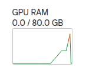
    
    `--yolo_max_edge` 인자를 받도록 하여, 최대 크기를 제한함.
    
- 간헐적 벤치마크 속도 지연 문제 (해결됨)
    - 인덱스 37까지 진행하는데 40분 이상 소요됨
        
        ```bash
        /content/drive/MyDrive/Benchmarks
        /usr/local/lib/python3.12/dist-packages/torch/cuda/__init__.py:65: FutureWarning: The pynvml package is deprecated. Please install nvidia-ml-py instead. If you did not install pynvml directly, please report this to the maintainers of the package that installed pynvml for you.
          import pynvml  # type: ignore[import]
        2026-05-16 04:00:13.452891: I tensorflow/core/util/port.cc:153] oneDNN custom operations are on. You may see slightly different numerical results due to floating-point round-off errors from different computation orders. To turn them off, set the environment variable `TF_ENABLE_ONEDNN_OPTS=0`.
        2026-05-16 04:00:13.523025: I tensorflow/core/platform/cpu_feature_guard.cc:210] This TensorFlow binary is optimized to use available CPU instructions in performance-critical operations.
        To enable the following instructions: AVX2 AVX512F AVX512_VNNI FMA, in other operations, rebuild TensorFlow with the appropriate compiler flags.
        Loading models for mme_rw_lite (1919 rows)... yolo_max_edge=7360
        [Model Memory] YOLO load time=0.1211s allocated_delta=0.00 MB reserved_delta=0.00 MB allocated_now=0.00 MB reserved_now=0.00 MB
        `torch_dtype` is deprecated! Use `dtype` instead!
        Loading checkpoint shards: 100% 2/2 [00:02<00:00,  1.36s/it]
        [Model Memory] Qwen load time=3.2912s allocated_delta=8465.11 MB reserved_delta=8466.00 MB allocated_now=8465.11 MB reserved_now=8466.00 MB
        WARNING ⚠️ imgsz=[4912, 7360] must be multiple of max stride 32, updating to [4928, 7360]
        [1/1919] source_index=0 ok=1 correct=1 acc=100.00% Total Time=128.6327s YOLO input=7360x4912->7360x4912 YOLO resized=0 YOLO mem_peak_alloc_delta=20405.41 MB YOLO mem_peak_reserved_delta=21860.00 MB Qwen mem_peak_alloc_delta=6413.59 MB Qwen mem_peak_reserved_delta=8210.00 MB Qwen prefill_alloc_delta=6413.59 MB Qwen decode_alloc_delta=3244.95 MB gt='A' pred='A'
        WARNING ⚠️ imgsz=[3244, 2432] must be multiple of max stride 32, updating to [3264, 2432]
        [2/1919] source_index=1 ok=0 correct=1 acc=50.00% Total Time=43.4304s YOLO input=2432x3244->2432x3244 YOLO resized=0 YOLO mem_peak_alloc_delta=1183.27 MB YOLO mem_peak_reserved_delta=0.00 MB Qwen mem_peak_alloc_delta=2661.25 MB Qwen mem_peak_reserved_delta=3282.00 MB Qwen prefill_alloc_delta=2661.25 MB Qwen decode_alloc_delta=1364.22 MB gt='B' pred='E'
        WARNING ⚠️ imgsz=[4912, 7360] must be multiple of max stride 32, updating to [4928, 7360]
        [3/1919] source_index=2 ok=1 correct=2 acc=66.67% Total Time=15.5569s YOLO input=7360x4912->7360x4912 YOLO resized=0 YOLO mem_peak_alloc_delta=20354.64 MB YOLO mem_peak_reserved_delta=19976.00 MB Qwen mem_peak_alloc_delta=1260.66 MB Qwen mem_peak_reserved_delta=1330.00 MB Qwen prefill_alloc_delta=1260.66 MB Qwen decode_alloc_delta=662.44 MB gt='D' pred='D'
        WARNING ⚠️ imgsz=[4912, 7360] must be multiple of max stride 32, updating to [4928, 7360]
        [4/1919] source_index=3 ok=0 correct=2 acc=50.00% Total Time=26.1443s YOLO input=7360x4912->7360x4912 YOLO resized=0 YOLO mem_peak_alloc_delta=20354.64 MB YOLO mem_peak_reserved_delta=21084.00 MB Qwen mem_peak_alloc_delta=1785.63 MB Qwen mem_peak_reserved_delta=2140.00 MB Qwen prefill_alloc_delta=1785.63 MB Qwen decode_alloc_delta=926.14 MB gt='D' pred='E'
        WARNING ⚠️ imgsz=[4097, 4096] must be multiple of max stride 32, updating to [4128, 4096]
        [5/1919] source_index=4 ok=1 correct=3 acc=60.00% Total Time=4.6901s YOLO input=4096x4097->4096x4097 YOLO resized=0 YOLO mem_peak_alloc_delta=4724.62 MB YOLO mem_peak_reserved_delta=4164.00 MB Qwen mem_peak_alloc_delta=848.89 MB Qwen mem_peak_reserved_delta=902.00 MB Qwen prefill_alloc_delta=848.89 MB Qwen decode_alloc_delta=454.60 MB gt='C' pred='C'
        [6/1919] source_index=5 ok=0 correct=3 acc=50.00% Total Time=33.0822s YOLO input=4096x4096->4096x4096 YOLO resized=0 YOLO mem_peak_alloc_delta=4656.22 MB YOLO mem_peak_reserved_delta=4738.00 MB Qwen mem_peak_alloc_delta=2192.44 MB Qwen mem_peak_reserved_delta=2674.00 MB Qwen prefill_alloc_delta=2192.44 MB Qwen decode_alloc_delta=1130.29 MB gt='C' pred='E'
        WARNING ⚠️ imgsz=[4912, 7360] must be multiple of max stride 32, updating to [4928, 7360]
        [7/1919] source_index=6 ok=1 correct=4 acc=57.14% Total Time=163.4906s YOLO input=7360x4912->7360x4912 YOLO resized=0 YOLO mem_peak_alloc_delta=20354.64 MB YOLO mem_peak_reserved_delta=20530.00 MB Qwen mem_peak_alloc_delta=7973.83 MB Qwen mem_peak_reserved_delta=10336.00 MB Qwen prefill_alloc_delta=7973.83 MB Qwen decode_alloc_delta=4027.06 MB gt='C' pred='C'
        WARNING ⚠️ imgsz=[4912, 7360] must be multiple of max stride 32, updating to [4928, 7360]
        [8/1919] source_index=7 ok=0 correct=4 acc=50.00% Total Time=96.0103s YOLO input=7360x4912->7360x4912 YOLO resized=0 YOLO mem_peak_alloc_delta=20354.76 MB YOLO mem_peak_reserved_delta=19144.00 MB Qwen mem_peak_alloc_delta=4962.19 MB Qwen mem_peak_reserved_delta=6242.00 MB Qwen prefill_alloc_delta=4962.19 MB Qwen decode_alloc_delta=2520.36 MB gt='D' pred='A'
        WARNING ⚠️ imgsz=[6000, 6000] must be multiple of max stride 32, updating to [6016, 6016]
        [9/1919] source_index=8 ok=1 correct=5 acc=55.56% Total Time=15.2776s YOLO input=6000x6000->6000x6000 YOLO resized=0 YOLO mem_peak_alloc_delta=20269.60 MB YOLO mem_peak_reserved_delta=19064.00 MB Qwen mem_peak_alloc_delta=1508.33 MB Qwen mem_peak_reserved_delta=1658.00 MB Qwen prefill_alloc_delta=1508.33 MB Qwen decode_alloc_delta=795.98 MB gt='B' pred='B'
        WARNING ⚠️ imgsz=[4912, 7360] must be multiple of max stride 32, updating to [4928, 7360]
        [10/1919] source_index=9 ok=1 correct=6 acc=60.00% Total Time=171.4900s YOLO input=7360x4912->7360x4912 YOLO resized=0 YOLO mem_peak_alloc_delta=20354.64 MB YOLO mem_peak_reserved_delta=20808.00 MB Qwen mem_peak_alloc_delta=8402.45 MB Qwen mem_peak_reserved_delta=11044.00 MB Qwen prefill_alloc_delta=8402.45 MB Qwen decode_alloc_delta=4244.12 MB gt='D' pred='D'
        WARNING ⚠️ imgsz=[1419, 1272] must be multiple of max stride 32, updating to [1440, 1280]
        [11/1919] source_index=10 ok=1 correct=7 acc=63.64% Total Time=5.7310s YOLO input=1272x1419->1272x1419 YOLO resized=0 YOLO mem_peak_alloc_delta=112.70 MB YOLO mem_peak_reserved_delta=0.00 MB Qwen mem_peak_alloc_delta=972.93 MB Qwen mem_peak_reserved_delta=1046.00 MB Qwen prefill_alloc_delta=972.93 MB Qwen decode_alloc_delta=516.21 MB gt='D' pred='D'
        WARNING ⚠️ imgsz=[4912, 7360] must be multiple of max stride 32, updating to [4928, 7360]
        [12/1919] source_index=11 ok=0 correct=7 acc=58.33% Total Time=117.6159s YOLO input=7360x4912->7360x4912 YOLO resized=0 YOLO mem_peak_alloc_delta=20355.21 MB YOLO mem_peak_reserved_delta=21362.00 MB Qwen mem_peak_alloc_delta=5925.34 MB Qwen mem_peak_reserved_delta=7004.00 MB Qwen prefill_alloc_delta=5925.34 MB Qwen decode_alloc_delta=2998.81 MB gt='C' pred='E'
        WARNING ⚠️ imgsz=[4912, 7360] must be multiple of max stride 32, updating to [4928, 7360]
        [13/1919] source_index=12 ok=1 correct=8 acc=61.54% Total Time=128.3096s YOLO input=7360x4912->7360x4912 YOLO resized=0 YOLO mem_peak_alloc_delta=20354.64 MB YOLO mem_peak_reserved_delta=19144.00 MB Qwen mem_peak_alloc_delta=6399.82 MB Qwen mem_peak_reserved_delta=7560.00 MB Qwen prefill_alloc_delta=6399.82 MB Qwen decode_alloc_delta=3237.30 MB gt='B' pred='B'
        [14/1919] source_index=13 ok=0 correct=8 acc=57.14% Total Time=5.2819s YOLO input=4096x4096->4096x4096 YOLO resized=0 YOLO mem_peak_alloc_delta=4656.00 MB YOLO mem_peak_reserved_delta=0.00 MB Qwen mem_peak_alloc_delta=880.52 MB Qwen mem_peak_reserved_delta=888.00 MB Qwen prefill_alloc_delta=880.52 MB Qwen decode_alloc_delta=469.53 MB gt='B' pred='A'
        WARNING ⚠️ imgsz=[4912, 7360] must be multiple of max stride 32, updating to [4928, 7360]
        [15/1919] source_index=14 ok=0 correct=8 acc=53.33% Total Time=170.3162s YOLO input=7360x4912->7360x4912 YOLO resized=0 YOLO mem_peak_alloc_delta=20355.21 MB YOLO mem_peak_reserved_delta=21362.00 MB Qwen mem_peak_alloc_delta=8415.69 MB Qwen mem_peak_reserved_delta=10986.00 MB Qwen prefill_alloc_delta=8415.69 MB Qwen decode_alloc_delta=4243.72 MB gt='A' pred='E'
        WARNING ⚠️ imgsz=[4912, 7360] must be multiple of max stride 32, updating to [4928, 7360]
        [16/1919] source_index=15 ok=0 correct=8 acc=50.00% Total Time=93.2388s YOLO input=7360x4912->7360x4912 YOLO resized=0 YOLO mem_peak_alloc_delta=20354.80 MB YOLO mem_peak_reserved_delta=19144.00 MB Qwen mem_peak_alloc_delta=4880.59 MB Qwen mem_peak_reserved_delta=6114.00 MB Qwen prefill_alloc_delta=4880.59 MB Qwen decode_alloc_delta=2473.79 MB gt='B' pred='C'
        WARNING ⚠️ imgsz=[4912, 7360] must be multiple of max stride 32, updating to [4928, 7360]
        [17/1919] source_index=16 ok=1 correct=9 acc=52.94% Total Time=6.6006s YOLO input=7360x4912->7360x4912 YOLO resized=0 YOLO mem_peak_alloc_delta=20354.64 MB YOLO mem_peak_reserved_delta=19144.00 MB Qwen mem_peak_alloc_delta=831.66 MB Qwen mem_peak_reserved_delta=764.00 MB Qwen prefill_alloc_delta=831.66 MB Qwen decode_alloc_delta=446.68 MB gt='C' pred='C'
        WARNING ⚠️ imgsz=[4912, 7360] must be multiple of max stride 32, updating to [4928, 7360]
        [18/1919] source_index=17 ok=0 correct=9 acc=50.00% Total Time=130.0143s YOLO input=7360x4912->7360x4912 YOLO resized=0 YOLO mem_peak_alloc_delta=20355.21 MB YOLO mem_peak_reserved_delta=21362.00 MB Qwen mem_peak_alloc_delta=6591.79 MB Qwen mem_peak_reserved_delta=8614.00 MB Qwen prefill_alloc_delta=6591.79 MB Qwen decode_alloc_delta=3332.58 MB gt='D' pred='E'
        WARNING ⚠️ imgsz=[4912, 7360] must be multiple of max stride 32, updating to [4928, 7360]
        [19/1919] source_index=18 ok=0 correct=9 acc=47.37% Total Time=167.2736s YOLO input=7360x4912->7360x4912 YOLO resized=0 YOLO mem_peak_alloc_delta=20354.64 MB YOLO mem_peak_reserved_delta=19144.00 MB Qwen mem_peak_alloc_delta=8349.22 MB Qwen mem_peak_reserved_delta=10462.00 MB Qwen prefill_alloc_delta=8349.22 MB Qwen decode_alloc_delta=4212.93 MB gt='A' pred='E'
        WARNING ⚠️ imgsz=[4096, 4097] must be multiple of max stride 32, updating to [4096, 4128]
        [20/1919] source_index=19 ok=0 correct=9 acc=45.00% Total Time=12.2307s YOLO input=4097x4096->4097x4096 YOLO resized=0 YOLO mem_peak_alloc_delta=4724.62 MB YOLO mem_peak_reserved_delta=0.00 MB Qwen mem_peak_alloc_delta=1177.62 MB Qwen mem_peak_reserved_delta=1314.00 MB Qwen prefill_alloc_delta=1177.62 MB Qwen decode_alloc_delta=618.04 MB gt='B' pred='D'
        WARNING ⚠️ imgsz=[4096, 4097] must be multiple of max stride 32, updating to [4096, 4128]
        [21/1919] source_index=20 ok=0 correct=9 acc=42.86% Total Time=18.0488s YOLO input=4097x4096->4097x4096 YOLO resized=0 YOLO mem_peak_alloc_delta=4724.62 MB YOLO mem_peak_reserved_delta=4552.00 MB Qwen mem_peak_alloc_delta=1444.23 MB Qwen mem_peak_reserved_delta=1608.00 MB Qwen prefill_alloc_delta=1444.23 MB Qwen decode_alloc_delta=756.94 MB gt='D' pred='C'
        [22/1919] source_index=21 ok=1 correct=10 acc=45.45% Total Time=4.4424s YOLO input=4096x4096->4096x4096 YOLO resized=0 YOLO mem_peak_alloc_delta=4656.00 MB YOLO mem_peak_reserved_delta=4096.00 MB Qwen mem_peak_alloc_delta=842.72 MB Qwen mem_peak_reserved_delta=812.00 MB Qwen prefill_alloc_delta=842.72 MB Qwen decode_alloc_delta=452.19 MB gt='A' pred='A'
        WARNING ⚠️ imgsz=[1062, 921] must be multiple of max stride 32, updating to [1088, 928]
        [23/1919] source_index=22 ok=0 correct=10 acc=43.48% Total Time=2.2588s YOLO input=921x1062->921x1062 YOLO resized=0 YOLO mem_peak_alloc_delta=57.79 MB YOLO mem_peak_reserved_delta=2.00 MB Qwen mem_peak_alloc_delta=789.36 MB Qwen mem_peak_reserved_delta=784.00 MB Qwen prefill_alloc_delta=789.36 MB Qwen decode_alloc_delta=424.53 MB gt='B' pred='A'
        WARNING ⚠️ imgsz=[4912, 7360] must be multiple of max stride 32, updating to [4928, 7360]
        [24/1919] source_index=23 ok=0 correct=10 acc=41.67% Total Time=173.2671s YOLO input=7360x4912->7360x4912 YOLO resized=0 YOLO mem_peak_alloc_delta=20354.64 MB YOLO mem_peak_reserved_delta=21362.00 MB Qwen mem_peak_alloc_delta=8430.32 MB Qwen mem_peak_reserved_delta=11006.00 MB Qwen prefill_alloc_delta=8430.32 MB Qwen decode_alloc_delta=4256.57 MB gt='A' pred='E'
        [25/1919] source_index=24 ok=1 correct=11 acc=44.00% Total Time=9.1258s YOLO input=4096x4096->4096x4096 YOLO resized=0 YOLO mem_peak_alloc_delta=4656.00 MB YOLO mem_peak_reserved_delta=0.00 MB Qwen mem_peak_alloc_delta=1030.96 MB Qwen mem_peak_reserved_delta=1040.00 MB Qwen prefill_alloc_delta=1030.96 MB Qwen decode_alloc_delta=545.48 MB gt='C' pred='C'
        WARNING ⚠️ imgsz=[4381, 4131] must be multiple of max stride 32, updating to [4384, 4160]
        [26/1919] source_index=25 ok=1 correct=12 acc=46.15% Total Time=78.7125s YOLO input=4131x4381->4131x4381 YOLO resized=0 YOLO mem_peak_alloc_delta=5449.63 MB YOLO mem_peak_reserved_delta=5542.00 MB Qwen mem_peak_alloc_delta=4168.38 MB Qwen mem_peak_reserved_delta=5270.00 MB Qwen prefill_alloc_delta=4168.38 MB Qwen decode_alloc_delta=2121.04 MB gt='A' pred='A'
        WARNING ⚠️ imgsz=[4912, 7360] must be multiple of max stride 32, updating to [4928, 7360]
        [27/1919] source_index=26 ok=0 correct=12 acc=44.44% Total Time=171.9921s YOLO input=7360x4912->7360x4912 YOLO resized=0 YOLO mem_peak_alloc_delta=20354.84 MB YOLO mem_peak_reserved_delta=19144.00 MB Qwen mem_peak_alloc_delta=8319.51 MB Qwen mem_peak_reserved_delta=10700.00 MB Qwen prefill_alloc_delta=8319.51 MB Qwen decode_alloc_delta=4193.61 MB gt='B' pred='E'
        [28/1919] source_index=27 ok=1 correct=13 acc=46.43% Total Time=4.4009s YOLO input=4096x4096->4096x4096 YOLO resized=0 YOLO mem_peak_alloc_delta=4656.00 MB YOLO mem_peak_reserved_delta=0.00 MB Qwen mem_peak_alloc_delta=792.44 MB Qwen mem_peak_reserved_delta=848.00 MB Qwen prefill_alloc_delta=792.44 MB Qwen decode_alloc_delta=427.18 MB gt='D' pred='D'
        WARNING ⚠️ imgsz=[6000, 6000] must be multiple of max stride 32, updating to [6016, 6016]
        [29/1919] source_index=28 ok=1 correct=14 acc=48.28% Total Time=53.1568s YOLO input=6000x6000->6000x6000 YOLO resized=0 YOLO mem_peak_alloc_delta=20269.30 MB YOLO mem_peak_reserved_delta=21280.00 MB Qwen mem_peak_alloc_delta=3021.04 MB Qwen mem_peak_reserved_delta=3186.00 MB Qwen prefill_alloc_delta=3021.04 MB Qwen decode_alloc_delta=1542.01 MB gt='D' pred='D'
        WARNING ⚠️ imgsz=[4912, 7360] must be multiple of max stride 32, updating to [4928, 7360]
        [30/1919] source_index=29 ok=0 correct=14 acc=46.67% Total Time=20.8276s YOLO input=7360x4912->7360x4912 YOLO resized=0 YOLO mem_peak_alloc_delta=20354.64 MB YOLO mem_peak_reserved_delta=19144.00 MB Qwen mem_peak_alloc_delta=1491.88 MB Qwen mem_peak_reserved_delta=1600.00 MB Qwen prefill_alloc_delta=1491.88 MB Qwen decode_alloc_delta=777.27 MB gt='D' pred='B'
        WARNING ⚠️ imgsz=[4912, 7360] must be multiple of max stride 32, updating to [4928, 7360]
        [31/1919] source_index=30 ok=1 correct=15 acc=48.39% Total Time=40.4529s YOLO input=7360x4912->7360x4912 YOLO resized=0 YOLO mem_peak_alloc_delta=20355.21 MB YOLO mem_peak_reserved_delta=20808.00 MB Qwen mem_peak_alloc_delta=2349.76 MB Qwen mem_peak_reserved_delta=2776.00 MB Qwen prefill_alloc_delta=2349.76 MB Qwen decode_alloc_delta=1205.63 MB gt='B' pred='B'
        WARNING ⚠️ imgsz=[4912, 7360] must be multiple of max stride 32, updating to [4928, 7360]
        [32/1919] source_index=31 ok=1 correct=16 acc=50.00% Total Time=135.2505s YOLO input=7360x4912->7360x4912 YOLO resized=0 YOLO mem_peak_alloc_delta=20354.64 MB YOLO mem_peak_reserved_delta=19976.00 MB Qwen mem_peak_alloc_delta=6880.15 MB Qwen mem_peak_reserved_delta=8938.00 MB Qwen prefill_alloc_delta=6880.15 MB Qwen decode_alloc_delta=3480.65 MB gt='B' pred='B'
        WARNING ⚠️ imgsz=[2098, 2098] must be multiple of max stride 32, updating to [2112, 2112]
        [33/1919] source_index=32 ok=1 correct=17 acc=51.52% Total Time=3.4704s YOLO input=2098x2098->2098x2098 YOLO resized=0 YOLO mem_peak_alloc_delta=439.84 MB YOLO mem_peak_reserved_delta=0.00 MB Qwen mem_peak_alloc_delta=849.74 MB Qwen mem_peak_reserved_delta=844.00 MB Qwen prefill_alloc_delta=849.74 MB Qwen decode_alloc_delta=456.21 MB gt='A' pred='A'
        WARNING ⚠️ imgsz=[4096, 4097] must be multiple of max stride 32, updating to [4096, 4128]
        [34/1919] source_index=33 ok=0 correct=17 acc=50.00% Total Time=3.7147s YOLO input=4097x4096->4097x4096 YOLO resized=0 YOLO mem_peak_alloc_delta=4724.62 MB YOLO mem_peak_reserved_delta=4810.00 MB Qwen mem_peak_alloc_delta=793.23 MB Qwen mem_peak_reserved_delta=668.00 MB Qwen prefill_alloc_delta=793.23 MB Qwen decode_alloc_delta=426.58 MB gt='A' pred='E'
        [35/1919] source_index=34 ok=0 correct=17 acc=48.57% Total Time=20.8593s YOLO input=4096x4096->4096x4096 YOLO resized=0 YOLO mem_peak_alloc_delta=4656.00 MB YOLO mem_peak_reserved_delta=4738.00 MB Qwen mem_peak_alloc_delta=1475.24 MB Qwen mem_peak_reserved_delta=1562.00 MB Qwen prefill_alloc_delta=1475.24 MB Qwen decode_alloc_delta=769.14 MB gt='B' pred='E'
        WARNING ⚠️ imgsz=[4096, 4097] must be multiple of max stride 32, updating to [4096, 4128]
        [36/1919] source_index=35 ok=1 correct=18 acc=50.00% Total Time=30.3538s YOLO input=4097x4096->4097x4096 YOLO resized=0 YOLO mem_peak_alloc_delta=4724.62 MB YOLO mem_peak_reserved_delta=4164.00 MB Qwen mem_peak_alloc_delta=2008.23 MB Qwen mem_peak_reserved_delta=2284.00 MB Qwen prefill_alloc_delta=2008.23 MB Qwen decode_alloc_delta=1039.21 MB gt='C' pred='C'
        WARNING ⚠️ imgsz=[4912, 7360] must be multiple of max stride 32, updating to [4928, 7360]
        [37/1919] source_index=36 ok=0 correct=18 acc=48.65% Total Time=171.6669s YOLO input=7360x4912->7360x4912 YOLO resized=0 YOLO mem_peak_alloc_delta=20355.21 MB YOLO mem_peak_reserved_delta=20530.00 MB Qwen mem_peak_alloc_delta=8336.05 MB Qwen mem_peak_reserved_delta=10286.00 MB Qwen prefill_alloc_delta=8336.05 MB Qwen decode_alloc_delta=4206.75 MB gt='D' pred='E'
        WARNING ⚠️ imgsz=[4912, 7360] must be multiple of max stride 32, updating to [4928, 7360]
        ```
        
    
    대부분의 벤치마크 문제들은 이미지 사이즈가 큰데도 불구하고 빠르게 연산되는데, 몇몇 문제들은 100초 이상이 소요되었다.
    
    일반적으로 빠르게 진행되다가 어느 순간부터 시간이 오래걸리기 시작하고, 다시 속도가 복구되는 경향을 보였다.
    
    해당 지연을 Breakdown 해보니 Preprocess(전처리)에 걸린 시간 비중이 제일 높았다. ~~Yolo 관련 문제일 가능성이 있다.~~
    
    모든 벤치마크에서 간헐적으로 발생하는 것으로 보아, ~~런타임 관련 문제인 것 같기도 하다.~~
    
    문제 원인은 구글 드라이브를 마운트한 경로에서 벤치마크 중간 결과들 (Crop된 이미지들)이 저장되고 로드되어 수많은 Crop된 이미지들에 대해 드라이브 동기화 지연 문제가 터졌던 것으로 추측된다. 
    
    **실제 겪었던 드라이브 동기화 문제들**
    
    - 드라이브 내에 json 파일에 접근하지 못해 벤차마킹이 중간에 터지는 경우가 1번 있었다.
    - Colab에서는 이미 업데이트된 파일이 구글 드라이브에 동기화되기까지 20분 넘게 소요되는 경우가 많았다.
    - 고화질로 Crop된 이미지들이 너무 많이 쌓여서 **기존 드라이브 용량이 쉽게 부족해지는 문제**가 생겼다.
    
    이에 벤치마킹 스크립트의 `--work_dir` 인자에 **런타임 내부 경로**인 `/content/benchmark_runs` 를 넣어 **벤치마크 중간 결과들을 빌린 런타임의 내부 경로에 저장**하도록 하니, 이런 케이스들이 사라진 것으로 보인다.
    
    **Merge 오버헤드?**
    
    이전에 진행했던 벤치마크에서 `CNN_MERGE_VLM.py`의 **Merge 오버헤드**가 매우 컸었는데, 혹시 이게 원인인가 추측해본다. 
    
    - `CNN_VLM.py`은 Crop한 이미지를 Write하고 입력할 때 Read
    - `CNN_MERGE_VLM.py`는 Crop한 이미지를 Write하고, Merge 동작을 하기 위해 다시 Read 한 뒤 결과를 다시 Write하고, 입력할 때 Read
    
    즉 이론상 기존보다 마운트된 드라이브 경로를 **2배 더 많이 접근**하게 된다. 이에 **간헐적으로 발생하던 동기화 지연이 더 많이 터진게 아닌가 의심**해본다.
    
    이에 경로 수정 후 벤치마크 진행 결과, 여전히 수백개 오브젝트가 탐지될 경우 Yolo 및 Merge 동작 시간이 포함되는 Preprocess 단계에서 수백초 수준의 지연이 발생했다. 즉 Merge 오버헤드의 주된 원인이라기 보다는, **Merge 동작의 지연을 증가시키는 부수적인 요소**가 되었을 수 있다. 주된 원인으로는 여전히 알고리즘적인 문제로 추측된다.
    

## 벤치마크 진행

### **테스트**

```bash
%%bash
python3 CNN_VLM_V2_Benchmark_HRBench_4K.py --thumbsz 1280x1280 --max_rows 5
python3 CNN_VLM_V2_Benchmark_MME-RWLite.py --thumbsz 1280x1280 --data_zip /content/drive/MyDrive/Benchmarks/datasets/MME-RWLite/data.zip --max_rows 5
python3 CNN_VLM_V2_Benchmark_TreeBench.py --thumbsz 1280x1280 --max_rows 5
python3 CNN_VLM_V2_Benchmark_VStar.py --thumbsz 1280x1280 --max_rows 5
```

### **풀 셋**

**1280x1280**

```bash
!mkdir -p /content/benchmark_runs && \
cd /content/drive/MyDrive/Benchmarks && \
pwd && \
python3 CNN_VLM_V2_Benchmark_HRBench_4K.py --thumbsz 1280x1280 --work_dir /content/benchmark_runs && \
python3 CNN_VLM_V2_Benchmark_MME-RWLite.py --thumbsz 1280x1280 --work_dir /content/benchmark_runs --data_zip /content/drive/MyDrive/Benchmarks/datasets/MME-RWLite/data.zip --yolo_max_edge 7360 && \
python3 CNN_VLM_V2_Benchmark_TreeBench.py --thumbsz 1280x1280 --work_dir /content/benchmark_runs && \
python3 CNN_VLM_V2_Benchmark_VStar.py --thumbsz 1280x1280 --work_dir /content/benchmark_runs && \
```

**1080x1080**

```bash
!mkdir -p /content/benchmark_runs && \
cd /content/drive/MyDrive/Benchmarks && \
pwd && \
python3 CNN_VLM_V2_Benchmark_HRBench_4K.py --thumbsz 1080x1080 --work_dir /content/benchmark_runs && \
python3 CNN_VLM_V2_Benchmark_MME-RWLite.py --thumbsz 1080x1080 --work_dir /content/benchmark_runs --data_zip /content/drive/MyDrive/Benchmarks/datasets/MME-RWLite/data.zip --yolo_max_edge 7360 &&
python3 CNN_VLM_V2_Benchmark_TreeBench.py --thumbsz 1080x1080 --work_dir /content/benchmark_runs && \
python3 CNN_VLM_V2_Benchmark_VStar.py --thumbsz 1080x1080 --work_dir /content/benchmark_runs && \

```

**960x960**

```bash
!mkdir -p /content/benchmark_runs && \
cd /content/drive/MyDrive/Benchmarks && \
pwd && \
python3 CNN_VLM_V2_Benchmark_HRBench_4K.py --thumbsz 960x960 --work_dir /content/benchmark_runs && \
python3 CNN_VLM_V2_Benchmark_MME-RWLite.py --thumbsz 960x960 --work_dir /content/benchmark_runs --data_zip /content/drive/MyDrive/Benchmarks/datasets/MME-RWLite/data.zip --yolo_max_edge 7360 && \
python3 CNN_VLM_V2_Benchmark_TreeBench.py --thumbsz 960x960 --work_dir /content/benchmark_runs && \
python3 CNN_VLM_V2_Benchmark_VStar.py --thumbsz 960x960 --work_dir /content/benchmark_runs && \
```

**480x480**

```bash
!mkdir -p /content/benchmark_runs && \
cd /content/drive/MyDrive/Benchmarks && \
pwd && \
python3 CNN_VLM_V2_Benchmark_HRBench_4K.py --thumbsz 480x480 --work_dir /content/benchmark_runs && \
python3 CNN_VLM_V2_Benchmark_MME-RWLite.py --thumbsz 480x480 --work_dir /content/benchmark_runs --data_zip /content/drive/MyDrive/Benchmarks/datasets/MME-RWLite/data.zip --yolo_max_edge 7360 && \
python3 CNN_VLM_V2_Benchmark_TreeBench.py --thumbsz 480x480 --work_dir /content/benchmark_runs && \
python3 CNN_VLM_V2_Benchmark_VStar.py --thumbsz 480x480 --work_dir /content/benchmark_runs
```

### 결과 데이터

[260516_all_benchmarks_summary_raw.csv](260516_all_benchmarks_summary_raw.csv)

[260516_all_benchmarks_summary_edit.csv](260516_all_benchmarks_summary_edit.csv)

결과 수집중…

[260516_all_benchmarks_summary_edit.csv](260516_all_benchmarks_summary_edit%201.csv)

## 비교 1 : CNN_VLM vs CNN_VLM_NO_LABEL


### 고해상도 벤치마크

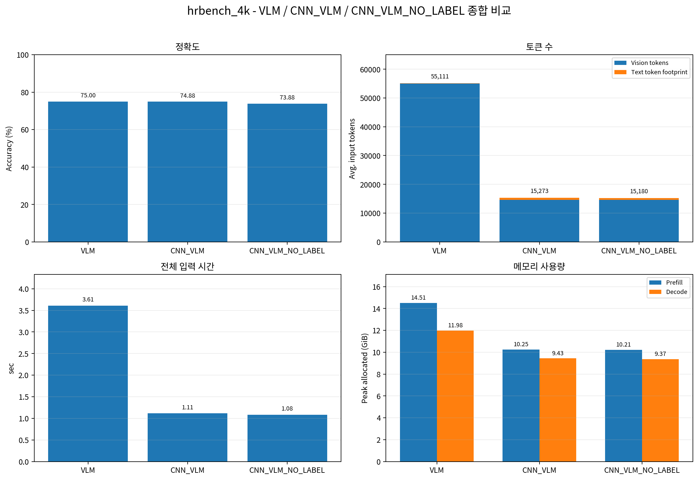

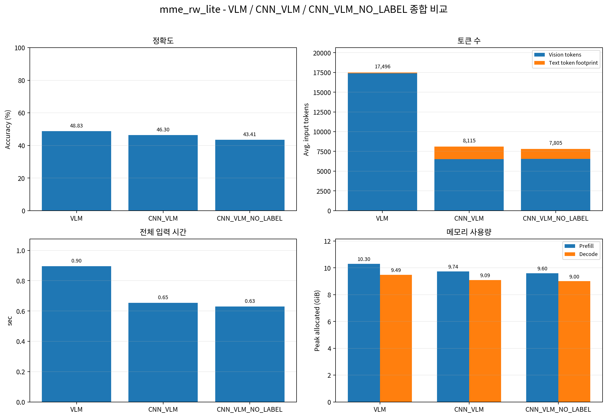


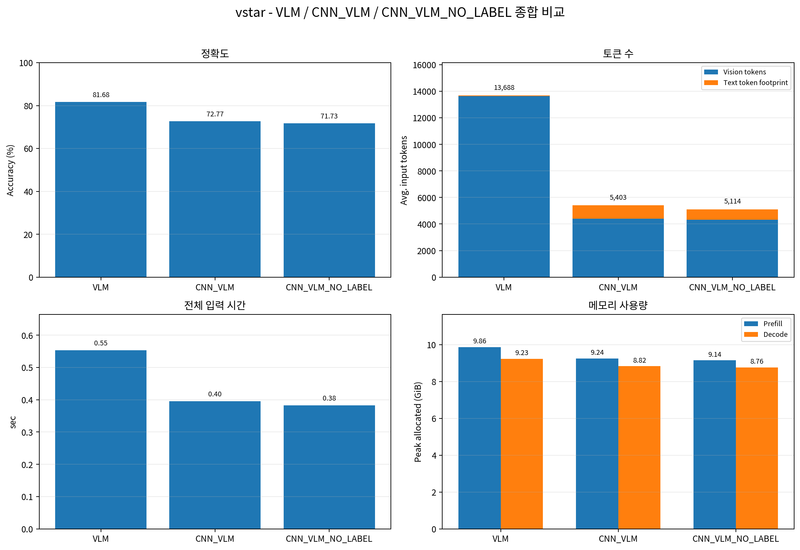

### 저해상도 벤치마크

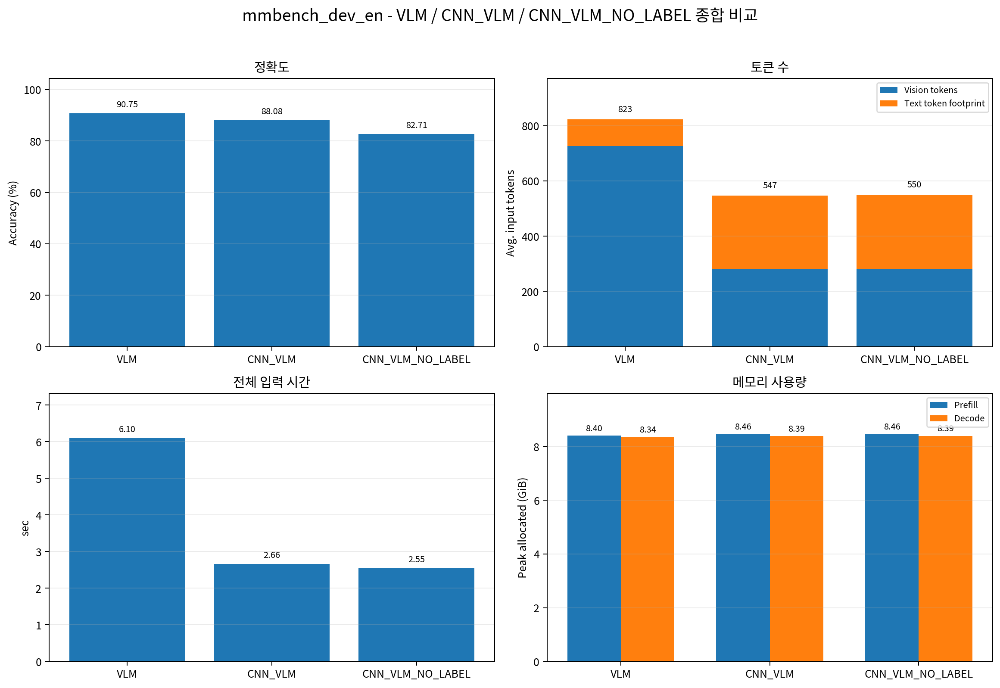

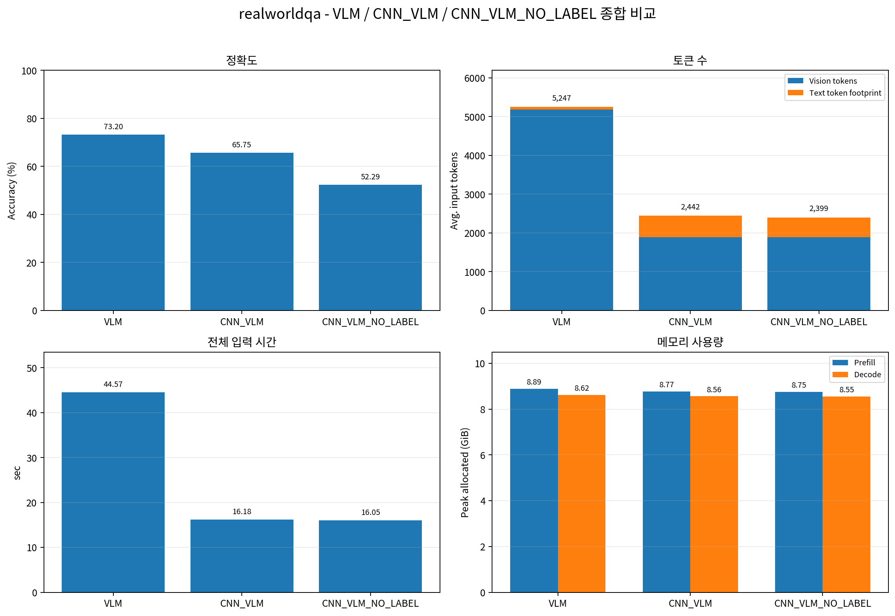

### 결과

| Benchmark | VLM 정확도 | CNN_VLM 정확도 | CNN_VLM_NO_LABEL 정확도 | NO_LABEL 하락폭 vs VLM | 상대 하락률 vs VLM | NO_LABEL 하락폭 vs CNN_VLM | 상대 하락률 vs CNN_VLM |
| --- | --- | --- | --- | --- | --- | --- | --- |
| **HR-Bench 4K** | 75.00% | 74.88% | 73.88% | **-1.13%p** | **-1.50%** | **-1.00%p** | **-1.34%** |
| **MME-RWLite** | 48.83% | 46.30% | 43.41% | **-5.42%p** | **-11.10%** | **-2.89%p** | **-6.24%** |
| **TreeBench** | 45.19% | 42.72% | 43.70% | **-1.48%p** | **-3.28%** | **+0.99%p** | **+2.31%** |
| *V Bench** | 81.68% | 72.77% | 71.73% | **-9.95%p** | **-12.18%** | **-1.05%p** | **-1.44%** |
| **MMBench** | 90.75% | 88.08% | 82.71% | **-8.04%p** | **-8.86%** | **-5.37%p** | **-6.10%** |
| **RealWorldQA** | 73.20% | 65.75% | 52.29% | **-20.92%p** | **-28.57%** | **-13.46%p** | **-20.48%** |

공통적으로 토큰 수, 전체 입력 시간, 메모리 사용량은 소폭 감소하였다.

### 결론

저해상도 벤치마크에서는, 원래 저해상도인 원본 이미지가 더욱 저해상도로 축소되면서 발생한 문맥 손실이 컸을 것으로 예상된다. 이때 Crop된 이미지만으로는 보존되는 문맥 정보가 적었고, Label이 이를 크게 보조하고 있었던 것으로 추정된다. 

즉, 저해상도 벤치마크에서는 이미지로 얻을 수 있는 정보량 대비 텍스트로 얻는 정보량이 의미있는 수준이었던 것으로 추정된다.

고해상도 벤치마크에서는, 원래 고해상도인 원본 이미지가 중간 해상도로 축소되면서 발생한 문맥 손실 자체가 작았다. Crop된 이미지만으로도 이를 보조하는데 충분하였고, Label이 기여하는 바가 작았던 것으로 추정된다.

즉, 고해상도 벤치마크에서는 이미지로 이미 충분한 정보량을 얻어 텍스트로 얻는 정보량이 크게 의미없었다고 추정된다.

라벨이 떨어지는 정확도를 보조하는 역할이, 저해상도일수록 크게 나타난다고 추론해 볼 수 있다.

비교 대상으로 VLM_4to1을 추가하여, CNN이 실제로 얼마나 정확도를 보조했는지, 그리고 라벨이 실제로 얼마나 정확도를 보조했는지 추가적인 분석이 필요하다.

고해상도 벤치마킹에서는 라벨이 크게 의미 없는 수준이었고, 저해상도 벤치마킹에서는 라벨의 역할이 컸다. 우리 연구는 일단 고해상도에 초점을 맞추고 있으므로 제거하더라도 괜찮다고 생각한다.

## 비교 2 : VLM vs CNN_VLM_NO_LABEL vs CNN_VLM_V2

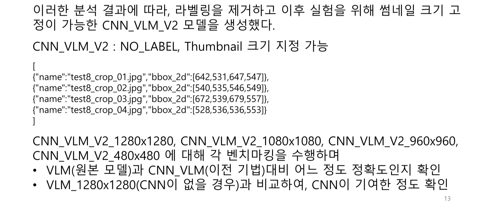

사실 라벨 제거 효과가 클 것이라고 생각하고 미리 벤치마킹을 돌렸다.

라벨 제거를 하지 않는 CNN_VLM_V2에 대해 결과를 다시 수집하긴 시간이 걸리므로 비교는 CNN_VLM이 아닌 CNN_VLM_NO_LABEL을 기준으로 삼겠다.

### 고해상도 벤치마크

각 벤치마크에서 CNN_VLM_NO_LABEL이 생성하는 썸네일의 평균 해상도 (4:1 압축 방식)

- HR-Bench 4K **2246 × 1583**
- MME-RWLite **1418 × 783**
- TreeBench **1076 × 808**
- V* Bench **1123 × 792**
- MMBench **232.5 × 176.6**
- RealWorldQA  **658 × 515**

.png)

.png)

.png)

.png)

**CNN_VLM_V2_1280x1280**

| Benchmark | VLM 정확도 | CNN_VLM_V2_1280x1280 정확도 | 절대 하락폭 | 상대 하락률 | 정답 수 변화 |
| --- | --- | --- | --- | --- | --- |
| **HR-Bench 4K** | 75.00% | 72.00% | **-3.00%p** | **-4.00%** | 600 → 576, **-24개** |
| **MME-RWLite** | 48.83% | 45.75% | **-3.07%p** | **-6.30%** | 937 → 878, **-59개** |
| **TreeBench** | 45.19% | 45.19% | **0.00%p** | **0.00%** | 183 → 183, **변화 없음** |
| *V Bench** | 81.68% | 73.30% | **-8.38%p** | **-10.26%** | 156 → 140, **-16개** |

**CNN_VLM_V2_1080x1080**

| Benchmark | VLM 정확도 | CNN_VLM_V2_1080x1080 정확도 | 절대 하락폭 | 상대 하락률 | 정답 수 변화 |
| --- | --- | --- | --- | --- | --- |
| **HR-Bench 4K** | 75.00% | 68.62% | **-6.38%p** | **-8.50%** | 600 → 549, **-51개** |
| **MME-RWLite** | 48.83% | 45.28% | **-3.54%p** | **-7.26%** | 937 → 869, **-68개** |
| **TreeBench** | 45.19% | 42.47% | **-2.72%p** | **-6.01%** | 183 → 172, **-11개** |
| *V Bench** | 81.68% | 71.20% | **-10.47%p** | **-12.82%** | 156 → 136, **-20개** |

**CNN_VLM_V2_960x960** (상대 하략률 -10% 수준으로 사실상 마지노선)

| Benchmark | VLM 정확도 | CNN_VLM_V2_960x960 정확도 | 절대 하락폭 | 상대 하락률 | 정답 수 변화 |
| --- | --- | --- | --- | --- | --- |
| **HR-Bench 4K** | 75.00% | 67.50% | **-7.50%p** | **-10.00%** | 600 → 540, **-60개** |
| **MME-RWLite** | 48.83% | 43.20% | **-5.63%p** | **-11.53%** | 937 → 829, **-108개** |
| **TreeBench** | 45.19% | 44.20% | **-0.99%p** | **-2.19%** | 183 → 179, **-4개** |
| *V Bench** | 81.68% | 70.16% | **-11.52%p** | **-14.10%** | 156 → 134, **-22개** |

**CNN_VLM_V2_480x480**

| Benchmark | VLM 정확도 | CNN_VLM_V2_480x480 정확도 | 절대 하락폭 | 상대 하락률 | 정답 수 변화 |
| --- | --- | --- | --- | --- | --- |
| **HR-Bench 4K** | 75.00% | 55.62% | **-19.38%p** | **-25.83%** | 600 → 445, **-155개** |
| **MME-RWLite** | 48.83% | 35.33% | **-13.50%p** | **-27.64%** | 937 → 678, **-259개** |
| **TreeBench** | 45.19% | 41.98% | **-3.21%p** | **-7.10%** | 183 → 170, **-13개** |
| *V Bench** | 81.68% | 62.30% | **-19.37%p** | **-23.72%** | 156 → 119, **-37개** |

썸네일이 480x480 수준까지 축소되자, 상대 하락률이 매우 커졌다.

### 저해상도 벤치마크

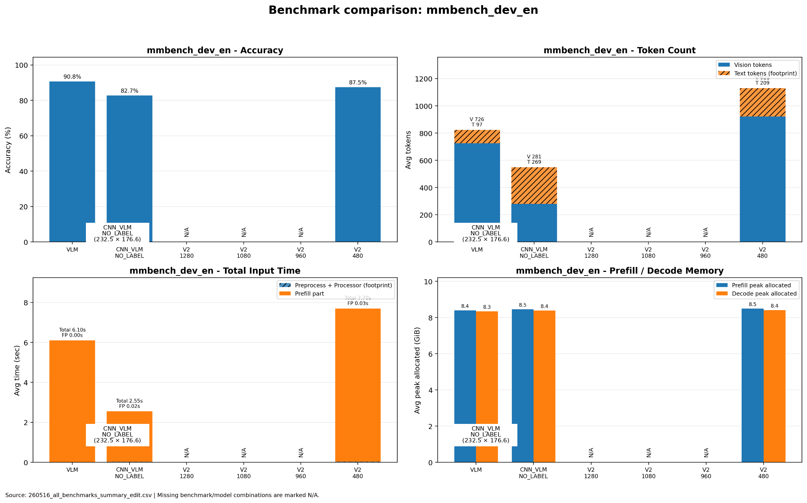

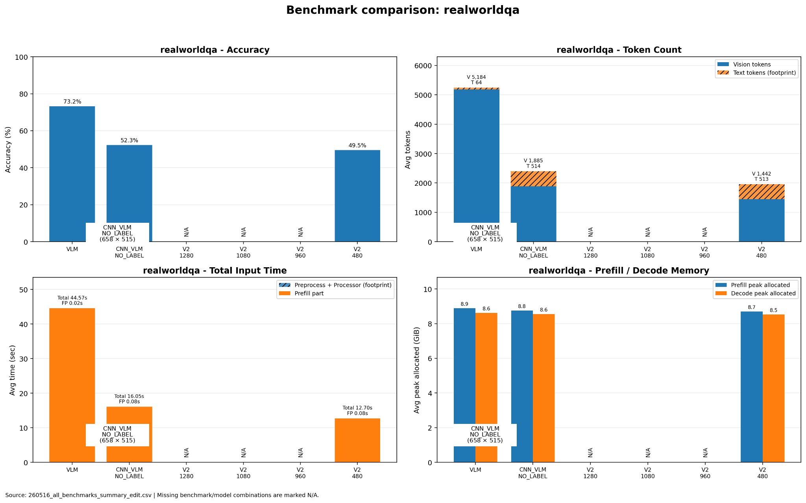

썸네일 큰 쪽이 당연히 더 유리하였다. CNN_VLM_NO_LABEL의 경우, 썸네일 평균 해상도로 계산해보면 역시 그런 패턴을 따르는 것으로 관찰된다.

## VLM_NxM vs CNN_VLM_v2_NxM

[thumb_area_vlm_summary (1).csv](thumb_area_vlm_summary_(1).csv)

### HRBench


**CNN의 정확도 향상 기여도**

| 해상도 | VLM_NxM 정확도 | CNN_VLM_V2_NxM 정확도 | CNN 적용 향상폭 | VLM_single 대비 하락폭: VLM_NxM | VLM_single 대비 하락폭: CNN_VLM_V2 |
| --- | --- | --- | --- | --- | --- |
| 1280 | 68.0% | 72.0% | **+4.0%p** | -7.0%p | -3.0%p |
| 1080 | 65.8% | 68.6% | **+2.8%p** | -9.2%p | -6.4%p |
| 960 | 64.2% | 67.5% | **+3.3%p** | -10.8%p | -7.5%p |
| 480 | 53.8% | 55.6% | **+1.8%p** | -21.2%p | -19.4%p |

기준 모델 `VLM_single` 정확도는 75.0%

모든 해상도 평균으로 보면, CNN은 `VLM_NxM` 대비 정확도를 평균 **+2.98%p**, 즉 약 **+3.0%p** 끌어올렸다. 상대 향상률로 표현하면 평균적으로 약 **+4.7%** 개선

CNN을 붙이면 기준 모델 `VLM_single`대비 손실을

- **-12.1%p → -9.1%p**

수준으로 줄이게 된다.

하락폭 자체는 평균 **3.0%p 감소**, 비율로는 기존 정확도 손실의 약 **24.7%를 회복**

### **MME_RW_Lite**


**CNN의 정확도 향상 기여도**

| 해상도 | VLM_NxM 정확도 | CNN_VLM_V2_NxM 정확도 | CNN 적용 향상폭 | VLM_single 대비 하락폭: VLM_NxM | VLM_single 대비 하락폭: CNN_VLM_V2 |
| --- | --- | --- | --- | --- | --- |
| 1280 | 46.4% | 45.8% | **-0.6%p** | -2.4%p | -3.0%p |
| 1080 | 45.2% | 45.3% | **+0.1%p** | -3.6%p | -3.5%p |
| 960 | 43.9% | 43.2% | **-0.7%p** | -4.9%p | -5.6%p |
| 480 | 34.1% | 35.3% | **+1.2%p** | -14.7%p | -13.5%p |

기준 모델 `VLM_single` 정확도는 **48.8%**입니다.

따라서 모든 해상도 평균으로 보면, CNN은 `VLM_NxM` 대비 정확도를 평균 **+0.00%p** 끌어올렸습니다. 즉, 절대 정확도 기준으로는 **평균 개선이 거의 없었습니다**.

상대 향상률로 표현하면 해상도별 변화율 평균은 약 **+0.21%** 수준입니다.

`VLM_single` 대비 정확도 하락폭은, CNN 적용 전에는 평균 **-6.40%p**였고, CNN 적용 후에도 평균 **-6.40%p**였습니다.

즉, CNN을 붙여도 기준 모델 대비 손실은

- **6.4%p → -6.4%p**

로 사실상 줄어들지 않았습니다.

다만 해상도별로 보면 `480`에서는 **+1.2%p** 개선되어 손실이 **-14.7%p → -13.5%p**로 줄었지만, `1280`과 `960`에서는 오히려 정확도가 낮아졌기 때문에 전체 평균에서는 상쇄되었습니다.

### TreeBench


**CNN의 정확도 향상 기여도**

| 해상도 | VLM_NxM 정확도 | CNN_VLM_V2_NxM 정확도 | CNN 적용 향상폭 | VLM_single 대비 하락폭: VLM_NxM | VLM_single 대비 하락폭: CNN_VLM_V2 |
| --- | --- | --- | --- | --- | --- |
| 1280 | 43.5% | 45.2% | **+1.7%p** | -1.7%p | 0.0%p |
| 1080 | 43.7% | 42.5% | **-1.2%p** | -1.5%p | -2.7%p |
| 960 | 41.0% | 44.2% | **+3.2%p** | -4.2%p | -1.0%p |
| 480 | 38.0% | 42.0% | **+4.0%p** | -7.2%p | -3.2%p |

기준 모델 `VLM_single` 정확도는 **45.2%**입니다.

따라서 모든 해상도 평균으로 보면, CNN은 `VLM_NxM` 대비 정확도를 평균 **+1.93%p**, 즉 약 **+1.9%p** 끌어올렸습니다. 상대 향상률로 표현하면 평균적으로 약 **+4.7%** 개선입니다.

`VLM_single` 대비 정확도 하락폭은, CNN 적용 전에는 평균 **-3.65%p**였고, CNN 적용 후에는 평균 **-1.73%p**까지 줄었습니다.

즉, CNN을 붙이면 기준 모델 대비 손실을

- **3.7%p → -1.7%p**

수준으로 줄인 것입니다.

하락폭 자체는 평균 **1.9%p 감소**, 비율로는 기존 정확도 손실의 약 **52.7%를 회복**한 셈입니다.

### VStar


**CNN의 정확도 향상 기여도**

| 해상도 | VLM_NxM 정확도 | CNN_VLM_V2_NxM 정확도 | CNN 적용 향상폭 | VLM_single 대비 하락폭: VLM_NxM | VLM_single 대비 하락폭: CNN_VLM_V2 |
| --- | --- | --- | --- | --- | --- |
| 1280 | 72.3% | 73.3% | **+1.0%p** | -9.4%p | -8.4%p |
| 1080 | 72.8% | 71.2% | **-1.6%p** | -8.9%p | -10.5%p |
| 960 | 66.0% | 70.2% | **+4.2%p** | -15.7%p | -11.5%p |
| 480 | 55.0% | 62.3% | **+7.3%p** | -26.7%p | -19.4%p |

기준 모델 `VLM_single` 정확도는 **81.7%**입니다.

따라서 모든 해상도 평균으로 보면, CNN은 `VLM_NxM` 대비 정확도를 평균 **+2.73%p**, 즉 약 **+2.7%p** 끌어올렸습니다. 상대 향상률로 표현하면 평균적으로 약 **+4.7%** 개선입니다.

`VLM_single` 대비 정확도 하락폭은, CNN 적용 전에는 평균 **-15.18%p**였고, CNN 적용 후에는 평균 **-12.45%p**까지 줄었습니다.

즉, CNN을 붙이면 기준 모델 대비 손실을

- **15.2%p → -12.5%p**

수준으로 줄인 것입니다.

하락폭 자체는 평균 **2.7%p 감소**, 비율로는 기존 정확도 손실의 약 **18.0%를 회복**한 셈입니다.

다만 `1080` 해상도에서는 CNN 적용 후 정확도가 **72.8% → 71.2%**로 오히려 **-1.6%p** 낮아졌고, 전체 평균 개선은 주로 `960`과 `480` 해상도에서의 큰 향상폭이 만든 결과입니다.

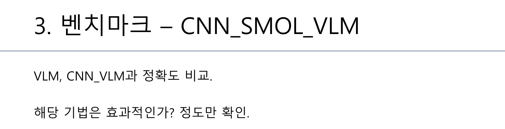

.png)

.png)

[benchmarks_summary_smol (1).csv](benchmarks_summary_smol_(1).csv)


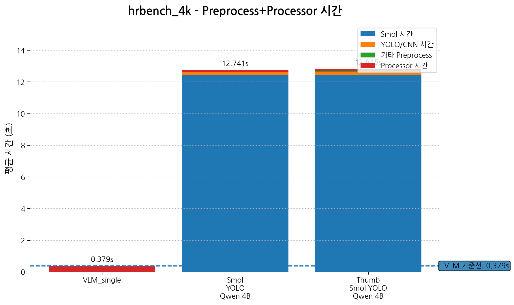

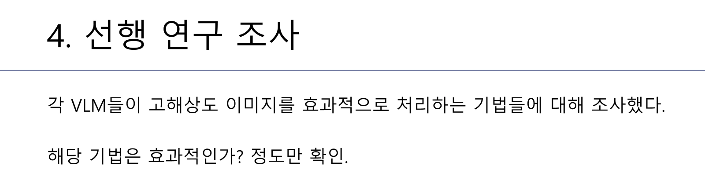


참고

[GitHub - inmare/jjs · GitHub](https://github.com/inmare/jjs)