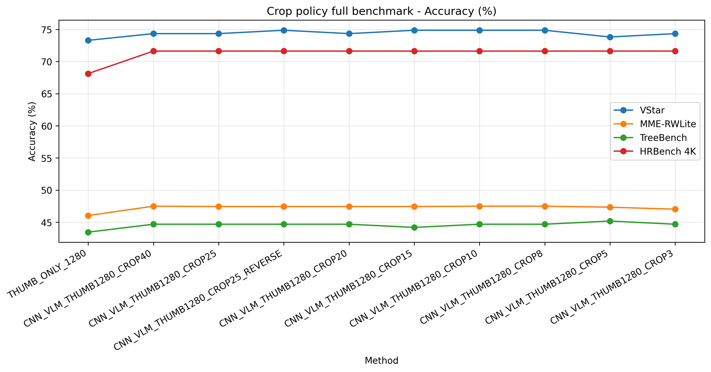
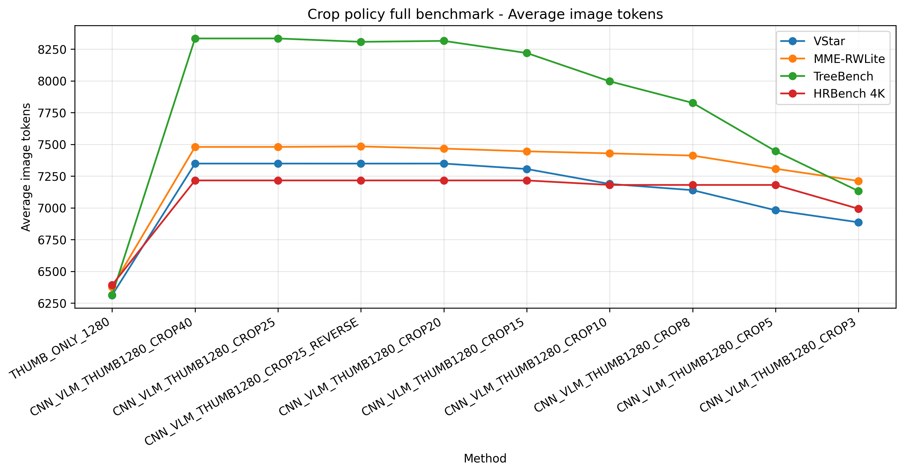
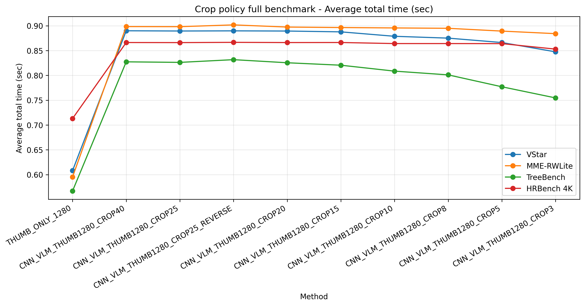
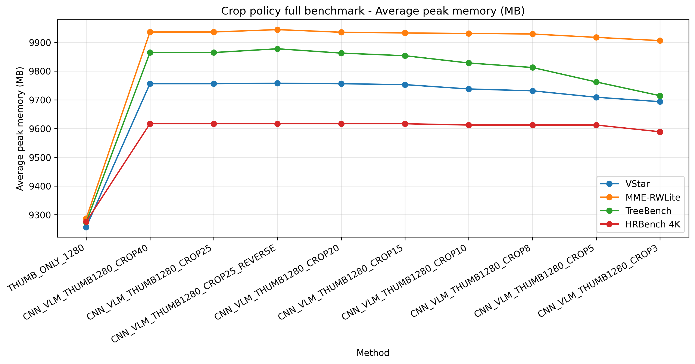
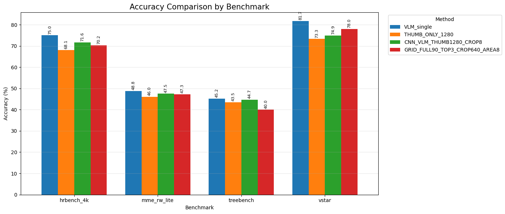

# 11주차

- Fixed Thumb 반영한 코드 생성
    
    기존에는 1/4 비율로 줄인 원본 이미지 크기에 따른 상대적인 썸네일 크기를 가졌다면 이제는 특정 픽셀로 고정해서 썸네일을 받을 수 있도록 함 (값 → 1280 x 1280)
    
- 원본 25% 크기의 크롭 제외 정책 파라미터 수정
    - 원본 이미지의 25% 크기 이상으로 크롭된 객체는 제거한다는 정책에서 25라는 숫자를 다양하게 바꿔보며 실험 진행
    - 40 / 25 / 20 / 15 / 10 / 8 / 5 / 3
    - 또한 동시에 원래는 이미지 토큰을 넘어버리면 작은 것부터 지워나갔었는데, 큰 객체부터 지워나가는 것도 같이 실험하였다. (이 경우 25는 고정한채로 진행.)
    - vstar, mme_rw_lite, treebench, hrbench_4k 에 대해서 전체 벤치마크 진행
- 추가로 크롭된 객체 이미지들의 합이 원본 이미지보다 커지게 된다면 작은 객체부터 지워나가는 정책이 존재했다. 이를 큰 객체부터 지워나가는 reverse 모델도 같이 실험했다.
- 결과
    - 그래프
        - 정확도
            
            
            
        - 이미지 토큰 수
            
            
            
        - 소요 시간
            
            
            
        - 최대 메모리 사용량
            
            
            
    - 내용 정리
        
        1280급 thumbnail에 crop을 추가하면 thumbnail-only 대비 평균 정확도는 약 1.7~1.9%p 향상되지만, 이미지 토큰·시간·메모리 비용이 함께 증가했다. Crop threshold를 40%에서 3%까지 낮춰도 정확도 변화는 크지 않았고, 오히려 token 비용만 점진적으로 감소했다. 따라서 단순히 큰 crop 상한선을 조절하는 정책은 정확도를 크게 바꾸는 주요 요인은 아니며, 비용 효율 측면에서는 `CROP3`가 가장 균형적인 후보로 보인다. Reverse 정책은 기본 CROP25와 거의 유사한 결과를 보여, 현재 설정에서는 뚜렷한 이점이 확인되지 않았다. 최종적으로는 `THUMB_ONLY_1280`을 가벼운 baseline으로 유지하고, crop을 추가하는 경우에는 `CNN_VLM_THUMB1280_CROP3`를 우선 후보로 삼는 것이 적절하다.
        
- 추가 실험 → 객체 크롭 방식이 과연 옳은가?
    - 틀린 문제에 대해서 다른 방식의 입력 실험
        - 간단 샘플 결과
            - 이번 HRBench wrong10 실험에서는 **구역 기반 `GRID_HEATMAP_CLIP_BUDGET`과 `HYBRID_HEATMAP_YOLO_QUOTA_BUDGET`이 5/10으로 가장 잘 맞췄고**, thumbnail-only는 1/10, YOLO 기반 QREWRITE는 0/10에 그쳤다. 즉 HRBench에서는 YOLO처럼 객체를 따라가는 crop보다, 질문과 CLIP similarity로 넓은 구역 후보를 고르는 방식이 훨씬 효과적이었다. 다만 성능 향상은 image tokens가 약 3.3배, 총 시간이 약 3.5배 늘어난 결과라서, 현재 설정은 edge-device용이라기보다는 “정확도 상한 확인용”에 가깝다. 또 `total_tokens`가 `image_tokens`보다 작은 이유는 둘이 다른 값이기 때문인데, `image_tokens`는 vision patch/grid 토큰 수이고 `total_tokens`는 주로 텍스트 input_ids 길이이므로 실제 비용 판단에는 `image_tokens`를 더 중요하게 봐야 한다. 다음 단계는 YOLO를 더 섞기보다 `GRID_HEATMAP`에서 top-k를 5→3 또는 2로 줄이고, 후보 window 수도 줄여서 정확도와 연산량의 trade-off를 확인하는 것이 좋아 보인다.
                
                
                | method | n | correct | accuracy | mean_image_tokens | mean_total_tokens | mean_candidates | mean_selected | mean_candidate_time | mean_clip_rank_time | mean_processor_time | mean_gen_time | mean_total_time | mean_peak_mb | accuracy_percent | acc_gain_vs_thumb | image_token_ratio_vs_thumb | time_ratio_vs_thumb | mem_ratio_vs_thumb |
                | --- | --- | --- | --- | --- | --- | --- | --- | --- | --- | --- | --- | --- | --- | --- | --- | --- | --- | --- |
                | THUMB_ONLY_1280_LOCAL | 10 | 1 | 0.1 | 6400 | 1664.2 | 0 | 0 | 0 | 0 | 0.038258 | 0.630943 | 1.159979 | 9537.547 | 10 | 0 | 1 | 1 | 1 |
                | YOLO_QREWRITE_CROP8_BUDGET | 10 | 0 | 0 | 7157.6 | 2064 | 2.2 | 1.2 | 0.202837 | 0.017299 | 0.04493 | 0.752819 | 1.769075 | 9633.814 | 0 | -0.1 | 1.118375 | 1.525092 | 1.010094 |
                | GRID_HEATMAP_CLIP_BUDGET | 10 | 5 | 0.5 | 21060.4 | 6077.3 | 90 | 5 | 0.023271 | 0.704732 | 0.119118 | 2.356873 | 4.022198 | 10695.99 | 50 | 0.4 | 3.290688 | 3.467476 | 1.121461 |
                | HYBRID_HEATMAP_YOLO_QUOTA_BUDGET | 10 | 5 | 0.5 | 20764.4 | 6001.9 | 92.2 | 5 | 0.224006 | 0.680058 | 0.112815 | 2.322813 | 4.145555 | 10675.8 | 50 | 0.4 | 3.244438 | 3.57382 | 1.119344 |
        - 벤치마크 결과
            
            
            | Benchmark | Best model excluding VLM_single | Accuracy | GRID accuracy | Interpretation |
            | --- | --- | --- | --- | --- |
            | HRBench | `CNN_VLM_THUMB1280_CROP8` | **71.63%** | 70.25% | 기존 CROP8이 GRID보다 정확도와 비용 모두 우세 |
            | MME-RW-Lite | `CNN_VLM_THUMB1280_CROP8` | **47.50%** | 47.26% | 성능은 거의 같지만 CROP8이 더 빠르고 가벼움 |
            | TreeBench | `CNN_VLM_THUMB1280_CROP8` | **44.69%** | 40.00% | GRID가 가장 불리하며, 전체 구조/관계 문제에 약함 |
            | VStar | `GRID_FULL90_TOP3_CROP640_AREA8` | **78.01%** | 78.01% | GRID가 CROP8보다 뚜렷하게 우세 |
            
            이번 GRID 실험 결과, `GRID_FULL90_TOP3_CROP640_AREA8`은 전반적인 범용 성능 향상보다는 **특정 유형의 benchmark에서 선택적으로 효과가 있는 방식**으로 해석된다. 특히 VStar에서는 GRID 방식이 `THUMB_ONLY_1280` 및 `CNN_VLM_THUMB1280_CROP8`보다 높은 정확도를 보여, 질문과 관련된 국소 영역을 CLIP으로 선택한 뒤 crop을 제공하는 전략이 작은 단서나 위치 기반 시각 추론에 유효함을 확인할 수 있었다. 그러나 HRBench, MME-RW-Lite, TreeBench에서는 기존 `CNN_VLM_THUMB1280_CROP8`이 GRID보다 같거나 더 높은 정확도를 보였고, 동시에 image token과 추론 시간도 더 낮았다. 따라서 현재 GRID 방식은 기본 정책으로 사용하기보다는, **localized evidence가 중요한 문제에서 보조적 또는 선택적 모드로 활용하는 것이 적절하며**, 전체 benchmark 기준의 기본 경량 전략으로는 기존 CROP8 정책이 더 안정적인 정확도-비용 trade-off를 제공한다고 결론낼 수 있다.
            
            - 정확도
                
                
                
            - 이미지 토큰
                
                
                
            - 시간
                
                
                
            - 메모리
                
                
                
        - 틀린 문제 확인 CROP8 vs GRID
        
        
        
        Sample text: What is the pose of the woman with yellow backpack?
        (A) walking
        (B) running
        (C) squatting
        (D) standing
        
        - CNN_VLM(CROP8)
            - 이미지 처리
                
                
                
                
                
        
        - GRID
            - 이미지 처리
                
                
                
                
                
        
        | 항목 | CROP8 | GRID |
        | --- | --- | --- |
        | Prediction | A, walking | C, squatting |
        | Correct | X | O |
        | 입력 구성 | thumbnail + YOLO object crop 37개 | overview + grid/slide crop top-3 |
        | Image tokens | 7,740 | 11,072 |
        | Total tokens | 10,117 | 약 11k대 |
        | Time | 1.23s | 1.53s |
        | 후보/크롭 수 | YOLO raw 39 → filtered 37 | 후보 중 top-3 선택 |
        | 선택 방식 | 객체 detector 기반, question-agnostic | CLIP query ranking 기반, question-aware |
        
        이 사례에서 **CROP8의 한계는 객체 단위 crop이 너무 잘게 쪼개졌다는 점**이야. YOLO가 사람을 많이 검출했고, 최종적으로 37개의 crop이 Qwen에 들어갔는데, 대부분은 개별 사람 단위의 세로로 긴 crop이었어. 문제는 “노란 가방을 멘 여성의 자세”를 묻고 있는데, 해당 인물이 crop 안에 잡히긴 했지만 몸 전체와 주변 맥락이 충분히 들어오지 않고, 다른 걷는 사람 crop들이 많이 섞여 있어. 그래서 Qwen이 장면 전체에서 “사람들이 걷고 있다”는 강한 prior에 끌려 **walking**을 고른 것으로 보인다. 실제로 CROP8은 원본 코드 기준 `39`개 YOLO 객체 중 `37`개를 필터 후 사용했고, 최종 응답도 기존 결과와 동일하게 `(A) walking`이었다.
        
        반면 **GRID는 객체 하나를 정확히 자르기보다, 질문과 관련 있을 법한 구역을 넓게 잡는 방식**이 유리하게 작동했어. GRID가 선택한 top-3 region은 모두 `slide_square` 기반이고, 특히 `[1386, 198, 1746, 558]`, `[1188, 198, 1548, 558]` 같은 crop은 노란 가방을 멘 사람과 주변 신체 자세가 함께 들어가. 이 덕분에 Qwen이 해당 사람이 서 있거나 걷는 게 아니라 **쪼그려 앉은 자세**라는 단서를 더 잘 볼 수 있었고, 정답인 `(C) squatting`을 냈어. GRID의 selected region은 3개뿐이지만, 각 crop이 640급 구역 crop이라 객체 crop보다 문맥을 더 보존한다는 장점이 드러난 사례야.
        
        비용 측면에서는 GRID가 더 비싸. 이 문제에서 CROP8은 image tokens가 **7,740**, GRID는 **11,072**로 GRID가 약 **1.43배** 많아. 시간도 기존 benchmark CSV 기준 CROP8은 **1.23초**, GRID는 **1.53초**라 GRID가 약 **24% 느리다**고 볼 수 있어. 다만 이번 재실행에서 CROP8 시간이 2.87초로 나온 것은 단일 재실행 환경, cold run, YOLO 실행 오버헤드 영향이 섞였을 가능성이 있어서, 공정 비교는 기존 저장된 benchmark time을 보는 게 맞아. 메모리는 CROP8 단일 재실행에서 약 **10.43GB peak**가 나왔고, GRID는 이 케이스의 peak가 표에 직접 드러나진 않았지만 전체 VStar 평균 기준으로는 CROP8과 GRID가 둘 다 약 9.7~10.0GB 수준이라 큰 차이는 아니었어.
        
        결론적으로 이 사례는 **GRID가 왜 VStar에서 강했는지 설명하는 대표 예시**야. CROP8은 경량이고 토큰/시간 효율이 좋지만, 객체 detector가 잘라낸 crop들이 질문 대상의 자세나 주변 맥락을 충분히 보존하지 못하면 오답으로 이어질 수 있다. 반대로 GRID는 토큰과 시간이 더 들지만, 질문과 관련된 국소 구역을 넓은 crop으로 제공하기 때문에 “노란 가방을 멘 사람의 자세”처럼 **대상 식별 + 자세 판단 + 주변 맥락**이 필요한 문제에서 더 높은 정확도를 낼 수 있다. 따라서 전체 기본 정책은 여전히 CROP8이 효율적이지만, VStar류의 localized visual evidence 문제에서는 GRID가 더 설득력 있는 보조 전략이라고 볼 수 있어.