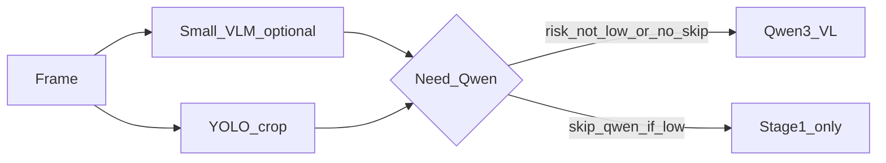

# 주간 데모: 감시 프레임 파이프라인 실험

> **실험 GUI**: `uv run python scripts/experiment_gui.py`(또는 `-m qwen_vlm.gui.hr_bench_app`) 한 창에 **HR-Bench** 탭과 **연속 프레임 비교** 탭이 있습니다. 연속 비교 실행은 내부적으로 `python -m qwen_vlm.pipeline.experiment sequence-compare` 로 이어지며, 기본 결과는 `docs/sequence_compare_last.json` · `sequence_compare_last.html` 입니다.  
> 같은 파이프라인을 배치·스크립트로 돌리려면 아래 **`run_week_experiments`** / **`experiment_pipeline`** CLI를 사용하세요.  
> HR-Bench 고해상 객관식은 [hr-bench-pipeline.md](./hr-bench-pipeline.md) 를 참고하세요.

연속 프레임(또는 영상에서 추출한 프레임)에 대해 **Qwen3-VL(llama.cpp)** 기준으로 다음을 비교·정리합니다.

- **Qwen-only**: 문맥용으로 리사이즈한 **이미지 1장**만 입력.
- **YOLO + Qwen**: 동일 문맥 1장 + **COCO 기반 감시 프리셋**으로 뽑은 **크롭 최대 K장** 추가. 기본적으로 [pipeline-yolo-crops-vlm.md](./pipeline-yolo-crops-vlm.md) 의 **픽셀 예산 필터**로 박스 수·면적을 줄여 비전 토큰을 억제합니다(`--disable-yolo-vlm-budget` 로 끔). 장수만큼 토큰이 **합산**될 수 있음 — [qwen3-vl-image-tokens.md](./qwen3-vl-image-tokens.md) 참고.
- **2단계**: **경량 VLM**(별도 `llama-server`, OpenAI 호환) 또는 실패·미설정 시 **YOLO 휴리스틱**으로 1단계 요약 → **조건부 Qwen**([realtime-vlm-input-strategies.md](./realtime-vlm-input-strategies.md) §2–3와 동일한 완화 논리).

비전 토큰 **근사치**는 입력 해상도로 `qwen_vlm/vision/tokens.py` (루트 `qwen3_vl_image_tokens.py` 래퍼와 동일)와 같은 `vendor` 프리셋 규칙을 코드에서 합산합니다. API의 `prompt_tokens`는 텍스트·특수 토큰을 포함하므로 **근사치와 다를 수 있습니다**.

---

## 데이터셋

| 구분 | 내용 |
|------|------|
| **즉시 받은 데모 클립** | `scripts/fetch_demo_video.py` → `data/datasets/demo/sample-5s.mp4` (Git 제외). 연속 프레임 파이프라인 검증용. |
| **실제 감시·이상행동 연구** | [ShanghaiTech Campus](https://svip-lab.github.io/dataset/campus_dataset.html) — 장면·연속성에 유리. [UCF-Crime](https://www.crcv.ucf.edu/projects/real-world/) — 이상 클래스 스토리텔링에 유리(용량 큼, Dropbox 분할 등). 받은 뒤 `data/datasets/` 아래에 두고 동일 스크립트로 프레임 추출. |

프레임 추출 예:

```bash
uv run python scripts/extract_frames.py --video "경로/clip.avi" --out data/datasets/my_run/frames --fps 1
```

---

## 의존성

```bash
uv sync --group dev
```

- `ultralytics` + (의존) `torch`: YOLO.
- `opencv-python-headless`: `ffmpeg` 가 없을 때 프레임 추출 폴백.

### GUI에서 연속 프레임 비교 (`sequence-compare`)

위 의존성을 맞춘 뒤 `uv run python scripts/experiment_gui.py` → **연속 프레임** 탭에서 프레임 디렉터리·`base_url`·`model`·게이트·YOLO 필드를 채우고 실행합니다. 생성물은 보통:

- `docs/sequence_compare_last.json`
- `docs/sequence_compare_last.html`(대시보드 미리보기·외부 브라우저 열기에 사용)

평탄한 폴더의 `jpg`/`jpeg`/`png`, 또는 `qwen_vlm.pipeline.experiment.list_frames`와 동일 규칙의 `testing/frames/<시퀀스>/` 구조를 허용합니다(GUI 검증과 동일).

CLI 대안은 아래 `experiment_pipeline` 계열 또는 `python -m qwen_vlm.pipeline.experiment sequence-compare --help` 입니다.

---

## YOLO 감시 프리셋 (COCO 클래스 부분집합)

공장·통로·캠퍼스 안전 스토리에 맞춘 **기본 재현용** 프리셋입니다. 연기·유출 등은 COCO에 없어 별도 검출기나 커스텀 가중치가 필요합니다.

| class id | 이름 |
|----------|------|
| 0 | person |
| 1 | bicycle |
| 2 | car |
| 3 | motorcycle |
| 5 | bus |
| 7 | truck |
| 24 | backpack |
| 26 | handbag |
| 28 | suitcase |

정의 위치: [qwen_vlm/vision/yolo.py](../qwen_vlm/vision/yolo.py) 의 `FACTORY_SURVEILLANCE_CLASS_IDS`.

1단계 **YOLO 폴백** 위험도(`low` / `med` / `high`)는 탐지 수·차량 클래스 유무 등 단순 휴리스틱입니다(`yolo_heuristic_risk`).

---

## 실험 스크립트

**전제**: Qwen용 `llama-server`가 `--base-url` 에 맞게 기동됨(또는 `main.py --no-spawn` 과 동일 주소).

### 벤치: Qwen-only vs YOLO+Qwen

```bash
uv run python experiment_pipeline.py bench ^
  --frames-dir data/datasets/demo/frames ^
  --max-frames 6 ^
  --base-url http://127.0.0.1:8765/v1 ^
  --model qwen3-vl-4b-q8
```

JSON 한 줄 요약: 각 프레임마다 `qwen_only` / `yolo_qwen` 의 `prompt_tokens`, `seconds`, `approx_image_tokens`, `reply_preview`.

### 2단계: 경량 VLM → (옵션) Qwen

경량 서버가 **없으면** 자동으로 YOLO 휴리스틱 JSON이 1단계가 됩니다.

```bash
# 경량 VLM 이 8766 에 떠 있고 -a 가 small-vlm 인 경우 예시
set SMALL_VLM_OPENAI_BASE=http://127.0.0.1:8766/v1
set SMALL_VLM_MODEL=small-vlm
uv run python experiment_pipeline.py two-stage ^
  --frames-dir data/datasets/demo/frames ^
  --max-frames 6 ^
  --skip-qwen-if-low
```

- `--small-vlm-url` / `--small-vlm-model` 로도 지정 가능.
- `--skip-qwen-if-low`: 1단계 JSON의 `risk` 가 `low` 로 파싱되면 Qwen 호출 생략(총 지연 완화).

---

## 파이프라인 개요



---

## 결과 표 (실행 후 채움)

로컬 GPU·양자화·컨텍스트에 따라 수치는 달라집니다. 아래는 **형식 예시**입니다.

| 프레임 | 모드 | approx 이미지 토큰(합) | prompt_tokens | 시간(s) |
|--------|------|------------------------|---------------|---------|
| … | qwen_only | … | … | … |
| … | yolo_qwen | … | … | … |

**해석 노트**: 크롭을 여러 장 넣으면 `approx_image_tokens` 가 오히려 커질 수 있습니다. “YOLO로 줄인다”는 **관심 영역에만 시각적 해상도를 쓰는** 효과와 **토큰 합산** 트레이드오프를 같이 적어 두는 것이 좋습니다.

---

<!-- AUTO_RESULTS_START -->

**자동 기록** (`run_week_experiments.py`): 2026-04-26T01:27:22

- **프레임 디렉터리**: `D:\Private\Fiddles\qwen-vlm\data\datasets\demo\frames` (6장)
- **경량 VLM**: [ggml-org/SmolVLM-256M-Instruct-GGUF](https://huggingface.co/ggml-org/SmolVLM-256M-Instruct-GGUF) — `SmolVLM-256M-Instruct-Q8_0.gguf` + `mmproj-SmolVLM-256M-Instruct-Q8_0.gguf`
- **Qwen**: 로컬 `Qwen3VL-4B-Instruct-Q8_0` / 별칭 `qwen3-vl-4b-q8`
- **Ultralytics/torch 백엔드**: CPU (CUDA 없음) — VLM·Smol·Qwen은 `llama-server` 별도 프로세스(VRAM/속도는 `resource_sampling_note`·행별 스냅샷 참고)

### 집계 (bench)

| 지표 | Qwen-only | YOLO+Qwen |
|------|-----------|-----------|
| 평균 VLM 시간(s) | 6.083 | 5.704 (YOLO+추론) |
| 평균 prompt_tokens | 552.0 | 754.2 |
| 평균 approx 비전 토큰(합) | 510.0 | 548.0 |

### 지연 비교 (평균, 초)

- **Qwen-only (bench)**: 평균 **6.083** s/프레임
- **YOLO+Qwen (bench)**: 평균 **5.704** s/프레임 (YOLO + VLM)
- **YOLO∥Smol→Qwen (병렬)**: wall 병렬 평균 **0.238** s, E2E 합산 평균 **6.785** s — (wall_parallel: ThreadPool YOLO∥Smol 구간, total: wall+qwen(또는 low 스킵시 wall만))
- **Smol→Qwen (two-stage)**: Smol 평균 **0.2185** s + Qwen(호출 시) 평균 **6.7187** s → 프레임당 평균 **6.9372** s (end-to-end 합산)
  - (total = Phase2에서 측정한 Smol stage1_seconds + Phase3 qwen_seconds(또는 low면 stage1만).)

### 집계 (two-stage, `--skip-qwen-if-low`)

- Qwen 호출 생략: **0** / 6 프레임 (1단계 `risk=low`)
- Qwen 실행: **6** 회

### 프레임별 bench (요약)

| 프레임 | approx Q-only | approx YOLO+Q | p.tok Q | p.tok Y |
|--------|---------------|---------------|---------|---------|
| frame_000001.jpg | 510 | 559 | 552 | 736 |
| frame_000002.jpg | 510 | 510 | 552 | 621 |
| frame_000003.jpg | 510 | 536 | 552 | 773 |
| frame_000004.jpg | 510 | 588 | 552 | 825 |
| frame_000005.jpg | 510 | 544 | 552 | 781 |
| frame_000006.jpg | 510 | 551 | 552 | 789 |

> ShanghaiTech 등 별도 프레임 디렉터리로 동일 스크립트를 다시 실행하면 이 블록을 덮어씁니다.
<!-- AUTO_RESULTS_END -->

---

## 한계·다음 단계

- **(계획)** 일반 VLM·멀티모달 정확도는 **MMBench**([OpenCompass MMBench](https://github.com/open-compass/mmbench) 등 공개 벤치)로도 측정해 감시 데모·연속 프레임 실험과 **역할을 분리**해 두는 것이 좋다(도메인·질문 형식이 다름). 스크립트/데이터는 추후 `data/datasets/mmbench/` 등에 둘 예정.
- 데모 MP4는 감시 영상이 아님 — 교수님 보고용 **서사**는 ShanghaiTech / UCF 등 실데이터 프레임으로 재실행 권장.
- 경량 VLM은 **모델·mmproj·한국어 품질**에 따라 1단계를 영어 JSON으로 고정했습니다(`--stage1-prompt` 변경 가능).
- PPE·화재·누유 등은 COCO YOLO만으로 부족 — 필요 시 산업 특화 가중치·별도 검출 채널을 문서화하는 편이 좋습니다.

---

## 변경 이력

- 초안: 주간 데모 계획 반영 — 데이터 경로, 벤치, 2단계, 문서 링크.
