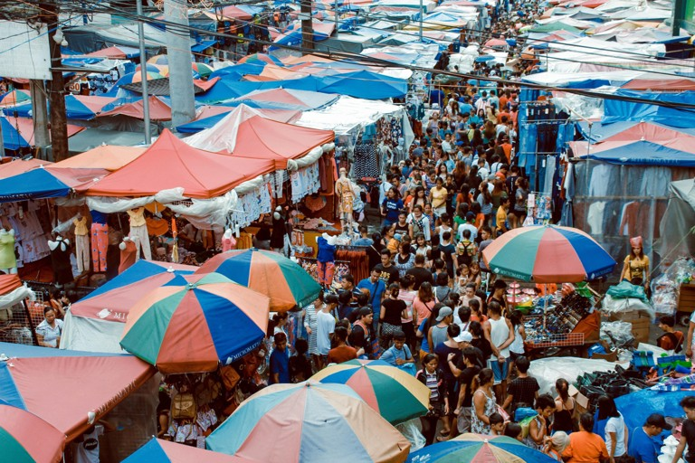
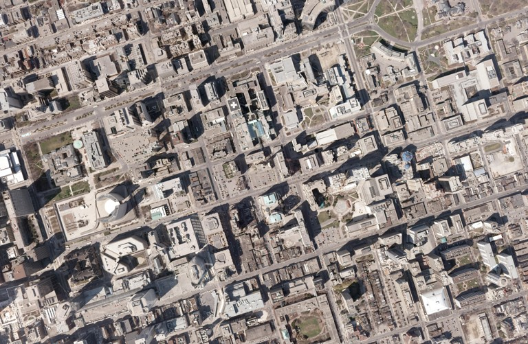

# 9주차 벤치마크 조사 및 벤치마크 수행, 결과 정리

- 고해상도 벤치마크 후보
    
    
    | 벤치마크 | HF에서 바로 쓸 때 | 사용된 논문 | 데이터 개수 | 주 해상도 / 화질 | 주 평가 지표 | 평가 성격 | 우리 프로젝트 적용성 | 확인해야 할 점 |
    | --- | --- | --- | --- | --- | --- | --- | --- | --- |
    | HR-Bench
      4K | DreamMr/HR-Bench,
      config hrbench_version_split, split hrbench_4k | DC² / HR-Bench,
      ERGO | 800 rows. 고유
      문제는 FSP 100 + FCP 100 = 200개이고, 선택지 cyclic permutation 때문에 800 rows로 제공됨 | 논문 표 기준 평균 resolution 4032. 실제 샘플은 4032×4032 형태가 많음. 8K 원본에서 질문 관련 객체
      영역을 crop해 만든 4K 버전 | Accuracy. HR-Bench 논문은 cyclic
      permutation 평균 accuracy 사용 | 고해상도 crop 이미지 이해, OCR, attribute,
      spatial relation | 매우 높음. 이미
      실험했고, 토큰/시간/메모리 절감 효과 보기 가장 적합 | 4K는 단순 resize가 아니라 질문 관련 영역 crop
      성격. 따라서 “전체 8K 장면 탐색”보다는 “고해상도 crop 입력 최적화”로 해석해야 함 |
    | HR-Bench
      8K | DreamMr/HR-Bench,
      config hrbench_version_split, split hrbench_8k | DC² / HR-Bench,
      ERGO | 800 rows. 고유
      문제는 200개, permutation 포함 800 rows | 논문 표 기준 평균 resolution 7680. HR-Bench 8K는 DIV8K와 인터넷 이미지
      기반의 평균 8K급 이미지 | Accuracy, throughput, 경우에 따라
      token/latency | 원본 고해상도 장면에서 필요한 단서를 직접 찾아야 하는 평가 | 높음, 하지만 비용 큼 | Qwen processor max pixel 제한 때문에 실제
      full 8K로 들어가는지 확인 필요. crop token budget 없이 CNN_VLM을 적용하면 오히려 token이 증가할 수 있음 |
    | V* Bench | xjtupanda/VStar_Bench | ERGO, DC², V* 논문 | 191 questions | DC² 논문에서는 기존 벤치마크 중 가장 높은 편으로 보고,
      평균 resolution을 2348로 비교함.
      본문에서는 V*가 약 2246×1582
      수준이라고 설명 | MCQ Accuracy, V* score, vision
      token 수, latency | 복잡한 이미지에서 작은 시각 단서를 찾아 답하는 visual
      search benchmark | 높음**. HR-Bench 다음 후보로 좋음 | 4K급은 아니지만 작은 단서 탐색 성격이 강함. HF 데이터는
      MCQ라 자동 평가가 비교적 쉬움 |
    | MME-RealWorld-Lite
      / MME-RWLite | yifanzhang114/MME-RealWorld-Lite | ERGO | Lite는 task당 50
      samples 또는 50개 미만이면 전체로 구성. 전체 MME-RealWorld는 13,366 images / 29,429 QA annotations / 43 tasks | 전체 MME-RealWorld 기준 평균 2000×1500 고해상도 real-world 이미지 | Accuracy, task별 score, domain별 Avg
      / Avg-C | 실제 환경 이미지, OCR, remote sensing,
      diagram/table, monitoring, autonomous driving 등 | 높음. 4K보다는 낮지만
      현실적인 고해상도 benchmark | Lite는 zip/JSON 기반이라 실제 row 수는 로드 후
      확인 필요. OCR/text 단서가 많아 YOLO-only crop 한계 확인에 좋음 |
    | MME-RealWorld
      전체 | MME-RealWorld HF repo / GitHub 제공
      파일 | ERGO 관련 배경, MME-RealWorld 논문 | 13,366 images / 29,429 annotations
      / 43 tasks | 평균 2000×1500. 일부 remote sensing/map 계열은 더 큼 | Accuracy, domain별 score, Avg,
      Avg-C | 실제 환경 고해상도 종합 benchmark | 높음, 단 전체 수행 비용
      큼 | 전체는 데이터 규모와 task가 커서 먼저 Lite로 실험하는
      게 좋음. 상업적 사용 제한 등 license 확인 필요 |
    | TreeBench | HaochenWang/TreeBench | ERGO, TreeVGR
      논문 | 405 rows / 405 VQA pairs | HF card나 논문 snippet에서 평균 해상도는 명확히
      제시되지 않음. 이미지가 base64 string으로 들어 있고 복잡한 dense scene 중심 | Accuracy, visual
      grounding/evidence 관련 평가 가능 | “thinking with images” 평가. 작은
      target, bbox evidence, 객체 관계, spatial hierarchy | 중간~높음 | query-specific evidence가 중요해서 YOLO
      crop은 불리할 수 있음. 단, “crop이 어디를 봐야 하는가” 분석에는 좋음 |
    | VisualProbe
      / VisualProbe_Hard | xjtupanda/VisualProbe_Hard 또는 Mini-o3/VisualProbe_Hard | ERGO, MiniO3 /
      VisualProbe 계열 | 106 questions | 평균 해상도는 공식 HF card에 명확히 표기되지 않음.
      파일 크기상 이미지 기반 hard subset | Free-form answer 평가 | 작은 시각 단서 탐색, visual probing,
      multi-turn visual search 성격 | 중간. 소규모 추가 실험용 | free-form 답변이라 자동 채점이 번거로움. 정답
      parsing 또는 LLM judge 없이 정확히 평가하려면 후처리 필요 |
- 일반 성능 확인 벤치마크
    
    
    | 벤치마크 | 사용된 논문 | 데이터 개수 | 주 해상도 / 화질 | 주 평가 지표 | 평가 성격 | 우리 프로젝트 적용성 | 확인해야 할 점 |
    | --- | --- | --- | --- | --- | --- | --- | --- |
    | **GQA** | **CROP** | 대규모 VQA benchmark. CROP 학습 데이터에는 GQA 88k 사용 | 일반 이미지. 고해상도 전용 아님 | Accuracy | 객체 관계, compositional reasoning | **중간** | 고해상도 경량화보다는 “crop 후에도 관계 추론 유지되는지” 확인용 |
    | **MME** | **CROP**, DC² 일반 benchmark | MME benchmark score 방식 | 일반 VLM 종합 평가 | MME score / task score | perception, cognition, OCR, count, position 등 | **중간** | 고해상도 전용은 아니지만 OCR/position task는 관련 있음 |
    | **VQAT / TextVQA 계열** | **CROP** | TextVQA는 텍스트 읽기 중심 VQA | 문서/간판/텍스트 포함 이미지 | VQA accuracy / exact match 계열 | 이미지 내 텍스트 읽기 | **중간~높음** | 우리 방식이 YOLO-only라 텍스트 crop을 못 잡을 가능성이 큼. OCR detector 추가 실험에 좋음 |
    | **SQA / ScienceQA** | **CROP** | 과학 문제 기반 VQA | 일반 이미지/도표 | Accuracy | 과학 지식 + 이미지 이해 | **낮음~중간** | 고해상도보다는 reasoning benchmark 성격 |
    | **VQAv2** | **CROP** | 대규모 일반 VQA | COCO 기반 일반 이미지 | VQA accuracy | 일반 시각 질의응답 | **낮음~중간** | 고해상도 최적화 효과를 보기는 어려움 |
    | **POPE** | **CROP**, ERGO 일반 benchmark | object hallucination 평가 | 일반 이미지 | Accuracy, Precision, Recall, F1. CROP에서는 평균 accuracy 보고 | 객체 환각 평가 | **중간** | crop을 넣었을 때 hallucination이 줄거나 늘어나는지 확인 가능 |
    | **AI2D / ChartQA** | **ERGO 일반 benchmark** | 각각 diagram/chart QA | 도표·차트 이미지 | Accuracy | diagram/chart reasoning | **중간** | ChartQA는 작은 텍스트/숫자가 중요해서 OCR crop 개선 후에 적합 |
- 코랩 버전 전체 벤치마크 코드
    
    아래 코드는 cnn_vlm, merge_cnn_vlm, single_vlm 다 돌리는거라 새로 생성된 모델만 돌리도록 하면 될듯?
    
    그리고 모델은 아래 포함하지 않음.
    
    - 벤치마크 스크립트 생성
        
        ```python
        %%writefile benchmark_cnn_merge_vlm.py
        from __future__ import annotations
        
        import argparse
        import base64
        import gc
        import io
        import json
        import math
        import os
        import re
        import time
        from pathlib import Path
        from typing import Any
        
        import pandas as pd
        import torch
        from PIL import Image
        from datasets import load_dataset
        from transformers import AutoProcessor, Qwen3VLForConditionalGeneration
        
        import CNN_VLM as base
        
        MERGED_BACKGROUND = (255, 255, 255)
        CURRENT_DATASET_ID = None
        CURRENT_DATASET_CONFIG = None
        
        DEFAULT_QWEN_MODEL_ID = base.QWEN_MODEL_ID
        DEFAULT_MAX_NEW_TOKENS = 64
        
        DEFAULT_PROCESSOR_SIZE = {
            "longest_edge": 16384 * 32**2,
            "shortest_edge": 4 * 32**2,
        }
        
        BENCHMARK_CONFIGS = {
            "hrbench_4k": {
                "dataset_id": "DreamMr/HR-Bench",
                "config_name": "hrbench_version_split",
                "split": "hrbench_4k",
                "direct_parquet_url": "https://huggingface.co/datasets/DreamMr/HR-Bench/resolve/main/hr_bench_4k.parquet",
                "type": "mcq",
            },
            "vstar": {
                "dataset_candidates": [
                    ("craigwu/vstar_bench", None, "test"),
                    ("xjtupanda/VStar_Bench", None, "train"),
                ],
                "type": "mcq",
            },
            "mme_rw_lite": {
                "dataset_candidates": [
                    ("yifanzhang114/MME-RealWorld-lite-lmms-eval", None, "test"),
                    ("yifanzhang114/MME-RealWorld-lite-lmms-eval", None, "train"),
                    ("yifanzhang114/MME-RealWorld-Lite", None, "train"),
                    ("yifanzhang114/MME-RealWorld-Lite", None, "test"),
                ],
                "type": "mixed",
            },
            "treebench": {
                "dataset_candidates": [
                    ("HaochenWang/TreeBench", None, "train"),
                    ("HaochenWang/TreeBench", None, "test"),
                ],
                "type": "mcq",
            },
            "visualprobe": {
                "dataset_candidates": [
                    ("xjtupanda/VisualProbe_Hard", None, "test"),
                    ("Mini-o3/VisualProbe_Hard", None, "test"),
                    ("xjtupanda/VisualProbe_Hard", None, "train"),
                ],
                "type": "freeform",
            },
        }
        
        def now_sec() -> float:
            return time.perf_counter()
        
        def normalize_text(text: Any) -> str:
            if text is None:
                return ""
            text = str(text).strip().lower()
            text = re.sub(r"\s+", " ", text)
            text = re.sub(r"[^a-z0-9가-힣\s\.\-_/]", "", text)
            return text.strip()
        
        def normalize_answer_letter(text: Any) -> str:
            if text is None:
                return ""
        
            raw = str(text).strip()
            upper = raw.upper()
        
            match = re.search(r"\b([A-K])\b", upper)
            if match:
                return match.group(1)
        
            if raw.isdigit():
                idx = int(raw)
                if 0 <= idx < 11:
                    return chr(ord("A") + idx)
        
            return upper[:1]
        
        def parse_predicted_answer(text: str) -> str:
            if not text:
                return ""
        
            upper = str(text).upper()
        
            patterns = [
                r"answer\s*[:：]\s*([A-K])",
                r"정답\s*[:：]\s*([A-K])",
                r"\(([A-K])\)",
                r"\b([A-K])\b",
            ]
        
            for pattern in patterns:
                match = re.search(pattern, upper)
                if match:
                    return match.group(1)
        
            return ""
        
        def is_multiple_choice(question: str) -> bool:
            if not question:
                return False
            return bool(re.search(r"\bA[\.\)]", question)) or "Options:" in question
        
        def compute_correctness(response: str, gt_answer: str, question: str) -> tuple[str, int | None]:
            if gt_answer is None or str(gt_answer).strip() == "":
                return "", None
        
            if is_multiple_choice(question):
                pred = parse_predicted_answer(response)
                gt = normalize_answer_letter(gt_answer)
                return pred, int(pred == gt) if pred else 0
        
            pred_norm = normalize_text(response)
            raw = str(gt_answer).strip()
        
            gt_candidates = []
            try:
                parsed = json.loads(raw)
                if isinstance(parsed, list):
                    gt_candidates = [str(x) for x in parsed]
                else:
                    gt_candidates = [raw]
            except Exception:
                if "|" in raw:
                    gt_candidates = [x.strip() for x in raw.split("|")]
                elif ";" in raw:
                    gt_candidates = [x.strip() for x in raw.split(";")]
                else:
                    gt_candidates = [raw]
        
            gt_norms = [normalize_text(x) for x in gt_candidates if normalize_text(x)]
        
            if not pred_norm or not gt_norms:
                return response.strip()[:80], None
        
            correct = int(any(pred_norm == gt or gt in pred_norm for gt in gt_norms))
            return response.strip()[:80], correct
        
        def load_benchmark_dataset(benchmark_name: str):
            global CURRENT_DATASET_ID, CURRENT_DATASET_CONFIG
        
            if benchmark_name not in BENCHMARK_CONFIGS:
                raise ValueError(f"Unknown benchmark: {benchmark_name}")
        
            cfg = BENCHMARK_CONFIGS[benchmark_name]
        
            if benchmark_name == "hrbench_4k":
                CURRENT_DATASET_ID = cfg["dataset_id"]
                CURRENT_DATASET_CONFIG = cfg.get("config_name")
                print("Loading HR-Bench 4K directly from parquet.")
                return load_dataset(
                    "parquet",
                    data_files={"data": cfg["direct_parquet_url"]},
                    split="data",
                )
        
            errors = []
        
            for dataset_id, config_name, split in cfg["dataset_candidates"]:
                try:
                    print(f"Trying dataset: {dataset_id}, config={config_name}, split={split}")
        
                    if config_name is None:
                        ds = load_dataset(dataset_id, split=split)
                    else:
                        ds = load_dataset(dataset_id, config_name, split=split)
        
                    CURRENT_DATASET_ID = dataset_id
                    CURRENT_DATASET_CONFIG = config_name
        
                    print(f"Loaded: {dataset_id} / {split}, rows={len(ds)}")
                    return ds
        
                except Exception as exc:
                    errors.append(f"{dataset_id}/{split}: {repr(exc)}")
        
            raise RuntimeError("All dataset candidates failed:\n" + "\n".join(errors))
        
        def load_image_from_value(value: Any) -> Image.Image:
            if isinstance(value, Image.Image):
                return value.convert("RGB")
        
            if isinstance(value, dict):
                if value.get("bytes") is not None:
                    return Image.open(io.BytesIO(value["bytes"])).convert("RGB")
        
                if value.get("path") is not None and str(value.get("path")) not in ["", "dummy/path"]:
                    return load_image_from_value(value["path"])
        
                for subkey in ["image", "img", "file", "filename", "filepath"]:
                    if subkey in value and value[subkey] is not None:
                        return load_image_from_value(value[subkey])
        
            if isinstance(value, bytes):
                return Image.open(io.BytesIO(value)).convert("RGB")
        
            try:
                import numpy as np
                if isinstance(value, np.ndarray):
                    return Image.fromarray(value).convert("RGB")
            except Exception:
                pass
        
            if isinstance(value, str):
                text_value = value.strip()
        
                if text_value.lower().startswith("data:image"):
                    raw = base64.b64decode(text_value.split(",", 1)[1])
                    return Image.open(io.BytesIO(raw)).convert("RGB")
        
                if text_value.startswith("http://") or text_value.startswith("https://"):
                    import requests
                    response = requests.get(text_value, timeout=60)
                    response.raise_for_status()
                    return Image.open(io.BytesIO(response.content)).convert("RGB")
        
                looks_like_base64_image = (
                    text_value.startswith("/9j/")
                    or text_value.startswith("iVBOR")
                    or text_value.startswith("R0lGOD")
                    or text_value.startswith("UklGR")
                    or len(text_value) > 1000
                )
        
                if looks_like_base64_image:
                    try:
                        raw = base64.b64decode(text_value)
                        return Image.open(io.BytesIO(raw)).convert("RGB")
                    except Exception:
                        pass
        
                try:
                    local_path = Path(text_value)
                    if local_path.exists():
                        return Image.open(local_path).convert("RGB")
                except OSError:
                    pass
        
                if CURRENT_DATASET_ID is not None:
                    try:
                        from huggingface_hub import hf_hub_download, list_repo_files
        
                        cleaned = text_value.replace("\\", "/").lstrip("./")
                        basename = Path(cleaned).name
                        stem = Path(cleaned).stem
        
                        candidate_filenames = [
                            cleaned,
                            basename,
                            f"images/{cleaned}",
                            f"image/{cleaned}",
                            f"imgs/{cleaned}",
                            f"data/{cleaned}",
                            f"train/{cleaned}",
                            f"test/{cleaned}",
                            f"HR-Bench/{cleaned}",
                            f"TreeBench/{cleaned}",
                            f"VStarBench/{cleaned}",
                            f"VisualProbe_Hard/{cleaned}",
                        ]
        
                        for filename in candidate_filenames:
                            try:
                                local_file = hf_hub_download(
                                    repo_id=CURRENT_DATASET_ID,
                                    filename=filename,
                                    repo_type="dataset",
                                )
                                return Image.open(local_file).convert("RGB")
                            except Exception:
                                continue
        
                        repo_files = list_repo_files(
                            repo_id=CURRENT_DATASET_ID,
                            repo_type="dataset",
                        )
        
                        image_exts = (".jpg", ".jpeg", ".png", ".webp", ".bmp")
                        image_files = [
                            f for f in repo_files
                            if f.lower().endswith(image_exts)
                        ]
        
                        matched = []
        
                        for f in image_files:
                            f_norm = f.replace("\\", "/")
                            f_base = Path(f_norm).name
                            f_stem = Path(f_norm).stem
        
                            if (
                                f_norm == cleaned
                                or f_norm.endswith("/" + cleaned)
                                or f_base == basename
                                or f_stem == stem
                            ):
                                matched.append(f)
        
                        if matched:
                            local_file = hf_hub_download(
                                repo_id=CURRENT_DATASET_ID,
                                filename=matched[0],
                                repo_type="dataset",
                            )
                            return Image.open(local_file).convert("RGB")
        
                    except Exception:
                        pass
        
            raise ValueError(f"Cannot load image from type={type(value)}, value={repr(value)[:300]}")
        
        def extract_image(example: dict[str, Any]) -> Image.Image:
            image_keys = [
                "image",
                "bytes",
                "img",
                "input_image",
                "decoded_image",
                "image_1",
                "image_path",
                "img_path",
                "path",
                "base64_image",
                "file_name",
                "filename",
            ]
        
            errors = []
        
            if "bytes" in example and example["bytes"] is not None:
                try:
                    return load_image_from_value(example["bytes"])
                except Exception as exc:
                    errors.append(f"bytes -> {repr(exc)}")
        
            for key in image_keys:
                if key in example and example[key] is not None:
                    if key == "path" and str(example[key]) == "dummy/path":
                        continue
        
                    try:
                        return load_image_from_value(example[key])
                    except Exception as exc:
                        errors.append(f"{key}={repr(example[key])[:120]} -> {repr(exc)}")
        
            for key, value in example.items():
                if isinstance(value, Image.Image):
                    return value.convert("RGB")
        
                if isinstance(value, dict) and ("bytes" in value or "path" in value):
                    try:
                        return load_image_from_value(value)
                    except Exception as exc:
                        errors.append(f"{key} dict -> {repr(exc)}")
        
            if CURRENT_DATASET_ID is not None:
                try:
                    from huggingface_hub import hf_hub_download, list_repo_files
        
                    repo_files = list_repo_files(
                        repo_id=CURRENT_DATASET_ID,
                        repo_type="dataset",
                    )
        
                    image_exts = (".jpg", ".jpeg", ".png", ".webp", ".bmp")
                    image_files = sorted([
                        f for f in repo_files
                        if f.lower().endswith(image_exts)
                    ])
        
                    index_candidates = []
        
                    for key in ["index", "question_id", "id"]:
                        if key in example and example[key] is not None:
                            raw = str(example[key]).strip()
                            index_candidates.append(raw)
        
                            if raw.isdigit():
                                n = int(raw)
                                index_candidates.extend([
                                    str(n),
                                    f"{n:03d}",
                                    f"{n:04d}",
                                    f"{n:05d}",
                                    f"{n:06d}",
                                ])
        
                    if "image" in example and example["image"] is not None:
                        raw_image = str(example["image"]).replace("\\", "/").strip()
                        index_candidates.append(Path(raw_image).stem)
                        index_candidates.append(Path(raw_image).name)
        
                    index_candidates = [x for x in index_candidates if x]
                    matched = []
        
                    for f in image_files:
                        f_norm = f.replace("\\", "/")
                        f_base = Path(f_norm).name
                        f_stem = Path(f_norm).stem
        
                        for cand in index_candidates:
                            if (
                                f_stem == cand
                                or f_base == cand
                                or f_stem.endswith("_" + cand)
                                or f_stem.endswith("-" + cand)
                                or f_norm.endswith("/" + cand)
                                or f_norm.endswith("/" + cand + ".jpg")
                                or f_norm.endswith("/" + cand + ".png")
                                or f_norm.endswith("/" + cand + ".jpeg")
                            ):
                                matched.append(f)
        
                    if matched:
                        local_file = hf_hub_download(
                            repo_id=CURRENT_DATASET_ID,
                            filename=matched[0],
                            repo_type="dataset",
                        )
                        return Image.open(local_file).convert("RGB")
        
                    if "index" in example and str(example["index"]).isdigit():
                        idx = int(example["index"])
                        if 0 <= idx < len(image_files):
                            local_file = hf_hub_download(
                                repo_id=CURRENT_DATASET_ID,
                                filename=image_files[idx],
                                repo_type="dataset",
                            )
                            return Image.open(local_file).convert("RGB")
        
                except Exception as exc:
                    errors.append(f"repo fallback -> {repr(exc)}")
        
            raise ValueError(
                "Image field not found or could not be loaded. "
                f"keys={list(example.keys())}; errors={errors[:8]}"
            )
        
        def extract_options(example: dict[str, Any]) -> list[str]:
            options = []
        
            for letter in list("ABCDEFGHIJK"):
                for key in [letter, letter.lower(), f"option_{letter}", f"option_{letter.lower()}"]:
                    if key in example and example[key] is not None:
                        value = str(example[key]).strip()
                        if value and value.lower() != "nan":
                            options.append(f"{letter}. {value}")
                        break
        
            if options:
                return options
        
            for key in ["options", "choices", "candidates", "answer_choices", "multi-choice options"]:
                if key in example and example[key] is not None:
                    raw = example[key]
        
                    if isinstance(raw, str):
                        try:
                            raw = json.loads(raw)
                        except Exception:
                            raw = [x.strip() for x in re.split(r"\n|;", raw) if x.strip()]
        
                    if isinstance(raw, dict):
                        for letter in list("ABCDEFGHIJK"):
                            if letter in raw:
                                options.append(f"{letter}. {raw[letter]}")
                            elif letter.lower() in raw:
                                options.append(f"{letter}. {raw[letter.lower()]}")
        
                    elif isinstance(raw, list):
                        for idx, item in enumerate(raw):
                            if idx >= 11:
                                break
        
                            letter = chr(ord("A") + idx)
                            value = str(item).strip()
        
                            if value and value.lower() != "nan":
                                if re.match(r"^[A-K][\.\)]", value):
                                    options.append(value)
                                else:
                                    options.append(f"{letter}. {value}")
        
                    if options:
                        return options
        
            return []
        
        def extract_question(example: dict[str, Any]) -> str:
            question = ""
        
            for conv_key in ["conversations", "conversation", "messages"]:
                if conv_key in example and example[conv_key] is not None:
                    conv = example[conv_key]
        
                    if isinstance(conv, str):
                        try:
                            conv = json.loads(conv)
                        except Exception:
                            conv = None
        
                    if isinstance(conv, list):
                        user_parts = []
        
                        for item in conv:
                            if not isinstance(item, dict):
                                continue
        
                            role = str(item.get("from", item.get("role", ""))).lower()
                            value = item.get("value", item.get("content", item.get("text", "")))
        
                            if role in ["human", "user", "question", ""]:
                                if value is not None:
                                    user_parts.append(str(value))
        
                        if user_parts:
                            question = "\n".join(user_parts).strip()
                            break
        
            if not question:
                for key in ["question", "query", "prompt", "text", "instruction", "Question", "problem", "question_text"]:
                    if key in example and example[key] is not None:
                        question = str(example[key]).strip()
                        break
        
            question = question.replace("<image>", "").strip()
        
            options = extract_options(example)
        
            if options and "Options:" not in question and not re.search(r"\bA[\.\)]", question):
                question = question + "\n\nOptions:\n" + "\n".join(options)
        
            return question.strip()
        
        def extract_answer(example: dict[str, Any]) -> str:
            for conv_key in ["conversations", "conversation", "messages"]:
                if conv_key in example and example[conv_key] is not None:
                    conv = example[conv_key]
        
                    if isinstance(conv, str):
                        try:
                            conv = json.loads(conv)
                        except Exception:
                            conv = None
        
                    if isinstance(conv, list):
                        assistant_parts = []
        
                        for item in conv:
                            if not isinstance(item, dict):
                                continue
        
                            role = str(item.get("from", item.get("role", ""))).lower()
                            value = item.get("value", item.get("content", item.get("text", "")))
        
                            if role in ["gpt", "assistant", "answer"]:
                                if value is not None:
                                    assistant_parts.append(str(value))
        
                        if assistant_parts:
                            return assistant_parts[-1].replace("<image>", "").strip()
        
            for key in [
                "answer",
                "gt_answer",
                "label",
                "correct_answer",
                "target",
                "Answer",
                "gt",
                "ground_truth",
                "groundtruth",
                "reference",
                "answers",
                "final_answer",
            ]:
                if key in example and example[key] is not None:
                    value = example[key]
        
                    if isinstance(value, list):
                        if len(value) == 0:
                            continue
                        value = value[0]
        
                    if isinstance(value, dict):
                        for subkey in ["answer", "label", "text", "value", "gt", "correct_answer"]:
                            if subkey in value and value[subkey] is not None:
                                value = value[subkey]
                                break
        
                    value = str(value).strip()
        
                    if value.isdigit():
                        idx = int(value)
                        if 0 <= idx < 26:
                            return chr(ord("A") + idx)
        
                    return value
        
            for key in ["answer_idx", "answer_index", "label_idx"]:
                if key in example and example[key] is not None:
                    value = str(example[key]).strip()
        
                    if value.isdigit():
                        return chr(ord("A") + int(value))
        
                    return normalize_answer_letter(value)
        
            return ""
        
        def normalize_sample(example: dict[str, Any], dataset_index: int) -> dict[str, Any]:
            image = extract_image(example)
            question = extract_question(example)
            answer = extract_answer(example)
        
            return {
                "dataset_index": dataset_index,
                "image": image,
                "question": question,
                "gt_answer": answer,
                "original_width": image.size[0],
                "original_height": image.size[1],
                "raw_keys": list(example.keys()),
            }
        
        def crop_size_from_bbox(obj: dict[str, Any]) -> tuple[int, int]:
            x1, y1, x2, y2 = obj["bbox_2d"]
            return max(1, x2 - x1), max(1, y2 - y1)
        
        def candidate_bin_widths(rectangles: list[tuple[int, int]]) -> list[int]:
            max_width = max(width for width, _ in rectangles)
            sum_width = sum(width for width, _ in rectangles)
            total_area = sum(width * height for width, height in rectangles)
            sqrt_width = max(max_width, int(math.ceil(math.sqrt(total_area))))
        
            candidates = {max_width, sqrt_width, sum_width}
            span = sum_width - max_width
        
            if span > 0:
                sample_count = min(160, span)
                for step in range(sample_count + 1):
                    candidates.add(max_width + int(round(span * step / sample_count)))
        
            running_width = 0
        
            for width, height in sorted(rectangles, key=lambda item: item[0] * item[1], reverse=True):
                running_width += width
                candidates.add(max(max_width, min(sum_width, running_width)))
                candidates.add(max(max_width, min(sum_width, width + height)))
        
            return sorted(width for width in candidates if width >= max_width)
        
        def pack_with_rectpack(rectangles: list[tuple[int, int]]) -> dict[str, Any]:
            from rectpack import MaxRectsBssf, SORT_AREA, newPacker
        
            if not rectangles:
                return {"width": 1, "height": 1, "placements": {}}
        
            bin_height = sum(height for _, height in rectangles)
            best = None
        
            for bin_width in candidate_bin_widths(rectangles):
                packer = newPacker(pack_algo=MaxRectsBssf, sort_algo=SORT_AREA, rotation=False)
        
                for index, (width, height) in enumerate(rectangles):
                    packer.add_rect(width, height, index)
        
                packer.add_bin(bin_width, bin_height)
                packer.pack()
        
                packed_rects = packer.rect_list()
        
                if len(packed_rects) != len(rectangles):
                    continue
        
                placements = {}
                used_width = 0
                used_height = 0
        
                for _, x, y, width, height, rect_id in packed_rects:
                    x = int(x)
                    y = int(y)
                    width = int(width)
                    height = int(height)
                    rect_id = int(rect_id)
        
                    placements[rect_id] = [x, y, width, height]
                    used_width = max(used_width, x + width)
                    used_height = max(used_height, y + height)
        
                candidate = {
                    "width": used_width,
                    "height": used_height,
                    "area": used_width * used_height,
                    "perimeter": used_width + used_height,
                    "placements": placements,
                }
        
                if best is None or (candidate["area"], candidate["perimeter"], candidate["height"], candidate["width"]) < (
                    best["area"],
                    best["perimeter"],
                    best["height"],
                    best["width"],
                ):
                    best = candidate
        
            if best is None:
                raise RuntimeError("rectpack failed to pack all crop images.")
        
            return best
        
        def merged_canvas_area(objects: list[dict[str, Any]]) -> int:
            if not objects:
                return 1
        
            rectangles = [crop_size_from_bbox(obj) for obj in objects]
            packed = pack_with_rectpack(rectangles)
            return int(packed["width"]) * int(packed["height"])
        
        def enforce_merged_vlm_pixel_budget(objects: list[dict[str, Any]], image_size: tuple[int, int]) -> list[dict[str, Any]]:
            original_width, original_height = image_size
            original_pixel_count = original_width * original_height
        
            resized_width, resized_height = base.resized_dimensions(image_size)
            resized_pixel_count = resized_width * resized_height
        
            filtered = list(objects)
        
            while filtered and resized_pixel_count + merged_canvas_area(filtered) > original_pixel_count:
                smallest_index = min(
                    range(len(filtered)),
                    key=lambda index: (base.bbox_pixel_area(filtered[index]["bbox_2d"]), index),
                )
                filtered.pop(smallest_index)
        
            return filtered
        
        def filter_objects_for_merged_vlm(objects: list[dict[str, Any]], image_size: tuple[int, int]) -> list[dict[str, Any]]:
            filtered = base.filter_objects_for_vlm(objects, image_size)
            return enforce_merged_vlm_pixel_budget(filtered, image_size)
        
        def run_yolo_on_pil(yolo_model: Any, image: Image.Image, yolo_device_name: str, image_size: tuple[int, int]):
            kwargs = {
                "verbose": False,
                "imgsz": base.yolo_imgsz_from_image_size(image_size),
            }
        
            if yolo_device_name is not None:
                kwargs["device"] = yolo_device_name
        
            return yolo_model.predict(image, **kwargs)
        
        def prepare_cnn_vlm_inputs(image: Image.Image, yolo_model: Any, yolo_device_name: str, image_stem: str) -> dict[str, Any]:
            total_start = now_sec()
        
            yolo_start = now_sec()
            results = run_yolo_on_pil(yolo_model, image, yolo_device_name, image.size)
        
            if torch.cuda.is_available():
                torch.cuda.synchronize()
        
            yolo_time = now_sec() - yolo_start
        
            parse_start = now_sec()
        
            original_objects = base.parse_yolo_results(
                results,
                image.size,
                yolo_model.names,
                image_stem,
            )
        
            filtered_objects = base.rename_objects_for_output(
                base.filter_objects_for_vlm(original_objects, image.size),
                image_stem,
            )
        
            parse_filter_time = now_sec() - parse_start
        
            resize_crop_start = now_sec()
        
            original_width, original_height = image.size
            resized_width, resized_height = base.resized_dimensions(image.size)
        
            resized_image = image.resize((resized_width, resized_height), Image.Resampling.LANCZOS)
        
            resized_objects = []
            images = [resized_image]
        
            x_scale = resized_width / original_width
            y_scale = resized_height / original_height
        
            for obj in filtered_objects:
                x1, y1, x2, y2 = obj["bbox_2d"]
                crop = image.crop((x1, y1, x2, y2))
                images.append(crop)
        
                resized_bbox = base.clamp_bbox(
                    [x1 * x_scale, y1 * y_scale, x2 * x_scale, y2 * y_scale],
                    resized_width,
                    resized_height,
                )
        
                resized_objects.append(
                    {
                        "name": obj.get("name", ""),
                        "bbox_2d": resized_bbox,
                        "label": obj.get("label", ""),
                    }
                )
        
            resize_crop_time = now_sec() - resize_crop_start
            total_time = now_sec() - total_start
        
            return {
                "images": images,
                "resized_objects": resized_objects,
                "num_objects": len(resized_objects),
                "num_input_images": len(images),
                "yolo_time_sec": yolo_time,
                "object_parse_filter_time_sec": parse_filter_time,
                "resize_crop_time_sec": resize_crop_time,
                "merge_time_sec": 0.0,
                "cnn_preprocess_time_sec": total_time,
                "merged_width": 0,
                "merged_height": 0,
                "merged_area": 0,
                "merged_to_resized_objects": [],
            }
        
        def create_merged_image_from_crops(crop_images: list[Image.Image], resized_objects: list[dict[str, Any]]):
            if len(crop_images) != len(resized_objects):
                raise ValueError("crop image count and object count mismatch.")
        
            if not crop_images:
                return Image.new("RGB", (1, 1), MERGED_BACKGROUND), [], {
                    "merged_width": 1,
                    "merged_height": 1,
                    "merged_area": 1,
                }
        
            crop_images = [img.convert("RGB") for img in crop_images]
            rectangles = [(crop.width, crop.height) for crop in crop_images]
        
            packed = pack_with_rectpack(rectangles)
            placements = packed["placements"]
        
            merged_image = Image.new("RGB", (packed["width"], packed["height"]), MERGED_BACKGROUND)
            merged_to_resized_objects = []
        
            for index, crop_image in enumerate(crop_images):
                x, y, width, height = placements[index]
                merged_image.paste(crop_image, (x, y))
        
                resized_obj = resized_objects[index]
        
                merged_to_resized_objects.append(
                    {
                        "bbox_merged": [x, y, width, height],
                        "bbox_resized": resized_obj["bbox_2d"],
                        "label": resized_obj["label"],
                    }
                )
        
            return merged_image, merged_to_resized_objects, {
                "merged_width": packed["width"],
                "merged_height": packed["height"],
                "merged_area": packed["width"] * packed["height"],
            }
        
        def prepare_merged_cnn_inputs(image: Image.Image, yolo_model: Any, yolo_device_name: str, image_stem: str) -> dict[str, Any]:
            total_start = now_sec()
        
            yolo_start = now_sec()
            results = run_yolo_on_pil(yolo_model, image, yolo_device_name, image.size)
        
            if torch.cuda.is_available():
                torch.cuda.synchronize()
        
            yolo_time = now_sec() - yolo_start
        
            parse_start = now_sec()
        
            original_objects = base.parse_yolo_results(
                results,
                image.size,
                yolo_model.names,
                image_stem,
            )
        
            filtered_objects = base.rename_objects_for_output(
                filter_objects_for_merged_vlm(original_objects, image.size),
                image_stem,
            )
        
            parse_filter_time = now_sec() - parse_start
        
            resize_crop_start = now_sec()
        
            original_width, original_height = image.size
            resized_width, resized_height = base.resized_dimensions(image.size)
        
            resized_image = image.resize((resized_width, resized_height), Image.Resampling.LANCZOS)
        
            resized_objects = []
            crop_images = []
        
            x_scale = resized_width / original_width
            y_scale = resized_height / original_height
        
            for obj in filtered_objects:
                x1, y1, x2, y2 = obj["bbox_2d"]
                crop = image.crop((x1, y1, x2, y2))
                crop_images.append(crop)
        
                resized_bbox = base.clamp_bbox(
                    [x1 * x_scale, y1 * y_scale, x2 * x_scale, y2 * y_scale],
                    resized_width,
                    resized_height,
                )
        
                resized_objects.append(
                    {
                        "name": obj.get("name", ""),
                        "bbox_2d": resized_bbox,
                        "label": obj.get("label", ""),
                    }
                )
        
            resize_crop_time = now_sec() - resize_crop_start
        
            merge_start = now_sec()
            merged_image, merged_to_resized_objects, merged_meta = create_merged_image_from_crops(
                crop_images,
                resized_objects,
            )
            merge_time = now_sec() - merge_start
        
            total_time = now_sec() - total_start
        
            return {
                "images": [resized_image, merged_image],
                "resized_objects": resized_objects,
                "merged_to_resized_objects": merged_to_resized_objects,
                "num_objects": len(resized_objects),
                "num_input_images": 2,
                "yolo_time_sec": yolo_time,
                "object_parse_filter_time_sec": parse_filter_time,
                "resize_crop_time_sec": resize_crop_time,
                "merge_time_sec": merge_time,
                "cnn_preprocess_time_sec": total_time,
                **merged_meta,
            }
        
        def build_single_prompt(question: str) -> str:
            if is_multiple_choice(question):
                return (
                    f"{question}\n\n"
                    "Choose the best answer from the given options. "
                    "Respond with only one letter from the given options."
                )
        
            return f"{question}\n\nAnswer the question concisely."
        
        def build_cnn_vlm_prompt(resized_objects: list[dict[str, Any]], user_prompt: str) -> str:
            objects_json = json.dumps(resized_objects, ensure_ascii=False, indent=4)
        
            answer_instruction = (
                "Choose the best answer from the given options. Respond with only one letter from the given options."
                if is_multiple_choice(user_prompt)
                else "Answer the question concisely."
            )
        
            return (
                "첫번째 이미지는 원본 이미지를 저해상도로 리사이징한 이미지다.\n"
                "그 다음 이미지들은 모두 원본 이미지에서 객체를 잘라낸 이미지이며, 첫번째 이미지 내에 대응되는 위치 정보는 다음과 같다.\n"
                f"{objects_json}\n"
                "객체 이미지들과 그 위치 정보를 모두 활용하여, 첫번째 이미지에 대해 다음 작업을 수행한다.\n"
                f"{user_prompt}\n\n"
                f"{answer_instruction}"
            )
        
        def build_merged_vlm_prompt(merged_to_resized_objects: list[dict[str, Any]], user_prompt: str) -> str:
            objects_json = json.dumps(merged_to_resized_objects, ensure_ascii=False, indent=4)
        
            answer_instruction = (
                "Choose the best answer from the given options. Respond with only one letter from the given options."
                if is_multiple_choice(user_prompt)
                else "Answer the question concisely."
            )
        
            return (
                "첫번째 이미지는 원본 이미지를 저해상도로 리사이징한 이미지다.\n"
                "두번째 이미지는 원본 이미지에서 잘라낸 객체들을 하나로 병합한 이미지이며, "
                "각 객체가 두 이미지 내에서 서로 대응되는 위치 정보는 다음과 같다.\n"
                f"{objects_json}\n"
                "병합된 객체 이미지와 그 위치 정보를 모두 활용하여, 첫번째 이미지에 대해 다음 작업을 수행한다.\n"
                f"{user_prompt}\n\n"
                f"{answer_instruction}"
            )
        
        def reset_peak_memory(device: torch.device) -> None:
            if device.type == "cuda":
                idx = base.cuda_device_index(device)
                torch.cuda.set_device(idx)
                torch.cuda.empty_cache()
                torch.cuda.reset_peak_memory_stats(idx)
                base.sync_cuda(device)
        
        def run_vlm_profile_once(
            method_name: str,
            model: Any,
            processor: Any,
            images: list[Image.Image],
            prompt: str,
            device: torch.device,
            max_new_tokens: int,
            do_sample: bool,
            temperature: float,
        ) -> dict[str, Any]:
            content = [{"type": "image", "image": image} for image in images]
            content.append({"type": "text", "text": prompt})
        
            messages = [{"role": "user", "content": content}]
            messages_text_only = [{"role": "user", "content": [{"type": "text", "text": prompt}]}]
        
            prompt_build_start = now_sec()
            full_text = processor.apply_chat_template(
                messages,
                tokenize=False,
                add_generation_prompt=True,
            )
            text_only_template = processor.apply_chat_template(
                messages_text_only,
                tokenize=False,
                add_generation_prompt=True,
            )
            prompt_build_time = now_sec() - prompt_build_start
        
            full_token_ids = processor.tokenizer(
                full_text,
                add_special_tokens=False,
                return_attention_mask=False,
            )["input_ids"]
        
            text_only_token_ids = processor.tokenizer(
                text_only_template,
                add_special_tokens=False,
                return_attention_mask=False,
            )["input_ids"]
        
            text_token_count = len(text_only_token_ids)
        
            image_pad_token_id = base.get_image_pad_token_id(processor)
            image_pad_token_count = base.count_image_pad_tokens(full_token_ids, image_pad_token_id)
        
            full_template_token_count = len(full_token_ids)
        
            processor_start = now_sec()
            inputs = processor(
                text=[full_text],
                images=[images],
                padding=True,
                return_tensors="pt",
            )
            processor_time = now_sec() - processor_start
        
            inputs = base.move_inputs_to_device(inputs, device)
        
            image_token_count, per_image_token_counts = base.count_image_tokens_from_grid(inputs)
        
            if image_pad_token_count is not None and image_token_count is not None:
                total_token_count = full_template_token_count - image_pad_token_count + image_token_count
            else:
                total_token_count = None
        
            reset_peak_memory(device)
            prefill_mem_before_pt = base.get_pytorch_gpu_mem(device)
            prefill_mem_before_nvml = base.get_nvml_process_gpu_mem(device)
        
            vision_timer = None
        
            if hasattr(model, "visual"):
                try:
                    vision_timer = base.ForwardTimer(model.visual, device)
                    vision_timer.install()
                except Exception:
                    vision_timer = None
        
            prefill_start = now_sec()
        
            with torch.inference_mode():
                outputs = model(
                    **inputs,
                    use_cache=True,
                    return_dict=True,
                )
        
            base.sync_cuda(device)
            prefill_time = now_sec() - prefill_start
        
            if vision_timer is not None:
                try:
                    vision_timer.remove()
                    image_processing_time = vision_timer.total_time
                except Exception:
                    image_processing_time = None
            else:
                image_processing_time = None
        
            prefill_mem_after_pt = base.get_pytorch_gpu_mem(device)
            prefill_mem_after_nvml = base.get_nvml_process_gpu_mem(device)
        
            del outputs
            gc.collect()
        
            if device.type == "cuda":
                torch.cuda.empty_cache()
                base.sync_cuda(device)
        
            reset_peak_memory(device)
            decode_mem_before_pt = base.get_pytorch_gpu_mem(device)
            decode_mem_before_nvml = base.get_nvml_process_gpu_mem(device)
        
            decode_start = now_sec()
        
            gen_kwargs = {
                **inputs,
                "max_new_tokens": max_new_tokens,
                "do_sample": do_sample,
            }
        
            if do_sample:
                gen_kwargs["temperature"] = temperature
        
            with torch.inference_mode():
                generated_ids = model.generate(**gen_kwargs)
        
            base.sync_cuda(device)
            decode_time = now_sec() - decode_start
        
            decode_mem_after_pt = base.get_pytorch_gpu_mem(device)
            decode_mem_after_nvml = base.get_nvml_process_gpu_mem(device)
        
            generated_ids_trimmed = [
                output_ids[len(input_ids):]
                for input_ids, output_ids in zip(inputs["input_ids"], generated_ids)
            ]
        
            response = processor.batch_decode(
                generated_ids_trimmed,
                skip_special_tokens=True,
                clean_up_tokenization_spaces=False,
            )[0].strip()
        
            output_tokens = int(generated_ids_trimmed[0].shape[-1]) if generated_ids_trimmed else None
        
            prefill_tokens_per_sec = None
            if total_token_count is not None and prefill_time > 0:
                prefill_tokens_per_sec = total_token_count / prefill_time
        
            decode_tokens_per_sec = None
            if output_tokens is not None and decode_time > 0:
                decode_tokens_per_sec = output_tokens / decode_time
        
            def mem_get(mem, key):
                if mem is None:
                    return None
                return mem.get(key)
        
            prefill_peak_allocated = mem_get(prefill_mem_after_pt, "max_allocated_mb")
            decode_peak_allocated = mem_get(decode_mem_after_pt, "max_allocated_mb")
        
            overall_peak_allocated = None
        
            if prefill_peak_allocated is not None and decode_peak_allocated is not None:
                overall_peak_allocated = max(prefill_peak_allocated, decode_peak_allocated)
        
            peak_stage = None
        
            if prefill_peak_allocated is not None and decode_peak_allocated is not None:
                peak_stage = "prefill" if prefill_peak_allocated >= decode_peak_allocated else "decode"
        
            return {
                "method": method_name,
                "prompt_build_time_sec": prompt_build_time,
                "processor_time_sec": processor_time,
                "image_processing_time_sec": image_processing_time,
                "prefill_time_sec": prefill_time,
                "decode_time_sec": decode_time,
                "output_time_sec": decode_time,
                "text_tokens": text_token_count,
                "image_tokens": image_token_count,
                "total_tokens": total_token_count,
                "output_tokens": output_tokens,
                "per_image_tokens": json.dumps(per_image_token_counts, ensure_ascii=False),
                "prefill_tokens_per_sec": prefill_tokens_per_sec,
                "decode_tokens_per_sec": decode_tokens_per_sec,
                "num_input_images": len(images),
        
                "prefill_mem_before_allocated_mb": mem_get(prefill_mem_before_pt, "allocated_mb"),
                "prefill_mem_before_reserved_mb": mem_get(prefill_mem_before_pt, "reserved_mb"),
                "prefill_mem_after_allocated_mb": mem_get(prefill_mem_after_pt, "allocated_mb"),
                "prefill_mem_after_reserved_mb": mem_get(prefill_mem_after_pt, "reserved_mb"),
                "prefill_mem_peak_allocated_mb": mem_get(prefill_mem_after_pt, "max_allocated_mb"),
                "prefill_mem_peak_reserved_mb": mem_get(prefill_mem_after_pt, "max_reserved_mb"),
                "prefill_mem_before_nvml_mb": prefill_mem_before_nvml,
                "prefill_mem_after_nvml_mb": prefill_mem_after_nvml,
        
                "decode_mem_before_allocated_mb": mem_get(decode_mem_before_pt, "allocated_mb"),
                "decode_mem_before_reserved_mb": mem_get(decode_mem_before_pt, "reserved_mb"),
                "decode_mem_after_allocated_mb": mem_get(decode_mem_after_pt, "allocated_mb"),
                "decode_mem_after_reserved_mb": mem_get(decode_mem_after_pt, "reserved_mb"),
                "decode_mem_peak_allocated_mb": mem_get(decode_mem_after_pt, "max_allocated_mb"),
                "decode_mem_peak_reserved_mb": mem_get(decode_mem_after_pt, "max_reserved_mb"),
                "decode_mem_before_nvml_mb": decode_mem_before_nvml,
                "decode_mem_after_nvml_mb": decode_mem_after_nvml,
        
                "overall_peak_allocated_mb": overall_peak_allocated,
                "peak_stage": peak_stage,
                "response": response,
            }
        
        def append_jsonl(path: Path, row: dict[str, Any]) -> None:
            path.parent.mkdir(parents=True, exist_ok=True)
        
            with path.open("a", encoding="utf-8") as f:
                f.write(json.dumps(row, ensure_ascii=False) + "\n")
        
        def write_csv_from_jsonl(jsonl_path: Path, csv_path: Path) -> None:
            rows = []
        
            if not jsonl_path.exists():
                return
        
            with jsonl_path.open("r", encoding="utf-8") as f:
                for line in f:
                    if line.strip():
                        try:
                            rows.append(json.loads(line))
                        except Exception:
                            pass
        
            if rows:
                pd.DataFrame(rows).to_csv(csv_path, index=False, encoding="utf-8-sig")
        
        def existing_keys_from_jsonl(jsonl_path: Path) -> set[tuple[str, int]]:
            keys = set()
        
            if not jsonl_path.exists():
                return keys
        
            with jsonl_path.open("r", encoding="utf-8") as f:
                for line in f:
                    if not line.strip():
                        continue
        
                    try:
                        row = json.loads(line)
        
                        if row.get("error", "") == "":
                            keys.add((str(row["method"]), int(row["dataset_index"])))
        
                    except Exception:
                        pass
        
            return keys
        
        def load_models():
            base.torch = torch
            base.Image = Image
            base.init_nvml_optional()
        
            print(f"Loading YOLO: {base.YOLO_MODEL_ID}")
            yolo_model = base.load_yolo_model()
        
            yolo_device_name = "cuda:0" if torch.cuda.is_available() else "cpu"
        
            print(f"Loading processor/model: {DEFAULT_QWEN_MODEL_ID}")
            processor = AutoProcessor.from_pretrained(
                DEFAULT_QWEN_MODEL_ID,
                trust_remote_code=True,
            )
            processor.image_processor.size = DEFAULT_PROCESSOR_SIZE
        
            model_kwargs = {
                "torch_dtype": base.choose_dtype(),
                "trust_remote_code": True,
            }
        
            if torch.cuda.is_available():
                model_kwargs["device_map"] = "auto"
        
            qwen_model = Qwen3VLForConditionalGeneration.from_pretrained(
                DEFAULT_QWEN_MODEL_ID,
                **model_kwargs,
            ).eval()
        
            try:
                model_device = qwen_model.device
            except Exception:
                model_device = torch.device("cuda:0" if torch.cuda.is_available() else "cpu")
        
            print("model_device:", model_device)
            print("yolo_device:", yolo_device_name)
        
            return yolo_model, processor, qwen_model, model_device, yolo_device_name
        
        def run_one_method(
            benchmark_name: str,
            method_name: str,
            sample: dict[str, Any],
            yolo_model: Any,
            processor: Any,
            qwen_model: Any,
            model_device: torch.device,
            yolo_device_name: str,
            max_new_tokens: int,
            do_sample: bool,
            temperature: float,
        ) -> dict[str, Any]:
            dataset_index = int(sample["dataset_index"])
            image = sample["image"]
            question = sample["question"]
            gt_answer = sample["gt_answer"]
        
            preprocess_info = {
                "preprocess_time_sec": 0.0,
                "yolo_time_sec": 0.0,
                "object_parse_filter_time_sec": 0.0,
                "resize_crop_time_sec": 0.0,
                "merge_time_sec": 0.0,
                "cnn_preprocess_time_sec": 0.0,
                "num_objects": 0,
                "merged_width": 0,
                "merged_height": 0,
                "merged_area": 0,
                "merged_mapping_json": "",
            }
        
            if method_name == "VLM_single":
                images = [image]
                prompt = build_single_prompt(question)
        
            elif method_name == "CNN_VLM":
                pack = prepare_cnn_vlm_inputs(
                    image=image,
                    yolo_model=yolo_model,
                    yolo_device_name=yolo_device_name,
                    image_stem=f"{benchmark_name}_{dataset_index:06d}",
                )
        
                images = pack["images"]
                prompt = build_cnn_vlm_prompt(pack["resized_objects"], question)
        
                preprocess_info.update({
                    "preprocess_time_sec": pack["cnn_preprocess_time_sec"],
                    "yolo_time_sec": pack["yolo_time_sec"],
                    "object_parse_filter_time_sec": pack["object_parse_filter_time_sec"],
                    "resize_crop_time_sec": pack["resize_crop_time_sec"],
                    "merge_time_sec": pack["merge_time_sec"],
                    "cnn_preprocess_time_sec": pack["cnn_preprocess_time_sec"],
                    "num_objects": pack["num_objects"],
                    "merged_width": pack["merged_width"],
                    "merged_height": pack["merged_height"],
                    "merged_area": pack["merged_area"],
                })
        
            elif method_name == "CNN_MERGE_VLM":
                pack = prepare_merged_cnn_inputs(
                    image=image,
                    yolo_model=yolo_model,
                    yolo_device_name=yolo_device_name,
                    image_stem=f"{benchmark_name}_{dataset_index:06d}",
                )
        
                images = pack["images"]
                prompt = build_merged_vlm_prompt(pack["merged_to_resized_objects"], question)
        
                preprocess_info.update({
                    "preprocess_time_sec": pack["cnn_preprocess_time_sec"],
                    "yolo_time_sec": pack["yolo_time_sec"],
                    "object_parse_filter_time_sec": pack["object_parse_filter_time_sec"],
                    "resize_crop_time_sec": pack["resize_crop_time_sec"],
                    "merge_time_sec": pack["merge_time_sec"],
                    "cnn_preprocess_time_sec": pack["cnn_preprocess_time_sec"],
                    "num_objects": pack["num_objects"],
                    "merged_width": pack["merged_width"],
                    "merged_height": pack["merged_height"],
                    "merged_area": pack["merged_area"],
                    "merged_mapping_json": json.dumps(pack["merged_to_resized_objects"], ensure_ascii=False),
                })
        
            else:
                raise ValueError(f"Unknown method: {method_name}")
        
            wall_start = now_sec()
        
            profile = run_vlm_profile_once(
                method_name=method_name,
                model=qwen_model,
                processor=processor,
                images=images,
                prompt=prompt,
                device=model_device,
                max_new_tokens=max_new_tokens,
                do_sample=do_sample,
                temperature=temperature,
            )
        
            wall_time = now_sec() - wall_start
        
            pred, correct = compute_correctness(
                profile["response"],
                gt_answer,
                question,
            )
        
            total_time = (
                preprocess_info["preprocess_time_sec"]
                + profile["processor_time_sec"]
                + profile["prefill_time_sec"]
                + profile["decode_time_sec"]
            )
        
            input_time_with_preprocess = (
                preprocess_info["preprocess_time_sec"]
                + profile["processor_time_sec"]
                + profile["prefill_time_sec"]
            )
        
            return {
                "benchmark": benchmark_name,
                "method": method_name,
                "dataset_index": dataset_index,
                "question": question,
                "gt_answer": gt_answer,
                "predicted_answer": pred,
                "is_correct": correct,
                "original_width": sample["original_width"],
                "original_height": sample["original_height"],
                "input_time_with_preprocess_sec": input_time_with_preprocess,
                "total_time_sec": total_time,
                "wall_time_sec": wall_time + preprocess_info["preprocess_time_sec"],
                "error": "",
                **preprocess_info,
                **profile,
            }
        
        def run_benchmark(args: argparse.Namespace) -> None:
            benchmark_name = args.benchmark
            benchmark_dir = Path(args.save_root) / benchmark_name
            benchmark_dir.mkdir(parents=True, exist_ok=True)
        
            jsonl_path = benchmark_dir / f"{benchmark_name}_results.jsonl"
            csv_path = benchmark_dir / f"{benchmark_name}_results.csv"
        
            print("=" * 80)
            print("Benchmark:", benchmark_name)
            print("Save dir:", benchmark_dir)
            print("JSONL:", jsonl_path)
            print("CSV:", csv_path)
            print("=" * 80)
        
            ds = load_benchmark_dataset(benchmark_name)
            print(ds)
            print("Dataset length:", len(ds))
        
            yolo_model, processor, qwen_model, model_device, yolo_device_name = load_models()
        
            methods = ["VLM_single", "CNN_VLM", "CNN_MERGE_VLM"]
        
            already_done = existing_keys_from_jsonl(jsonl_path)
            print("Already done method/index:", len(already_done))
        
            start_index = args.start_index
            end_index = min(len(ds), start_index + args.num_samples)
        
            print(f"Running index range: [{start_index}, {end_index})")
        
            for order_idx, dataset_idx in enumerate(range(start_index, end_index), start=1):
                print("\n" + "=" * 80)
                print(f"[{order_idx}/{end_index - start_index}] dataset_index={dataset_idx}")
        
                all_done = all((method, dataset_idx) in already_done for method in methods)
        
                if all_done:
                    print(f"[SKIP] all methods done: dataset_index={dataset_idx}")
                    continue
        
                try:
                    example = dict(ds[dataset_idx])
                    sample = normalize_sample(example, dataset_idx)
        
                except Exception as exc:
                    print(f"[ERROR] sample load/normalize failed: {exc}")
        
                    for method in methods:
                        if (method, dataset_idx) not in already_done:
                            row = {
                                "benchmark": benchmark_name,
                                "method": method,
                                "dataset_index": dataset_idx,
                                "error": repr(exc),
                                "is_correct": None,
                            }
                            append_jsonl(jsonl_path, row)
        
                    write_csv_from_jsonl(jsonl_path, csv_path)
                    continue
        
                for method in methods:
                    if (method, dataset_idx) in already_done:
                        print(f"[SKIP] {method} dataset_index={dataset_idx}")
                        continue
        
                    try:
                        row = run_one_method(
                            benchmark_name=benchmark_name,
                            method_name=method,
                            sample=sample,
                            yolo_model=yolo_model,
                            processor=processor,
                            qwen_model=qwen_model,
                            model_device=model_device,
                            yolo_device_name=yolo_device_name,
                            max_new_tokens=args.max_new_tokens,
                            do_sample=args.do_sample,
                            temperature=args.temperature,
                        )
        
                        append_jsonl(jsonl_path, row)
                        already_done.add((method, dataset_idx))
        
                        print(
                            f"{method} pred={row.get('predicted_answer')} "
                            f"gt={row.get('gt_answer')} "
                            f"correct={row.get('is_correct')} "
                            f"tokens={row.get('total_tokens')} "
                            f"prefill={float(row.get('prefill_time_sec') or 0):.3f}s "
                            f"decode={float(row.get('decode_time_sec') or 0):.3f}s "
                            f"total={float(row.get('total_time_sec') or 0):.3f}s "
                            f"peak={row.get('overall_peak_allocated_mb')}MB "
                            f"peak_stage={row.get('peak_stage')}"
                        )
        
                    except Exception as exc:
                        print(f"[ERROR] {method} failed: {exc}")
        
                        row = {
                            "benchmark": benchmark_name,
                            "method": method,
                            "dataset_index": dataset_idx,
                            "question": sample.get("question", ""),
                            "gt_answer": sample.get("gt_answer", ""),
                            "error": repr(exc),
                            "is_correct": None,
                        }
        
                        append_jsonl(jsonl_path, row)
                        already_done.add((method, dataset_idx))
        
                    write_csv_from_jsonl(jsonl_path, csv_path)
        
                    gc.collect()
        
                    if torch.cuda.is_available():
                        torch.cuda.empty_cache()
                        base.sync_cuda(model_device)
        
            write_csv_from_jsonl(jsonl_path, csv_path)
        
            print("\nDone.")
            print("CSV:", csv_path)
            print("JSONL:", jsonl_path)
        
        def parse_args() -> argparse.Namespace:
            parser = argparse.ArgumentParser()
        
            parser.add_argument("--benchmark", type=str, required=True, choices=list(BENCHMARK_CONFIGS.keys()))
            parser.add_argument("--save-root", type=str, required=True)
            parser.add_argument("--num-samples", type=int, default=20)
            parser.add_argument("--start-index", type=int, default=0)
            parser.add_argument("--max-new-tokens", type=int, default=DEFAULT_MAX_NEW_TOKENS)
            parser.add_argument("--temperature", type=float, default=0.7)
            parser.add_argument("--do-sample", action="store_true")
        
            return parser.parse_args()
        
        def main() -> None:
            args = parse_args()
            run_benchmark(args)
        
        if __name__ == "__main__":
            main()
        ```
        
    - 결과 요약 / 그래프 / 통합표 함수
        
        ```python
        import pandas as pd
        import numpy as np
        import matplotlib.pyplot as plt
        from pathlib import Path
        
        SAVE_ROOT = Path("/content/drive/MyDrive/cnn_vlm_benchmark_results")
        
        BENCHMARKS = [
            "vstar",
            "mme_rw_lite",
            "treebench",
            "visualprobe",
            "hrbench_4k",
        ]
        
        METHOD_ORDER = [
            "VLM_single",
            "CNN_VLM",
            "CNN_MERGE_VLM",
        ]
        
        METRIC_COLUMNS = [
            "preprocess_time_sec",
            "processor_time_sec",
            "prefill_time_sec",
            "decode_time_sec",
            "output_time_sec",
            "input_time_with_preprocess_sec",
            "total_time_sec",
            "text_tokens",
            "image_tokens",
            "total_tokens",
            "prefill_tokens_per_sec",
            "decode_tokens_per_sec",
            "prefill_mem_peak_allocated_mb",
            "decode_mem_peak_allocated_mb",
            "overall_peak_allocated_mb",
            "prefill_mem_peak_reserved_mb",
            "decode_mem_peak_reserved_mb",
            "num_objects",
        ]
        
        def load_benchmark_csv(benchmark_name):
            path = SAVE_ROOT / benchmark_name / f"{benchmark_name}_results.csv"
            if not path.exists():
                raise FileNotFoundError(path)
        
            df = pd.read_csv(path)
        
            if "output_time_sec" not in df.columns and "decode_time_sec" in df.columns:
                df["output_time_sec"] = df["decode_time_sec"]
        
            for col in METRIC_COLUMNS:
                if col not in df.columns:
                    df[col] = np.nan
        
            valid = df[df["error"].fillna("") == ""].copy()
            return df, valid
        
        def summarize_benchmark(benchmark_name):
            df, valid = load_benchmark_csv(benchmark_name)
        
            agg_dict = {
                "rows": ("dataset_index", "count"),
                "correct": ("is_correct", "sum"),
                "accuracy": ("is_correct", "mean"),
            }
        
            for col in METRIC_COLUMNS:
                agg_dict[f"avg_{col}"] = (col, "mean")
                agg_dict[f"min_{col}"] = (col, "min")
                agg_dict[f"max_{col}"] = (col, "max")
        
            summary = valid.groupby("method").agg(**agg_dict).reset_index()
            summary["accuracy_percent"] = summary["accuracy"] * 100
        
            summary["method"] = pd.Categorical(summary["method"], categories=METHOD_ORDER, ordered=True)
            summary = summary.sort_values("method")
        
            out_dir = SAVE_ROOT / benchmark_name
            out_dir.mkdir(parents=True, exist_ok=True)
        
            summary_path = out_dir / f"{benchmark_name}_summary.csv"
            summary.to_csv(summary_path, index=False, encoding="utf-8-sig")
        
            print("saved:", summary_path)
            display(summary)
        
            if "peak_stage" in valid.columns:
                peak_stage_table = (
                    valid.groupby(["method", "peak_stage"])
                    .size()
                    .reset_index(name="count")
                )
                peak_stage_path = out_dir / f"{benchmark_name}_peak_stage_counts.csv"
                peak_stage_table.to_csv(peak_stage_path, index=False, encoding="utf-8-sig")
                print("saved:", peak_stage_path)
                display(peak_stage_table)
        
            return summary
        
        def make_bar_plot(values, title, ylabel, path):
            plt.figure(figsize=(8, 5))
            plt.bar(values.index.astype(str), values.values)
            plt.title(title)
            plt.ylabel(ylabel)
            plt.grid(axis="y", alpha=0.3)
        
            for idx, value in enumerate(values.values):
                if pd.notna(value):
                    plt.text(idx, value, f"{value:.2f}", ha="center", va="bottom", fontsize=9)
        
            plt.xticks(rotation=15)
            plt.tight_layout()
            plt.savefig(path, dpi=300, bbox_inches="tight")
            plt.show()
            print("saved:", path)
        
        def make_box_plot(valid, metric, title, ylabel, path):
            data = []
            labels = []
        
            for method in METHOD_ORDER:
                values = valid.loc[valid["method"] == method, metric].dropna().values
                if len(values) > 0:
                    data.append(values)
                    labels.append(method)
        
            if not data:
                print("no data:", metric)
                return
        
            plt.figure(figsize=(8, 5))
            plt.boxplot(data, labels=labels, showmeans=True)
            plt.title(title)
            plt.ylabel(ylabel)
            plt.grid(axis="y", alpha=0.3)
            plt.xticks(rotation=15)
            plt.tight_layout()
            plt.savefig(path, dpi=300, bbox_inches="tight")
            plt.show()
            print("saved:", path)
        
        def plot_benchmark(benchmark_name):
            df, valid = load_benchmark_csv(benchmark_name)
        
            out_dir = SAVE_ROOT / benchmark_name / "plots"
            out_dir.mkdir(parents=True, exist_ok=True)
        
            metrics_for_bar = {
                "accuracy": ("Accuracy", "Accuracy"),
                "total_time_sec": ("Avg Total Time", "sec"),
                "prefill_time_sec": ("Avg Prefill Time", "sec"),
                "decode_time_sec": ("Avg Decode/Output Time", "sec"),
                "total_tokens": ("Avg Total Tokens", "tokens"),
                "image_tokens": ("Avg Image Tokens", "tokens"),
                "prefill_tokens_per_sec": ("Avg Prefill Throughput", "tokens/sec"),
                "overall_peak_allocated_mb": ("Avg Peak Allocated Memory", "MB"),
            }
        
            grouped = valid.groupby("method")
        
            for idx, (metric, (title, ylabel)) in enumerate(metrics_for_bar.items(), start=1):
                if metric == "accuracy":
                    values = grouped["is_correct"].mean().reindex(METHOD_ORDER)
                else:
                    values = grouped[metric].mean().reindex(METHOD_ORDER)
        
                make_bar_plot(
                    values,
                    f"{benchmark_name} {title}",
                    ylabel,
                    out_dir / f"{idx:02d}_{metric}_bar.png",
                )
        
            box_metrics = {
                "total_time_sec": "Total time (sec)",
                "prefill_time_sec": "Prefill time (sec)",
                "decode_time_sec": "Decode/output time (sec)",
                "total_tokens": "Total tokens",
                "image_tokens": "Image tokens",
                "overall_peak_allocated_mb": "Overall peak allocated memory (MB)",
            }
        
            for idx, (metric, ylabel) in enumerate(box_metrics.items(), start=20):
                make_box_plot(
                    valid,
                    metric,
                    f"{benchmark_name} {ylabel} Distribution",
                    ylabel,
                    out_dir / f"{idx:02d}_{metric}_box.png",
                )
        
            print("plots saved to:", out_dir)
        
        def compare_correctness_patterns(benchmark_name):
            _, valid = load_benchmark_csv(benchmark_name)
        
            pivot = valid.pivot_table(
                index="dataset_index",
                columns="method",
                values="is_correct",
                aggfunc="first",
            ).reset_index()
        
            out_path = SAVE_ROOT / benchmark_name / f"{benchmark_name}_correctness_by_index.csv"
            pivot.to_csv(out_path, index=False, encoding="utf-8-sig")
            print("saved:", out_path)
            display(pivot.head())
        
            return pivot
        
        def run_full_analysis(benchmark_name):
            print("=" * 80)
            print("SUMMARY:", benchmark_name)
            print("=" * 80)
            summary = summarize_benchmark(benchmark_name)
        
            print("=" * 80)
            print("CORRECTNESS BY INDEX:", benchmark_name)
            print("=" * 80)
            compare_correctness_patterns(benchmark_name)
        
            print("=" * 80)
            print("PLOTS:", benchmark_name)
            print("=" * 80)
            plot_benchmark(benchmark_name)
        
            return summary
        
        def build_all_benchmark_tables():
            all_summaries = []
        
            for benchmark in BENCHMARKS:
                summary_path = SAVE_ROOT / benchmark / f"{benchmark}_summary.csv"
                if not summary_path.exists():
                    print("missing summary:", summary_path)
                    continue
        
                s = pd.read_csv(summary_path)
                s.insert(0, "benchmark", benchmark)
                all_summaries.append(s)
        
            if not all_summaries:
                print("No summaries found.")
                return None
        
            all_summary = pd.concat(all_summaries, ignore_index=True)
            out_path = SAVE_ROOT / "all_benchmarks_summary.csv"
            all_summary.to_csv(out_path, index=False, encoding="utf-8-sig")
            print("saved:", out_path)
        
            simple_tables = {}
        
            table_specs = {
                "accuracy_table": "accuracy_percent",
                "avg_time_table": "avg_total_time_sec",
                "avg_memory_table": "avg_overall_peak_allocated_mb",
                "peak_time_table": "max_total_time_sec",
                "peak_memory_table": "max_overall_peak_allocated_mb",
            }
        
            for table_name, value_col in table_specs.items():
                if value_col not in all_summary.columns:
                    print("missing column:", value_col)
                    continue
        
                table = all_summary.pivot_table(
                    index="method",
                    columns="benchmark",
                    values=value_col,
                    aggfunc="first",
                ).reindex(METHOD_ORDER)
        
                out_table_path = SAVE_ROOT / f"{table_name}.csv"
                table.to_csv(out_table_path, encoding="utf-8-sig")
                simple_tables[table_name] = table
        
                print("\n" + "=" * 80)
                print(table_name)
                print("=" * 80)
                display(table)
                print("saved:", out_table_path)
        
            return all_summary, simple_tables
        ```
        
    - 전체 벤치마크 실행
        
        ```python
        SAVE_ROOT_STR = "/content/drive/MyDrive/cnn_vlm_benchmark_results"
        
        FULL_RUNS = [
            ("vstar", 999999),
            ("mme_rw_lite", 999999),
            ("treebench", 999999),
            ("visualprobe", 106),
            ("hrbench_4k", 800),
        ]
        
        for bench, n in FULL_RUNS:
            print("\n" + "#" * 100)
            print("FULL BENCHMARK:", bench)
            print("#" * 100)
        
            !python benchmark_cnn_merge_vlm.py \
              --benchmark {bench} \
              --save-root "$SAVE_ROOT_STR" \
              --num-samples {n} \
              --start-index 0 \
              --max-new-tokens 64 \
              --method-timeout-sec 25
        ```
        
    - 전체 결과 분석 및 5개 통합표 생성
        
        ```python
        for bench in ["vstar", "mme_rw_lite", "treebench", "visualprobe", "hrbench_4k"]:
            try:
                run_full_analysis(bench)
            except Exception as e:
                print("analysis failed:", bench, e)
        
        all_summary, simple_tables = build_all_benchmark_tables()
        ```
        
- 벤치마크 결과 및 분석
    
    [all_benchmarks_summary (1).csv](all_benchmarks_summary_(1).csv)
    
    이번 파일에는 5개 method가 모두 포함되어 있어.
    
    # 고해상도 벤치마크 전체 결과 정리
    
    ## 1. 전체 결론
    
    | Method | 전반적 해석 |
    | --- | --- |
    | **VLM_single** | 원본 이미지를 그대로 사용해 정확도는 가장 높지만, image token이 많아 시간과 메모리 비용이 큼 |
    | **CNN_VLM** | thumbnail과 crop을 함께 사용해 정확도 손실을 비교적 작게 유지하면서 token/time/memory를 줄인 가장 균형 잡힌 방식 |
    | **CNN_VLM_NO_THUMBNAIL** | crop만 사용해 token/time/memory는 가장 낮지만, 전체 문맥이 사라져 정확도가 크게 하락 |
    | **CNN_VLM_THUMBNAIL_ONLY** | thumbnail만 사용해 crop 없이도 일정 수준 성능은 유지하지만, 고해상도 세부 단서가 부족해 CNN_VLM보다 정확도가 낮음 |
    | **CNN_MERGE_VLM** | token/memory는 줄지만 crop 병합 과정이 불안정해 일부 benchmark에서 시간이 크게 튐 |
    
    핵심적으로는 **thumbnail과 crop을 함께 쓰는 `CNN_VLM`이 가장 현실적인 trade-off**를 보였고, `NO_THUMBNAIL`과 `THUMBNAIL_ONLY`는 각각 crop과 thumbnail의 역할을 확인하기 위한 ablation으로 의미가 있다.
    
    ---
    
    ## 2. 정확도
    
    | Benchmark | VLM_single | CNN_VLM | NO_THUMBNAIL | THUMBNAIL_ONLY | CNN_MERGE_VLM |
    | --- | --- | --- | --- | --- | --- |
    | HRBench 4K | **75.00** | 74.88 | 40.25 | 74.00 | 73.60 |
    | MME-RWLite | **48.83** | 46.30 | 19.52 | 43.74 | 44.35 |
    | TreeBench | **45.19** | 42.72 | 35.80 | 39.01 | 39.36 |
    | VisualProbe | **32.38** | 26.42 | 15.09 | 18.87 | 26.47 |
    | VStar | **81.68** | 72.77 | 57.59 | 67.54 | 74.87 |
    
    정확도는 전반적으로 `VLM_single`이 가장 높았다. 다만 `CNN_VLM`은 HRBench 4K에서 **75.00 → 74.88**로 거의 유지되었고, 전체적으로 CNN 계열 중 가장 안정적인 성능을 보였다.
    
    `NO_THUMBNAIL`은 모든 benchmark에서 정확도가 크게 떨어졌는데, 이는 crop만으로는 전체 이미지 문맥을 충분히 대체하기 어렵다는 것을 보여준다. 반대로 `THUMBNAIL_ONLY`는 `NO_THUMBNAIL`보다 정확도가 높아 thumbnail의 문맥 정보가 중요함을 보여주지만, crop의 고해상도 세부 단서가 없기 때문에 `CNN_VLM`보다는 낮았다.
    
    ---
    
    ## 3. 평균 시간
    
    | Benchmark | VLM_single | CNN_VLM | NO_THUMBNAIL | THUMBNAIL_ONLY | CNN_MERGE_VLM |
    | --- | --- | --- | --- | --- | --- |
    | HRBench 4K | 6.89s | 1.69s | **0.66s** | 1.65s | 1.80s |
    | MME-RWLite | 1.70s | 1.09s | **0.66s** | 1.07s | 2.21s |
    | TreeBench | 0.99s | 0.70s | **0.54s** | 0.60s | 1.10s |
    | VisualProbe | 7.26s | 3.72s | **1.99s** | 3.81s | 4.42s |
    | VStar | 1.03s | 0.69s | **0.56s** | 0.63s | 1.11s |
    
    `NO_THUMBNAIL`은 image token이 가장 적기 때문에 모든 benchmark에서 가장 빠르게 나왔다. 하지만 이 시간 절감은 정확도 하락과 함께 발생했으므로, 메인 방식보다는 ablation 결과로 보는 것이 적절하다.
    
    `CNN_VLM`과 `THUMBNAIL_ONLY`는 평균 시간 면에서 비슷한 수준이지만, `CNN_VLM`은 crop까지 사용하면서도 정확도가 더 높아 효율 대비 성능이 더 좋다. `CNN_MERGE_VLM`은 MME, TreeBench, VStar에서 오히려 느려졌고, 이는 merge 전처리 비용 때문이다.
    
    ---
    
    ## 4. 토큰 수
    
    | Benchmark | VLM_single | CNN_VLM | NO_THUMBNAIL | THUMBNAIL_ONLY | CNN_MERGE_VLM |
    | --- | --- | --- | --- | --- | --- |
    | HRBench 4K | 55,113 | 15,290 | **1,522** | 14,711 | 14,862 |
    | MME-RWLite | 17,498 | 8,157 | **2,835** | 7,498 | 6,870 |
    | TreeBench | 13,369 | 6,383 | **3,127** | 4,645 | 6,533 |
    | VisualProbe | 55,528 | 25,579 | **5,177** | 22,550 | 24,780 |
    | VStar | 13,690 | 5,431 | **2,085** | 4,741 | 5,465 |
    
    토큰 수는 모든 CNN 계열에서 크게 줄었다. 특히 `NO_THUMBNAIL`은 thumbnail을 제거하면서 image token이 극단적으로 줄어 가장 낮은 token 수를 보였다.
    
    다만 `THUMBNAIL_ONLY`가 `NO_THUMBNAIL`보다 token은 많지만 정확도는 훨씬 높게 나왔다는 점이 중요하다. 이는 thumbnail이 단순한 비용 요소가 아니라, 전체 장면 문맥을 제공하는 핵심 입력이라는 것을 보여준다.
    
    ---
    
    ## 5. 평균 메모리
    
    | Benchmark | VLM_single | CNN_VLM | NO_THUMBNAIL | THUMBNAIL_ONLY | CNN_MERGE_VLM |
    | --- | --- | --- | --- | --- | --- |
    | HRBench 4K | 14.86GB | 10.50GB | **8.91GB** | 10.50GB | 10.38GB |
    | MME-RWLite | 10.55GB | 9.97GB | **9.34GB** | 10.09GB | 9.72GB |
    | TreeBench | 10.07GB | 9.58GB | **9.20GB** | 9.49GB | 9.62GB |
    | VisualProbe | 14.89GB | 11.94GB | **9.60GB** | 11.80GB | 11.80GB |
    | VStar | 10.10GB | 9.47GB | **9.08GB** | 9.51GB | 9.50GB |
    
    평균 메모리는 image token 감소와 비슷한 경향을 보였다. `NO_THUMBNAIL`이 가장 낮았고, `CNN_VLM`, `THUMBNAIL_ONLY`, `CNN_MERGE_VLM`도 대체로 `VLM_single`보다 낮았다.
    
    즉, 고해상도 원본 이미지를 그대로 넣지 않는 것만으로도 평균 메모리 사용량을 줄일 수 있었다. 다만 peak memory는 일부 샘플에서 튈 수 있으므로 평균만으로 안정성을 판단하면 안 된다.
    
    ---
    
    ## 6. Peak time과 안정성
    
    | Benchmark | VLM_single | CNN_VLM | NO_THUMBNAIL | THUMBNAIL_ONLY | CNN_MERGE_VLM |
    | --- | --- | --- | --- | --- | --- |
    | HRBench 4K | 8.96s | 6.40s | 4.71s | 6.13s | 10.20s |
    | MME-RWLite | 10.19s | 11.56s | 6.37s | 12.62s | **576.58s** |
    | TreeBench | 2.37s | 2.06s | 1.78s | 1.88s | 19.73s |
    | VisualProbe | 9.75s | 10.38s | 5.70s | 11.68s | 21.17s |
    | VStar | 3.36s | 4.52s | 4.86s | 3.91s | 20.32s |
    
    `CNN_MERGE_VLM`은 평균적으로는 일부 benchmark에서 괜찮아 보이지만, peak time을 보면 안정성 문제가 명확하다. 특히 MME-RWLite에서 **576.58초**까지 튀었고, 이는 객체가 많은 복잡한 이미지에서 crop을 하나로 병합하는 packing 과정이 과도하게 오래 걸렸기 때문으로 보인다.
    
    따라서 `CNN_MERGE_VLM`은 현재 상태에서는 메인 방식으로 쓰기보다는, 개선이 필요한 실험적 방식으로 보는 것이 적절하다.
    
    ---
    
    ## 7. ablation 해석: thumbnail과 crop의 역할
    
    이번 결과에서 가장 중요한 부분은 `NO_THUMBNAIL`과 `THUMBNAIL_ONLY`를 통해 thumbnail과 crop의 역할을 분리해 볼 수 있었다는 점이다.
    
    | 비교 | 해석 |
    | --- | --- |
    | **NO_THUMBNAIL** | crop만 사용하므로 가장 빠르고 가볍지만, 전체 장면 문맥이 부족해 정확도가 크게 하락 |
    | **THUMBNAIL_ONLY** | 전체 문맥은 유지되지만 crop의 고해상도 세부 정보가 없어 CNN_VLM보다 정확도가 낮음 |
    | **CNN_VLM** | thumbnail의 전체 문맥과 crop의 세부 단서를 함께 사용해 가장 좋은 균형을 보임 |
    
    즉, `thumbnail`은 전체 장면 구조와 위치 관계를 보존하고, `crop`은 작은 글자·색상·객체 같은 고해상도 세부 단서를 보완하는 역할을 한다고 볼 수 있다. 둘 중 하나만 사용할 때보다 둘을 함께 사용할 때 성능과 효율의 균형이 가장 좋았다.
    
    ---
    
    ## 8. 최종 판단
    
    현재 결과는 다음처럼 정리할 수 있다.
    
    > 고해상도 벤치마크 전반에서 CNN 기반 입력 재구성은 token, time, memory를 줄이는 데 효과적이었다. 특히 `NO_THUMBNAIL`은 가장 빠르고 가벼웠지만 정확도가 크게 떨어져 crop만으로는 전체 문맥을 대체하기 어렵다는 점을 보여주었다. `THUMBNAIL_ONLY`는 thumbnail의 문맥 정보가 중요하다는 것을 보여주었지만, crop의 세부 단서가 부족해 `CNN_VLM`보다 낮은 성능을 보였다. 결과적으로 thumbnail과 crop을 함께 사용하는 `CNN_VLM`이 현재 가장 실용적인 방식이며, `CNN_MERGE_VLM`은 일부 상황에서 장점이 있으나 복잡한 장면에서 전처리 시간이 크게 증가해 안정화가 필요하다.
    > 
    
    ---
    
    ## 9. 앞으로 고쳐야 할 점
    
    1. **대표 방식은 `CNN_VLM`으로 잡는 것이 가장 안전함**
        
        정확도 손실을 비교적 작게 유지하면서 token/time/memory를 줄인다.
        
    2. **`NO_THUMBNAIL`과 `THUMBNAIL_ONLY`는 ablation으로 제시**
        
        thumbnail과 crop이 각각 어떤 역할을 하는지 보여주는 근거로 활용하기 좋다.
        
    3. **`CNN_MERGE_VLM`은 안정화 필요**
        
        객체 수 제한, YOLO 입력 해상도 제한, 단순 grid merge 등 개선이 필요하다.
        
    4. **OCR/작은 단서 문제에서는 YOLO만으로 부족할 수 있음**
        
        OCR detector나 query-aware crop selection을 추가하면 정확도 개선 가능성이 있다.
        
    5. **평균뿐 아니라 peak/time-out row를 함께 제시해야 함**
        
        특히 `CNN_MERGE_VLM`은 평균보다 tail latency와 실패 row가 더 중요하다.
        
- 에러 문제 확인
    
    
    | source_benchmark | method | error_type | error_indices |
    | --- | --- | --- | --- |
    | hrbench_4k | CNN_MERGE_VLM | timeout | [276, 277, 278, 279, 280, 281, 282, 283, 584, 585, 586, 587, 780, 781,
      782, 783] |
    | mme_rw_lite | CNN_MERGE_VLM | cuda_oom | [41] |
    | mme_rw_lite | CNN_MERGE_VLM | timeout | [14, 15, 17, 18, 23, 25, 26, 31, 36, 37, 39, 40, 44, 45, 46, 1154, 1162,
      1166, 1168, 1169, 1171, 1174, 1177, 1180, 1182, 1183, 1184, 1185, 1186, 1188,
      1190, 1193, 1342, 1451, 1454, 1455, 1460, 1462, 1466, 1467, 1468, 1470, 1472,
      1481, 1483, 1484, 1486, 1487, 1489, 1497, 1499] |
    | mme_rw_lite | CNN_VLM | cuda_oom | [41] |
    | treebench | CNN_MERGE_VLM | timeout | [261] |
    | visualprobe | CNN_MERGE_VLM | timeout | [17, 21, 92, 93] |
    - 예시
        - visualprobe
            
            
            
        - treebench
            
            
            
        - mme_rw_lite
            
            
            
        - hrbench_4k
            
            
            
- 에러 원인 분석
    
    ## 1. 에러 분포
    
    `error_rows_all.csv`와 `saved_error_thumbnails_all_index.csv` 기준으로 에러 row는 총 **74개**였어.
    
    | Benchmark | Method | Error rows | 주된 원인 |
    | --- | --- | --- | --- |
    | HRBench 4K | `CNN_MERGE_VLM` | 16 | timeout |
    | MME-RWLite | `CNN_MERGE_VLM` | 52 | timeout + OOM |
    | MME-RWLite | `CNN_VLM` | 1 | OOM |
    | TreeBench | `CNN_MERGE_VLM` | 1 | timeout |
    | VisualProbe | `CNN_MERGE_VLM` | 4 | timeout |
    
    전체 에러 중 **72개가 `method timed out after 25.0 seconds`**, **2개가 CUDA OOM**이었어. 즉, 대부분은 모델이 틀린 게 아니라 **시간 제한에 의해 중단된 row**야.
    
    ## 2. “처음에는 270초가 나왔는데 이후엔 왜 안 보이나?”
    
    네 말대로야. 처음에는 시간 제한이 없거나 아직 적용 전이라서, 오래 걸리는 `CNN_MERGE_VLM` row가 끝까지 실행되었고 그래서 `276초`, `423초`, `576초` 같은 값이 기록됐어.
    
    `slow_valid_rows_over_25s.csv`를 보면 25초를 넘었지만 정상 완료된 row는 총 **6개**이고, 모두 `mme_rw_lite / CNN_MERGE_VLM`이야.
    
    | dataset_index | 객체 수 | preprocess | merge | total |
    | --- | --- | --- | --- | --- |
    | 9 | 294 | 568.11s | 283.20s | 576.58s |
    | 6 | 269 | 415.51s | 206.88s | 423.63s |
    | 0 | 224 | 269.23s | 133.47s | 276.34s |
    | 12 | 218 | 224.51s | 111.44s | 231.38s |
    | 11 | 198 | 159.95s | 79.43s | 166.65s |
    | 7 | 164 | 82.23s | 40.41s | 88.06s |
    
    이후에 `--method-timeout-sec 25`를 넣으면서, 이런 row는 25초에서 끊기고 `error`로 기록되기 때문에 **preprocess/merge 시간 값이 남지 않는 게 정상**이야. 따라서 지금의 `error_rows_all.csv`에는 “얼마나 걸렸는지”보다 “25초 제한을 넘겨 중단됨”이 남아 있는 상태야.
    
    ## 3. 왜 `CNN_MERGE_VLM`에서 특히 문제가 컸나?
    
    핵심은 **객체 수가 많은 이미지에서 crop packing이 폭발적으로 느려진다**는 점이야.
    
    첨부한 예시 이미지들을 보면 공통적으로 다음 특징이 있어.
    
    - 시장/거리/푸드코트처럼 사람이 많고 작은 객체가 많은 장면
    - 위성/항공 이미지처럼 건물, 차, 도로, 작은 구조물이 반복되는 장면
    - 간판, 숫자, 작은 물체 위치를 묻는 OCR/visual search 성격
    - 비슷한 객체가 대량 반복되어 YOLO가 많은 bbox를 생성하기 쉬운 장면
    
    이 상황에서 `CNN_MERGE_VLM`은 다음 순서로 부담이 커져.
    
    ```
    dense image
    → YOLO가 객체를 매우 많이 탐지
    → crop 후보가 수십~수백 개 생성
    → 각 crop을 하나의 merged image에 packing하려고 함
    → rectpack 후보 width 탐색 + pixel budget 계산 반복
    → object_parse_filter_time + merge_time 급증
    → 25초 timeout 또는 OOM
    ```
    
    특히 MME의 느린 row들은 원본이 대부분 `7360×4912`급이고, 객체 수가 `164~294개`까지 올라갔어. 여기서 모델 추론 자체는 대략 `prefill 3~4초 + decode 3~4초` 수준인데, 전처리만 수백 초를 먹었어. 즉 **Qwen 모델이 느린 게 아니라 merge 전처리가 병목**이야.
    
    MME의 첫 샘플 로그에서도 데이터셋이 `1919`개 row이고 이미지가 `bytes/path/question/options/answer` 구조로 들어오며, 큰 이미지에서 `imgsz=[4912, 7360]`로 YOLO가 거의 원본급 입력을 받다가 OOM이 발생했던 흐름이 확인돼.
    
    ## 4. 왜 MME에서 특히 많이 터졌나?
    
    MME-RWLite는 이름은 Lite지만, 실제로는 큰 real-world 이미지가 섞여 있어. 지금 느린 row들은 `7360×4912` 이미지였고, 이는 약 **36MP**라서 사실상 고해상도/8K급 부담이야.
    
    또 질문이 “어디에 있나”, “무슨 색인가”, “특정 구조물이 어디에 있나” 같은 visual search 형태라서, 이미지 안에 작은 후보 객체가 많으면 YOLO가 관련 없는 객체도 대량으로 잡는다. 예를 들어 네가 보여준 시장, 도시 항공사진, 복잡한 거리 이미지는 “질문 관련 객체 하나”보다 “검출 가능한 객체 수”가 훨씬 많아지는 전형적인 케이스야.
    
    ERGO 논문에서도 고해상도 VLM의 핵심은 전체 고해상도 입력을 모두 처리하는 게 아니라, 저해상도 입력에서 **task-relevant region**을 찾고 필요한 영역만 다시 고해상도로 보는 것이라고 설명해. 또한 단순히 명확한 객체만 찾는 perception-driven 방식은 저해상도에서 target을 놓칠 수 있고, reasoning-driven perception이 필요하다고 주장해.  지금 우리의 YOLO 기반 방식은 질문을 이해해서 region을 고르는 게 아니라 “검출된 객체를 많이 가져오는” 방식이라서, MME 같은 dense scene에서 특히 비효율이 커진 거야.
    
    ## 5. HRBench / TreeBench / VisualProbe 에러는 왜 생겼나?
    
    ### HRBench 4K
    
    HRBench 에러 16개는 모두 `CNN_MERGE_VLM`이고, `276~283`, `584~587`, `780~783`처럼 cyclic permutation으로 묶인 문제들이야. 즉 실제 이미지는 몇 개 안 되는데, 같은 이미지/질문이 선택지 순서만 바뀌어 반복되면서 4개씩 timeout이 난 것으로 보인다.
    
    질문 유형을 보면:
    
    - dog color
    - green trash bin letters
    - Chinese text in red rectangle
    - black car relative to tram
    
    대부분 작은 글자, 특정 객체, 거리 장면 관련이야. 특히 “Chinese text”, “tram 주변 black car” 같은 경우는 첨부한 복잡한 거리 이미지처럼 small object/OCR와 dense object가 겹치는 케이스라 `CNN_MERGE_VLM`이 많은 crop을 만들고 병합하다 timeout된 것으로 볼 수 있어.
    
    ### TreeBench
    
    TreeBench 에러는 1개이고, 질문은 음식점 메뉴판의 세 자리 가격 숫자를 묻는 문제였어. 이건 전형적인 **OCR + 작은 영역** 문제야. YOLO가 메뉴판의 숫자 자체를 직접 잘 잡기 어렵고, 주변 사람/테이블/간판 등 객체를 많이 잡으면 병합 비용이 커질 수 있어.
    
    ### VisualProbe
    
    VisualProbe 에러 4개는 모두 숫자/텍스트 계열이야.
    
    - number 27의 색
    - tent의 검은 글자
    - “SINCE” 아래 숫자
    - 1000 왼쪽 숫자
    
    이것도 YOLO 객체 crop과 잘 안 맞는 OCR 중심 문제야. 즉 에러의 본질은 단순히 이미지가 크다기보다, **질문이 요구하는 단서가 YOLO의 COCO 객체 범주와 잘 맞지 않음 + 주변 객체가 많음**이 결합된 문제야.
    
    ## 6. 결론
    
    이번 에러는 다음처럼 정리하면 좋아.
    
    > 에러의 대부분은 모델 추론 실패가 아니라 `CNN_MERGE_VLM` 전처리의 시간 초과였다. 특히 MME-RWLite와 일부 HRBench/VisualProbe/TreeBench 샘플은 시장, 거리, 항공사진, 푸드코트처럼 작은 객체가 다수 존재하는 dense scene이거나 OCR 중심 문제였고, YOLO가 질문과 직접 관련 없는 객체까지 대량으로 탐지하면서 crop 수가 증가했다. 이 crop들을 하나의 merged image로 packing하는 과정에서 `object_parse_filter_time`과 `merge_time`이 급격히 증가했고, 시간 제한 적용 전에는 276~576초까지 걸리는 사례가 확인되었다. 이후 25초 제한을 적용하면서 같은 유형의 샘플들은 timeout으로 기록되어 세부 시간이 남지 않았다.
    > 
    
    발표용으로 더 짧게 말하면:
    
    > 누락 row는 대부분 `CNN_MERGE_VLM`에서 발생했으며, 원인은 모델 성능보다는 dense scene에서의 전처리 병목이었다. 객체가 수백 개 탐지되는 고해상도 이미지에서 crop 병합을 위한 packing 과정이 과도하게 오래 걸렸고, OCR/작은 단서 중심 문제에서는 YOLO crop이 질문 관련 영역만 선별하지 못해 불필요한 crop이 증가했다. 따라서 현재 구조에서는 `CNN_MERGE_VLM`보다 기존 `CNN_VLM`이 더 안정적이며, merge 방식은 객체 수 제한, YOLO 해상도 제한, query-aware crop selection 없이는 전체 benchmark에 적용하기 어렵다.
    > 
    
    ## 7. 개선 방향
    
    우선순위는 이거야.
    
    1. `CNN_MERGE_VLM`에 `max_objects=30~50` 제한 추가
    2. YOLO 입력 long edge를 `1536` 또는 `2048`로 제한
    3. 객체 수가 일정 기준 이상이면 `rectpack` 최적화 대신 단순 grid merge 사용
    4. OCR/간판/숫자 문제는 YOLO crop만으로 부족하므로 OCR/text-region detector 추가
    5. `CNN_MERGE_VLM`은 메인 방법보다 ablation/실패 사례로 두고, 현재 메인 결과는 `CNN_VLM` 중심으로 해석하는 게 안전함